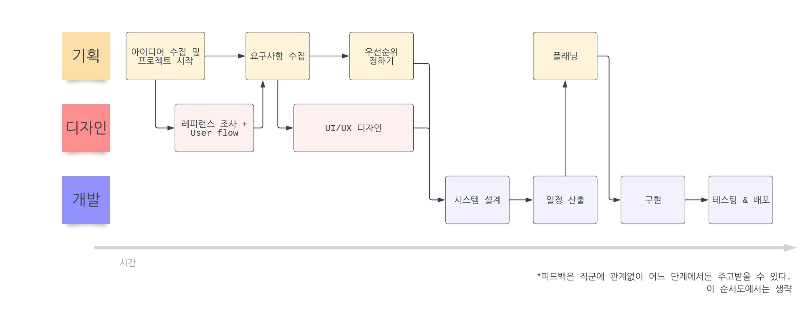
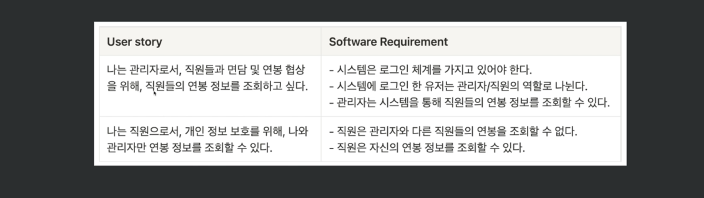

# 패스트캠퍼스 강의: 기획부터 프로젝트까지

## 시간에 따른 프로젝트 steps

## 문서화 측면

- 목표: 팀에 새로 조인한 사람이 봐도 파악하기 쉽도록 작성해야한다. 뉴비의 관점에서 보려고 노력하기

### 충분한 정보를 담고 있는가?

- 프로젝트 주제와 목표
- 서비스 요구사항/기능 리스트
- 시스템 설계 및 스펙
- 일정
- 대시보드

### 필요한 정보를 잘 찾을 수 있는가?

- 검색 기능활용
- 비슷한 내용을 여러 문서에 적기 X -> 한 곳에 정리
- Table 잘 사용하기
- Tag 사용하기

## 요구사항 작성법

### 1. User story 에서 시작

철저히 사용자의 관점에서 소프트웨어를 통해 어떤 것을 하고 싶은지 생각한다.

- Role: 소프트웨어를 사용/관리하는 주체 (e.g. 로그인 하지 않은 사용자, 관리자, 일반사용자 등)
- Goal: 하고 싶은 것
- Benefit: 이 것이 필요한 목적/이점

{Role}로서, 나는 {Benefit}을 위해 {Goal}을 이루고 싶다/가지고 싶다

### 2. Software requirement 정의

- User story를 만족시키기 위해 시스템에서 어떤 것들을 해야할지, 기능적 요구사항(functional requirements)와 비기능적 요구사항(non-functional requirements)을 이용하여 정의한다.

