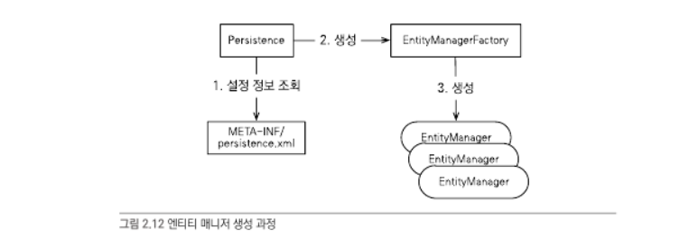
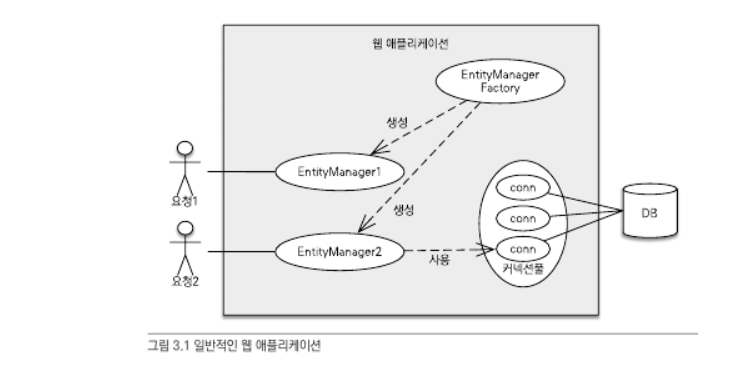
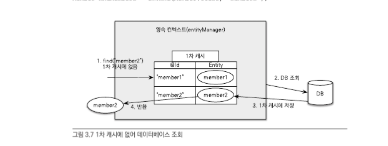
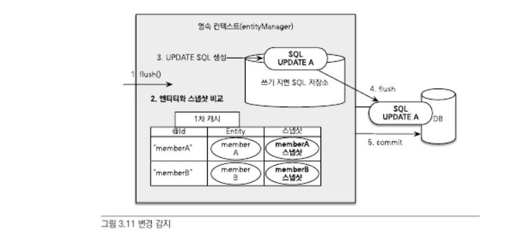
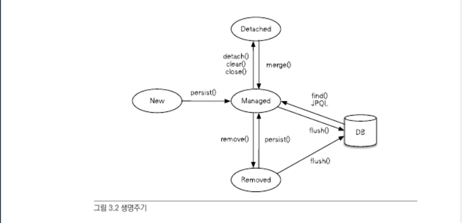
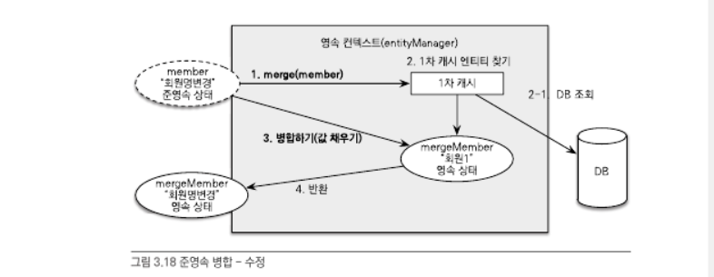

# 자바 ORM 표준 JPA 프로그래밍

## 2장 JPA 시작

### persistence.xml 설정

- JPA 는 persistence.xml 을 사용해서 필요한 설정정보를 관리한다
- JPA 설정은 영속성 유닛(persistence-unit) 등록부터 시작한다
  - (일반적으로) 데이터베이스당 하나의 영속성 유닛
- 데이터베이스 방언: SQL 표준을 지키지 않거나 특정데이터베이스만의 고유한 기능을 JPA 에서는 방언(Dialect)이라 한다

### 엔티티 매니저 설정



#### 엔티티 매니저 팩토리 생성

```java
EntityManagerFactory emf =
    Persistence.createEntityManagerFactory("jpabook");
```

- `persistence.xml` 의 설정정보를 사용해서 엔티티 매니저 팩토리를 생성한다
- 엔티티 매니저 팩토리는 생성비용은 아주 커서 애플리케이션 전체에 한번만 생성하고 공유해서 사용

#### 엔티티 매니저 생성

```java
EntityManager em = emf.createEntityManager();
```

- 엔티티매니저팩토리에서 엔티티매니저를 생성한다
- 엔티티 매니저는 내부에 데이터소스(데이터베이스 커넥션)을 유지하면서 데이터베이스와 통신한다
  - 엔티티 매니저를 통해 데이터베이스에 등록/수정/삭제/조회 할 수 있다
  - 스레드 간에 공유하거나 재사용하면 안된다
  - 엔티티 매니저를 가상의(논리) 데이터베이스로 생각할 수 있다

#### 종료

```java
em.close();
emf.close
```

---

### 트랜잭션 관리

- 트랜잭션을 시작할려면 엔티티 매니저에서 트랜잭션 API를 받아와야 한다.

```java
EntityTransaction tx = em.getTransaction();
try {
    tx.begin();
    login(em);
    tx.commit();
} catch (Exception e) {
    tx.rollback();
}
```

### 비즈니스 로직

- 개발자는 엔티티 객체 중심으로 개발하고 데이터베이스(SQL) 에 대한 처리는 JPA 에 맡긴다
  - JPA는 엔티티의 매핑정보를 분석해서 SQL 를 만들고 데이터베이스에 전달한다
- 엔티티 매니저를 통해 데이터베이스에 등록/수정/삭제/조회 할 수 있다

#### 엔티티 저장

- `em.persist(entity)`

#### 엔티티 수정

- 별다른 메서드 없이 엔티티 값을 수정하면 변경을 추적하여 `UPDATE SQL` 을 생성해서 전달한다

#### 엔티티 삭제

- `em.remove(entity)`

#### 한건 조회

- `Member findMemeber = em.find(Entity.class, id)`

#### 목록 조회

- JPA에서 필요한 데이터만 데이터베이스에서 불러올려면 검색조건이 포함된 SQL 를 사용해야한다
  - JPQL (Java Persistence Query Language) 사용

##### JPQL

- JPQL은 엔티티 객체(클래스, 필드)를 대상으로 쿼리한다

사용법

1. 쿼리객체 생성: `em.createQuery(JPQL, 반환타입);`
2. 메소드 호출: `쿼리객체.getResultList()`;

---

## 3장 영속성관리

- 매핑한 엔티티를 엔티티 매니저를 통해 어떻게 사용하는걸까?

### 3.1 엔티티 매니저 팩토리와 엔티티 매니저



- 엔티티 매니저는 데이터베이스 연결이 꼭 필요한 시점까지 커넥션을 얻지 않는다
  - e.g. 트랜잭션을 시작할 때 커넥션을 획득

### 3.2 영속성 컨텍스트(persistence context)

- 엔티티 매니저로 엔티티를 저장하거나 조회하면 엔티티 매니저는 영속성 컨텍스트에 엔티티를 보관하고 관리한다
- 영속성 컨텍스트는 엔티티 매니저를 생성할 때 하나 만들어진다
- 엔티티 매니저를 통해 영속성 컨텍스트에 접근하거나 관리할 수 있다

### 3.4 영속성 컨텍스트 특징

#### 영속성 컨텍스트와 식별자 값

- 영속성 컨텍스트는 엔티티를 식별자 값으로 구분

#### 영속성 컨텍스트와 데이터베이스 저장

- 플러시: JPA 는 트랜잭션을 커밋하는 순간 영속성 컨텍스트에 새로 저장된 엔티티를 데이터베이스에 반영

#### 3.4.1 엔티티 조회 & 1차 캐시

- 1차캐시: 영속성 컨텍스트 내부 캐시
- 영속성 컨텍스트 내부에 `Map`이 있다
  - key 는 식별자(`@Id`), value는 엔티티 인스턴스
- `em.find()` 호출시 1차 캐시에서 엔티티를 찾고, 없으면 데이터베이스에서 조회
  - 데이터베이스에서 조회 -> 엔티티 생성 -> 1차캐시 저장 -> (영속상태)엔티티 반환
  - 엔티티의 동일성 보장



#### 3.4.2 엔티티 등록

- 엔티티 매니저는 1차캐시에 엔티티를 저장하면서 동시에 `INSERT SQL`를 만들어 쓰기지연SQL저장소에 보관한다
- 엔티티매니저는 트랜잭션 커밋 직전까지 데이터베이스에 저장하지 않고, 내부쿼리저장소에 `INSERT SQL`를 모아둔다
  - 트랜잭션을 지원하는 쓰기지연 (transactional write-behind)
- 트랜잭션 커밋: 엔티티 매니저는 영속성 컨텍스트를 플러시 -> 데이터베이스 트랜잭션 커밋
- 플러시란 영속성 컨텍스트의 변경내용을 데이터베이스에 동기화하는 작업, 즉 쓰기지연SLQ저장소의 쿼리들을 뎅터베이스에 보낸다

#### 3.4.3 엔티티 수정

- 변경감지(dirty checking): 엔티티의 변경사항을 데이터베이스에 자동으로 반영하는 기능
  - 플러시 시점에 스냅샷과 엔티티를 비교해서 변경된 엔티티를 찾는다
  - 변경감지는 영속성 컨텍스트가 관리하는 영속상태의 엔티티에만 적용된다
- 스냅샷: 엔티티를 영속성 컨텍스트에 보관할 때 최초상태를 복사해서 저장다두는 것
- JPA의 기본전략은 엔티티의 모든 필드를 업데이트한다
  - `org.hibernate.annotations.DynamicUpdate` 어노테이션을 사용하면 수정된 데이터만 사용해서 동적으로 `UPDATE SQL`을 생성한다

#### 3.4.4 엔티티 삭제

- 엔티티를 삭제하려면 먼저 대상 엔티티를 조회하여 `em.remove(entity)`에 넘겨주어야 한다
- 등록과 마찬가지로 즉시 (데이터베이스에서) 삭제되는 것이 아니라 쿼리가 쓰기지연SQL저장소에 저장된다
  - 반면 `em.remove(entity)` 호출 시 해당 엔티티는 영속성 컨텍스트에서 즉시 제거된다
  - 삭제된 엔티티는 재사용하지 않고 가비지컬렉션의 대상이 되도록 하는것이 좋다

#### 3.5 플러시

- 플러시는 영속성 컨텍스트의 변경내용을 데이터베이스에 반영한다
- 순서: 영속성 컨텍스트의 모든 엔티티에 변경감지가 동작 -> 수정쿼리를 쓰기지연SQL저장소에 등록 -> 저장소 쿼리 데이터베이스에 전송
- 방법: 1. `em.flush()` 호출, 2. 트랜잭션 커밋 (플러시자동호출) 3. JPQL 쿼리실행 (플러시자동호출)



### 3.3 엔티티의 생명주기

엔티티에는 4가지의 상태가 있다

- 엔티티 상태에 대한 용어들이 모두 영속성 컨텍스트와 관련이 있다
- 비영속(new/transient): 영속성 컨텍스트와 전혀 관계가 없는 상태
- 영속(managed): 영속성 컨텍스트에 저장된(관리되는managed) 상태  
  `em.find()` 또는 JPQL을 통해 조회한 엔티티도 모두 영속상태
- 준영속(detached): 영속성 컨텍스트에 저장되었다가 분리된(detached) 상태  
  `em.detach()`, `em.close()` 영속성 컨텍스트 닫기, `em.clear()` 영속성컨텍스트 초기화
- 삭제(removed): `em.remove()` 엔티티를 영속성 컨텍스트와 데이터베이스에서 삭제한다



#### 3.6 준영속

- 영속성 컨텍스트가 관리하는 영속상태의 엔티티가 영속성 컨텍스트에서 분리된(detached) 된 것을 준영속상태라 한다.
  - 따라서 준영속상태의 엔티티는 영속성 컨텍스트의 기능을 사용할 수 없다
- 방법: 1. `em.detach(entity)` 특정 엔티티만 준영속 상태로 전환, 2. `em.clear()` 영속성 컨텍스트 초기화, 3. `em.close()` 종료

##### 3.6.1 엔티티를 준영속 상태로 전환: detach()

- 메소드 호출순간 1차캐시, 쓰기지연SQL저장소에서 해당 엔티티 관련 자료는 사라진다

##### 3.6.2 영속성 컨텍스트 초기화: clear()

- 해당 영속성 컨텍스트의 모든 엔티티를 준영속 상태로 만든다
- 영속성 컨텍스트를 새로 만든 것과 같은 상태

##### 3.6.5 병합: merge()

- `merge()` 메소드는 준영속 상태의 엔티티를 받아서(파라미터) 새로운 영속상태의 엔티티를 반환

###### 병합 동작방식



1. `merge()` 실행
2. 파라미터의 엔티티 식별자 값으로 1차캐시에서 조회한다
   2.1 만약 1차 캐시에 엔티티가 없으면 데이터베이스에서 조회하고 1차캐시에 저장한다
   2.2 만약 데이터베이스에도 없으면 새로운 엔티티를 생성한다
3. 조회한(또는 생성한) 영속 엔티티에 파라미터 엔티티의 값을 채워넣는다
4. 영속 엔티티를 반환한다

### 3.7 정리

- 엔티티 매니저는 엔티티 매니저 팩토리에서 생성한다
  - 엔티티 매니저를 통해서 영속성 컨텍스트에 접근할 수 있다
- 영속성 컨텍스트는 애플리케이션과 데이터베이스 사이에서 객체를 보관하는 가상의 데이터베이스 같은 역할
  - 1차캐시, 동일성보장, 트랜잭션을 지원하는 쓰기지연, 변경감지, 지연로딩기능 등을 제공
- `persist()` 는 플러시시점에 데이터베이스에 반영
- 영속상태, 준영속상태
