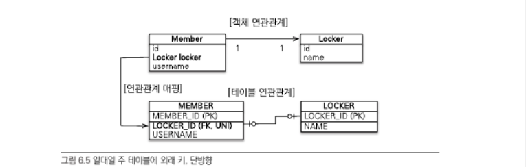
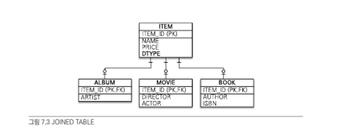
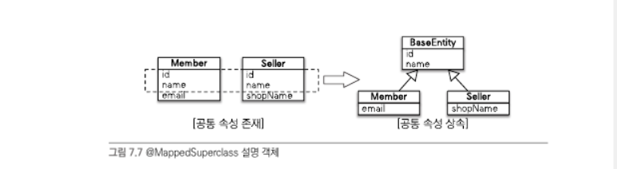
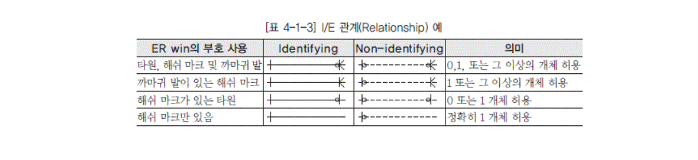
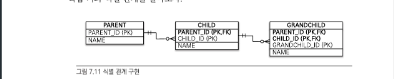

# 자바 ORM 표준 JPA 프로그래밍

## 엔티티 연관관계 매핑시 주의사항

- 다중성: 두 엔티티가 일대일인지? 일대다 관계인지?
- 단방향, 양방향
- 연관관계의 주인

## 일대일



```java
@Entity
public class Member {
    @Id @GeneratedValue
    @Column(name = "MEMBER_ID")
    private Long id;

    private String username;

    @OneToOne
    @JoinColumn(name = "LOCKER_ID")
    private Locker locker;
    ...
}

@Entity
public class Locker {
    @Id @GeneratedValue
    @Column(name = "LOCKER_ID")
    private Long id;

    private String name;
    ...
}
```

- 일대일 관계 중 대상테이블(Locker)에 외래 키가 있는 단방향 관계는 JPA 에서 지원하지 않는다

## 고급매핑

- 상속관계매핑: 객체의 상속관계를 데이터베이스에서는 어떻게 매핑할 것인가?
  - `@MappedSuperclass`: 공통으로 사용하는 매핑 정보를 상속받고 싶을 때 사용
- 복합 키와 식별관계 매핑
- 조인 테이블
- 엔티티 하나에 여러 테이블 매핑하기

## 상속 관계 매핑

- ORM의 상속관계매핑은 객체의 상속 구조와 데이터베이스의 슈퍼타입 서브타입 관계를 매핑하는 것
- 부모클래스는 매핑하지 않고 자식클래스에게 매핑정보 제공
  - `@Mappedsuperclass`
- 부모클래스, 자식클래스 모두 테이블과 매핑
  - 조인전략: 각각을 모두 테이블로 만들고 조회할 때 조인
  - 단일 테이블 전략: 테이블 하나만 사용해서 통합
  - 구현 클래스마다 테이블 전략: 서브타입마다 하나의 테이블을 만들기

## 조인전략

- 부모, 자식 엔티티 각각을 모두 테이블로 만든다
- 자식 테이블이 부모 테이블의 기본키를 받아서 기본키 + 외래키로 사용하는 전략
- 테이블은 타입 개념이 없으므로 타입을 구분하는 `DTYPE` 칼럼으로 구분



```java
@Entity
@Inheritance(strategy = InheritanceType.JOINED)
@DiscriminatorColumn(name = "DTYPE")
public abstract class Item {
    @Id @GeneratedValue
    @Column(name = "ITEM_ID")
    private Long id;

    private String name;
    private int price;
    ...
}

@Entity
@DiscriminatorValue("A")
public class Album extends Item {
    private String artist;
}

@Entity
@DiscriminatorValue("M")
public class Movie extends Item {
    private String director;
}
```

## 단일 테이블 전략

- 테이블을 하나만 사용하고 구분칼럼을 통해 어떤 자식 데이터가 저장되었는지 구분
- 자식 엔티티가 매핑한 칼럼은 모두 `null` 허용

```java
@Entity
@Inheritance(strategy = InheritanceType.SINGLE_TABLE)
@DiscriminatorColumn(name = "DTYPE")
public abstract class Item {
    @Id @GeneratedValue
    @Column(name = "ITEM_ID")
    private Long id;
}

@Entity
@DiscrimantorValue("A")
public class Album extends Item {...}
```

## 구현 클래스마다 테이블 전략

- 자식 엔티티마다 테이블을 만든다. 자식 테이블 각각에 필요한 칼럼이 모두 있다
- 여러 자식 테이블을 함께 조회할 시 SQL 의 `UNION`을 사용해야 해서 성능이 느리다
- 추천하지 않는 전략

## `@MappedSuperclass`

- 부모 클래스는 테이블과 매핑하지 않고, 자식클래스에게만 매핑정보를 제공하고 싶을 때 사용
- 부모 클래스는 직접 생성하여 사용할 일이 거의 없으므로 추상클래스로 만든다
- 등록일자, 수정일자, 등록자, 수정자 같은 여러 엔티티의 공통 속성을 효과적으로 관리할 수 있다
- 엔티티는 `@Entity`, `@MappedSuperclass` 클래스만 상속받을 수 있다



```java
@MappedSuperclass
public abstract class BaseEntity {
    @Id @GeneratedValue
    private Long id;
}

@Entity
public class Member extends BaseEntity {
    // ID 상속
    private String email;
}
```

## 식별관계 vs 비식별관계

- 테이블 사이의 관계에서 외래키가 기본키에 포함되는지 여부에 따라서 식별관계와 비식별관계가 나뉜다
- 식별관계: 부모테이블의 기본키를 내려받아서 자식 테이블의 기본키 + 외래키로 사용하는 관계


- 비식별관계: 부모 테이블의 기본키를 받아서 자식테이블의 외래키로만 사용하는 관계


- 비식별 관계는 외래 키에 `NULL`을 허용하는지에 따라 **필수적 비식별 관계**와 **선택적 비식별 관계**로 나눈다
- 필수적 비식별 관계(Mandatory): 외래 키에 `NULL`을 허용하지 않는다. 연관관계가 필수
- 선택적 비식별 관계(Optional): 외래 키에 `NULL`을 허용. 연관관계 선택
- 최근에는 비식별 관계를 주로 사용하고 꼭 필요한 곳에만 식별관계를 사용

### ERD 표기법



## 복합키: 비식별 관계 매핑

- JPA는 영속성 컨텍스트에 엔티티를 보관할 때 엔티티의 식별자를 키로 사용
  - 식별자를 구분하기 위해서는 `equals`와 `hashCode`를 사용해서 동등성 비교
- 식별자 필드가 2개 이상이면 별도의 식별자 클래스를 만들고, 그곳에 `equals` 와 `hashCode`를 구현해야한다
- JPA 는 복합키를 지원하기 위해 `@IdClass` 와 `@EmbeddedId` 두가지 방법을 제공
  - `@IdClass`는 관계형 데이터베이스에 가까운 방법
  - `@EmbeddedId`는 객체지향에 가까운 방법

## `@IdClass`: 비식별관계


- `PARENT` 테이블의 기본키는 `PARENT_ID1`과 `PARENT_ID2`를 묶은 복합키로 구성되었다
- 복합키를 매핑하기 위해 식별자 클래스를 별도로 만들어야 한다
- 각각의 기본 키 칼럼을 `@Id`로 매핑, `@IdClass`를 사용해서 `ParentId` 클래스를 식별자클래스로 지정

부모 클래스

```java
@Entity
@IdClass(ParentId.class)
public class Parent {
    @Id
    @Column(name = "PARENT_ID1")
    private String id1;

    @Id
    @Column(name = "PARENT_ID2")
    private String id2;
}

public class ParentId implements Serializable {
    private String id1;
    private String id2;

    public ParentId() {}
    public ParentId(Stirng id1, String id2) {...}

    @Override public boolean equals(Object o) {...}
    @Override public int hashCode() {...}
}
```

`@IdClass` 사용 조건

- 식별자 클래스 속성명과 엔티티에서 사용하는 식별자의 속성명이 같아야한다
- `Serializable` 인터페이스 구현
- `equals`, `hashCode` 구현
- 기본 생성자
- 클래스는 public 접근제어자

동작원리

- `em.persist()` 를 호출하면 영속성 컨텍스트에 엔티티를 등록하기 전에
  내부에서 `Parent.id1`, `Parent.id2` 값을 사용해서 식별자 클래스 `ParentId`를 생성하고 영속성 컨테스트의 키로 사용

자식 클래스

```java
@Entity
public class Child {
    @Id
    private String id;

    @ManyToOne({
        @JoinColumn(name = "PARENT_ID1",
            referencedColumnName = "PARENT_ID1"),
        @JoinColumn(name = "PARENT_ID2",
            referencedColumnName = "PARENT_ID2")
    })
    private Parent parent;
}
```

- 외래키가 복합키이므로 여러 칼럼을 매핑하기 위해 `@JoinColumns` 사용

## `@EmbeddedId`

```java
@Entity
public class Parent {
    @EmbeddedId
    private ParentId id;

    private String name;
    ...
}
```

- `Parent` 엔티티에서 식별자 클래스를 직접 사용하고 `@EmbeddedId` 어노테이션을 적어준다

```java
@Embeddable
public class ParentId implements Serializable {
    @Column(name = "PARENT_ID1")
    private String id1;
    @Column(name = "PARENT_ID2")
    private String id2;

    // equals and hashCode 구현
    ...
}
```

## `@IdClass` vs `@EmbeddedId`

- `@IdClass`와 `@EmbeddedId`는 각각 장단점이 있다
- `@EmbeddedId`는 `@IdClass` 보다 좀 더 객체지향적이고 중복이 없지만  
  특정상황에 `JPQL`이 조금 더 길어질 수 있다

```java
    em.createQuery("select p.id.id1, p.id.id2 from Parent p");  // @EmbeddedId
    em.createQuery("select p.id1, p.id2 from Parent p");  // @IdClass
```

- 복합 키에는 어느 칼럼에도 `@GenerateValue`를 사용할 수 없다

## 복합키: 식별관계 매핑



## `@IdClass`와 식별관계

```java
// 부모
@Entity
public class Parent {
    @Id @Column(name = "PARENT_ID")
    private String id;
    private String name;
    ...
}

// 자식
@Entity
@IdClass(ChildId.class)
public class Child {
    @Id
    @ManyToOne
    @JoinColumn(name = "PARENT_ID")
    public Parent parent;

    @Id @Column(name = "CHILD_ID")
    private String childId;

    private String name;
    ...
}

// 자식 ID
public class ChildId implements Serializable {
    private String parent;  // Child.parent 매핑
    private String childId; // Child.childId 매핑

    // equals, hashCode
    ...
}

// 손자
@Entity
@IdClass(GrandChildId.class)
public class GrandChild {
    @Id
    @ManyToOne
    @JoinColumns({
        @JoinColumn(name = "PARENT_ID"),
        @JoinColumn(name = "CHILD_ID")
    })
    private Child child;

    @Id @Column(name = "GRANDCHILD_ID")
    private String id;

    private String name;
    ...
}

// 손자 ID
public class GrandChildId implements Serializable {
    private ChildId child;  // GrandChild.child 매핑
    private String id;      // GrandChild.id 매핑

    // equals, hashCode
    ...
}
```

- 식별관계는 기본키와 외래키를 같이 매핑해주어야 한다. 외래키는 `@ManyToOne`을 사용하여 매핑

## `@EmbeddedId`와 식별관계

- `@EmbeddedId` 사용시에는 식별관계에 사용할 연관관계의 속성에 `@MapsId` 사용

  - `@IdClass`와 다르게 `@Id` 대신 `@MapsId`를 사용
  - `@MapsId`는 외래키와 매핑한 연관관계를 기본키에도 매핑하겠다는 의미
  - `@MapsId`의 속성 값은 `@EmbeddedId`에서 사용한 식별자 클래스의 기본 키 필드로 지정한다

  ```java
  // 부모
  @Entity
  public class Parent {
    @Id @Column(name = "PARENT_ID")
    private String id;

    private String name;
    ...
  }

  // 자식
  @Entity
  public class Child {
    @EmbeddedId
    private ChildId id;

    @MapsId("parentId")     // (식별자클래스)ChildId.parentId 매핑
    @ManyToOne
    @JoinColumn(name = "PARENT_ID")
    public Parent parent;
  }

  // 자식ID
  @Embeddable
  public class ChildId implements Serializable {
    private String parentId;    // `@MapsId("parentId")`로 매핑

    @Column(name = "CHILD_ID")
    private String id;

    // equals, hashCode
    ...
  }

  // 손자
  @Entity
  public class GrandChild {
    @EmbeddedId
    private GrandChildId id;

    @MapsId("childId")      // (식별자클래스) GrandChildId.childId 매핑
    @ManyToOne
    @JoinColumns ({
        @JoinColumn(name = "PARENT_ID"),
        @JoinColumn(name = "CHILD_ID")
    })
    private Child child;
  }

  // 손자 ID
  @Embeddable
  public class GrandChildId implements Serializable {
    private ChildId childId;    // `@MapsId("ChildId")`로 매핑

    @Column(name = "GRANDCHILD_ID")
    private String id;

    // equals, hashCode
    ...
  }
  ```

## 식별관계 vs 비식별관계 구현

- 비식별관계에는 복합키 클래스를 만들지 않아도 되고, 매핑도 쉽고 코드도 단순해진다

## 일대일 식별관계
