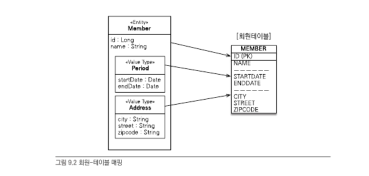

# 자바 ORM 표준 JPA 프로그래밍 - 09 값타입

## JPA 값 타입

- 기본값 타입(basic value type)
  - 자바 기본 타입(e.g. int, double)
  - 래퍼 클래스(e.g. Integer)
  - String
- 임베디드 타입(embedded type)(복합값 타입)
- 컬렉션 값 타입(collection value type)

## 임베디드 타입(복합값 타입)

- 임베디드 타입을 통해 **새로운 값 타입(value type)**을 정의해서 사용가능
  - 직접 정의한 임베디드 타입도 `int`, `String` 같은 값 타입
  - `@Embeddable`: 값 타입을 정의하는 곳에 표시
  - `@Embedded`: 값 타입을 사용하는 곳에 표시
- 임베디드 타입이 `null`이면 매핑한 칼럼 값은 모두 `null`이 된다

## 값 타입과 불변 객체

- 값 타입을 여러 엔티티에서 공유하면 위험하다 -> side effect 발생가능
  - 공유 대신 값(인스턴스)를 복사해서 사용
- 불변객체: 객체 공유참조 상황에서 사이드이펙트 방지책

## 값 타입의 비교

- 동일성(identity) 비교: 인스턴스의 참조값 비교, `==` 사용
- 동등성(equivalence) 비교: 인스턴스의 값 비교, `equals()` 사용

## 값 타입 컬렉션

- 값 타입을 하나 이상 저장하려면 `@ElementCollection`, `@CollectionTable` 어노테이션을 이용
  - 관계형 데이터베이스 테이블은 칼럼 안에 컬렉션을 포함할 수 없으므로 별도의 테이블을 추가해야한다

## 값 타입 컬렉션의 제약사항

- 값 타입 컬렉션에 변경사항이 발생하면 값타입컬렉션의 테이블 연관 데이터를 모두 삭제하고 다시 저장한다
  - 따라서 실무에서는 값 타입 컬렉션이 매핑된 테이블에 데이터가 많다면 **일대다**관계로 처리
