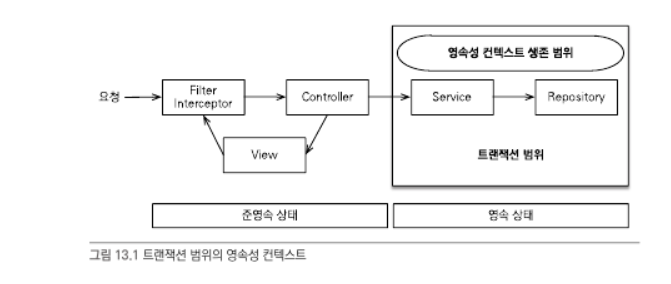
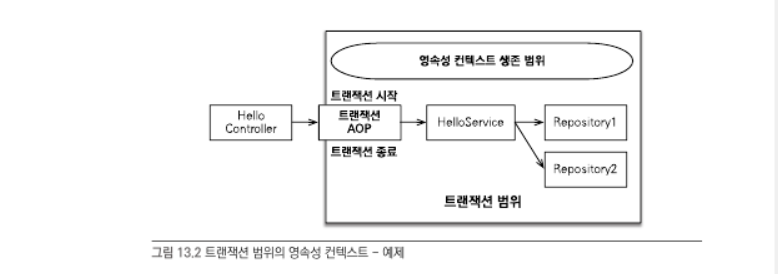
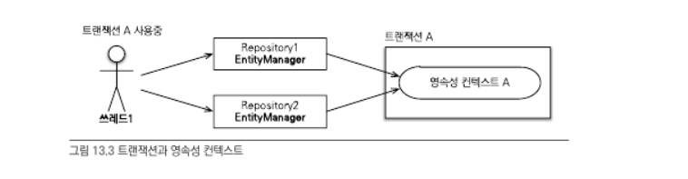
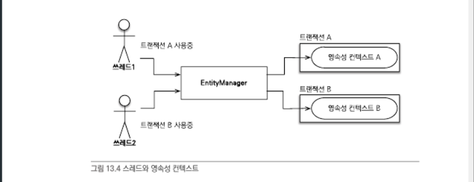
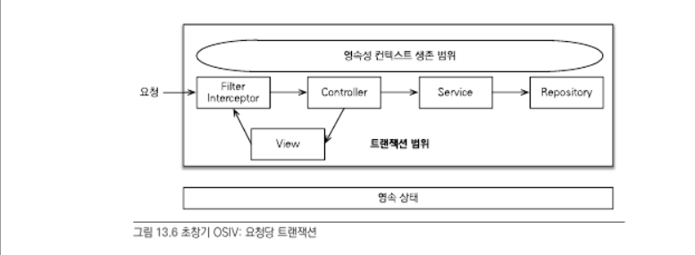

# 자바 ORM 표준 JPA 프로그래밍 - 13. 영속성 관리

## 스프링 컨테이너와 영속성 컨텍스트

- 순수 J2SE 환경에서는 개발자가 직접 엔티티 매니저를 생성하고 트랜잭션도 관리해야 한다
- 하지만 스프링 같은 컨테이너 환경에서는 컨테이너가 제공하는 전략을 따라야 한다

## 스프링 컨테이너의 기본 전략

- 트랜잭션 범위의 영속성 컨텍스트 전략
  - 트랜잭션의 범위와 영속성 컨텍스트의 생존 범위가 같다
  - 트랜잭션을 시작할 때 영속성컨텍스트를 생성하고 끝날 때 영속성 컨텍스트를 종료한다.  
    같은 트랜잭션 안에서는 같은 영속성 컨텍스트에 접근한다

- 스레드가 다르면 같은 엔티티 매니저를 사용해도 트랜잭션에 따라 접근하는 영속성 컨텍스트가 다르다
  - 스프링 컨테이너는 스레드마다 각각 다른 트랜잭션을 할당한다

## 준영속 상태와 지연로딩

- 서비스계층에 `@Transactional`이 있다면 서비스계층이 끝나는 시점에 트랜잭션이 종료되면서 영속성 컨텍스트도 함께 종료된다  
  즉, 서비스, 리포지토리계층에서는 영속상태를 유지하지만 **프레젠테이션 계층에서는 준영속 상태**가 된다
  - 준영속상태에서는 변경감지와 지연로딩이 동작하지 않는다

## 준영속 상태의 지연로딩문제 해결법

1. 뷰가 필요한 엔티티를 미리 로딩해둔다
2. `OSIV`를 사용해서 엔티티를 항상 영속상태로 유지하기

## 뷰가 필요한 엔티티를 미리 로딩해두는 방법

- 영속성 컨텍스트가 살아 있을 때 뷰에 필요한 엔티티들을 미리 다 로딩하거나 초기화해서 반환하기
  - 1. 글로벌 페치 전략 수정
  - 2. JPQL 페치 조인
  - 3. 강제 초기화

## 글로벌 페치전략의 단점 - N+1

- `em.find()` 로 엔티티를 조회할 때 즉시로딩전략이라면 데이터베이스에 `JOIN` 쿼리를 사용해서 한 번에 연관된 엔티티까지 조회한다
- 하지만 JPQL을 사용하여 SQL을 생성할 때는 글로벌 페치 전략을 참고하지 않고 오직 JPQL 자체만 사용한다.
- e.g. `List<Order> orders = em.createQuery("select o from Order o", Order.class).getResultList();` 사용시

  1. `select o from Order o` JPQL을 분석해서 `select * from Order` SQL을 생성한다
  2. 데이터베이스에서 결과를 받아 `order` 엔티티 인스턴스들을 생성한다
  3. `Order.member`의 글로벌 페치전략이 즉시로딩이므로 `order`을 로딩하는 즉시 연관된 `member`로 로딩해야한다
  4. 연관된 `member`를 영속성 컨텍스트에서 찾는다
  5. 영속성 컨텍스트에 없으면 `SELECT * FROM MEMBER WHERE id = ?` SQL을 조회한 `order` 엔티티 수 만큼 실행한다

- 이처럼 조회한 데이터 수만큼 다시 SQL을 사용해서 조회하는 것을 `N+1` 문제라한다.
  - N+1 문제는 JPQL 페치조인으로 해결할 수 있다

## JPQL 페치조인

- e.g. `select o  from Order o join fetch o.member`  
  페치조인을 통해 호출하는 시점에 함께 로딩할 엔티티를 선택할 수 있다
- 단점: 페치조인을 무분별하게 사용하면 화면에 맞춘 리포지토리 메소드가 증가하고 이는 프레젠테이션 계층이 알게 모르게 데이터접근 계층을 침범(의존관계 증가)하는 것이다
  - 페치조인은 상황에 따라 다르지만 성능에 미치는 영향이 미비한 편

## 초기화

- 프록시 객체는 영속성 컨텍스트가 살아있을 때 강제로 초기화하면 준영속 상태에서도 사용가능하다
  - 하이버네이트에서는 `initialize()`를 사용하여 강제로 초기화할 수 있다
  - JPA 표준에는 프록시 초기화 메소드가 없다
- 프록시를 초기화하는 역할을 서비스 계층이 담당하는건 프리젠테이션 계층이 서비스 계층을 침범하는 상황
  - 이를 해결하기 위해 FACADE 계층이 필요하다

## FACADE 계층추가

- 서비스 계층은 비즈니스 로직에 집중하고, 프리젠테이션 계층을 위한 초기화 코드는 모두 FACADE가 담당
  - 단점: 중간에 계층이 하나 더 추가 -> 코드 증가

## OSIV(open session in view)

- OSIV는 영속성 컨텍스트를 뷰까지 열어둔다. 영속성 컨텍스트가 살아있으면 엔티티는 영속상태로 유지된다

## OSIV1. 요청 당 트랜잭션

- 클라이언트 요청시 서블릿 필터나 스프링 인터셉터에서 트랜잭션을 시작하고 요청이 끝날 때 트랜잭션을 끝낸다

- 문제점: 프리젠테이션 계층에서 엔티티를 변경할 수 있다

## OSIV2: 스프링OSIV(비즈니스 계층 트랜잭션)

- OSIV를 서블릿 필터에서 적용할지 스프링 인터셉터에서 적용할지에 따라 원하는 클래스를 선택해서 사용하면 된다
- 스프링OSIV는 OSIV를 사용하지만 트랜잭션은 비즈니스 계층에서만 사용한다

### 스프링OSIV 동작방식

1. 클라이언트 요청시 서블릿 필터나, 스프링 인터셉터에서 영속성 컨텍스트를 생성한다  
   이때 트랜잭션은 시작하지 않는다
2. 서비스계층에서 `@Transactional`로 트랜잭션을 시작할 때 `1`에서 생성해둔 영속성 컨텍스트를 찾아와 트랜잭션을 시작한다
3. 서비스계층이 끝나면 트랜잭션을 커밋하고, 영속성 컨텍스트를 플러시한다  
   트랜잭션은 끝내지만 영속성 컨텍스트는 종료하지 않는다
4. 서블릿 필터나, 스프링 인터셉터로 요청이 돌아오면 영속성 컨텍스트를 종료한다  
   이때 플러시를 호출하지 않고 바로 종료

### 트랜잭션 없이 읽기(Nontransactional reads)

- 영속성 컨텍스트는 트랜잭션 범위 안에서 엔티티를 조회하고 수정할 수 있다
- 영속성 컨텍스트는 트랜잭션 범위 밖에서 엔티티를 **조회만** 할 수 있다. 이를 트랜잭션 없이 읽기라 한다

### 스프링OSIV 주의사항

- 프리젠테이션 계층에서 엔티티를 수정한 직후에 트랜잭션을 시작하면 문제가 발생  
  트랜잭션을 시작(비즈니스로직)을 한 후 (뷰에서) 엔티티를 변경하면 된다
- 스프링 OSIV는 같은 영속성 컨텍스트를 여러 트랜잭션이 공유할 수 있으므로 이런 문제가 발생한다
