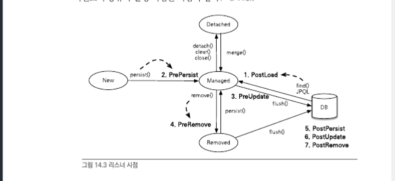

# 자바 ORM 표준 JPA 프로그래밍 - 14. 컬렉션과 부가기능

## 개괄

- JPA 가 지원하는 컬렉션의 종류와 특징
- 컨버터를 사용하면 엔티티의 데이터를 변환해서 데이터베이스에 저장할 수 있다
- 리스너를 사용하면 엔티티에서 발생한 이벤트를 받아서 처리할 수 있다
- 페치 조인은 객체지향 쿼리를 사용해야 하지만 엔티티 그래프를 사용하면 객체지향 쿼리를 사용하지 않아도 원하는 객체 그래프를 한번에 조회할 수 있다

## 컬렉션

- JPA는 `Collection`, `List`, `Set`, `Map`을 지원한다
- JPA에서 다음의 경우에 컬렉션을 사용한다
  - `@OneToMany`, `@ManyToMany` 매핑시
  - `@ElementCollection`으로 값타입을 하나 이상 보관할 때

## JPA와 컬렉션

- 하이버네이트는 엔티티를 영속상태로 만들 때 컬렉션필드를 하이버네이트에서 준비할 컬렉션으로 감싸서 사용

  - 컬렉션을 효율적으로 관리하기 위해서
  - 이런 특징 때문에 컬렉션 사용시 즉시 초기화해서 사용하는걸 권장  
    `Collection<Member> members = new ArrayList<Member>();`

  | 컬렉션 인터페이스   | 내장컬렉션     | 중복허용 | 순서보관 |
  | ------------------- | -------------- | -------- | -------- |
  | Collection, List    | PersistentBag  | O        | X        |
  | Set                 | PersistentSet  | X        | X        |
  | List + @OrderColumn | PersistentList | O        | O        |

## Collection, List

- Collection, List는 중복을 허용하므로 엔티티 추가할 때 중복을 비교하지 않고 단순 저장한다
  - 엔티티를 추가해도 지연로딩된 컬렉션을 초기화하지 않는다

## Set

- Set은 중복을 허용하지 않으므로 엔티티 추가시 비교를 위해 지연로딩된 컬렉션을 초기화한다

## `@OrderBy`

- `@OrderBy`는 데이터베이스의 `ORDER BY`절을 사용해서 컬렉션을 정렬한다
  - 모든 컬렉션에 사용 가능
  - Set에 `@OrderBy` 사용시 순서유지를 위해 `LinkedHashSet`을 사용한다
- `OrderBy`의 값은 엔티티의 필드를 대상으로 한다

## `@Converter`

- 컨버터를 사용하면 엔티티의 데이터를 변환해서 데이터베이스에 저장할 수 있다
  - e.g. 자바의 boolean 타입 사용시 데이터베이스에 숫자 대신 문자 Y, N 으로 저장하고자 할 때 사용

## 리스너

- 리스너 기능을 사용하면 엔티티의 생명주기에 따른 이벤트를 처리할 수 있다

1. PostLoad: 엔티티가 영속성 컨텍스트에 조회된 직후 또는 `refresh`를 호출한 후(2차 캐시에 저장되어 있어도 호출된다)
2. PrePersist: `persist()` 호출해서 엔티티를 영속성 컨텍스트에 관리하기 직전에 호출된다  
   식별자 생성전략을 사용한 경우 엔티티에 식별자는 아직 존재하지 않는다
   새로운 인스턴스를 `merge`할 때도 수행된다
3. PreUpdate: `flush`나 `commit`을 호출해서 엔티티를 데이터베이스에 수정하기 직전에 호출된다
4. PreRemove(): `remove()` 메소드를 호출해서 엔티티를 영속성 컨텍스트에 삭제하기 직전에 호출된다  
   삭제 명령어로 영속성 전이가 일어날 때도 호출된다
   `orphanRemoval`에 대해서는 `flush`나 `commit` 시에 호출된다
5. PostPersist: `flush`나 `commit`을 호출해서 엔티티를 데이터베이스에 저장한 직후에 호출된다  
   식별자가 항상 존재한다
   식별자생성전략이 `IDENTITY`면 식별자 생성을 위해 `persist()`를 호출하면서 저장하므로 이때는 바로 호출된다
6. PostUpdate: `flush`나 `commit`을 호출해서 엔티티를 데이터베이스에 수정한 직후 호출된다
7. PostRemove: `flush`나 `commit`을 호출해서 엔티티를 데이터베이스에 삭제한 직후 호출
