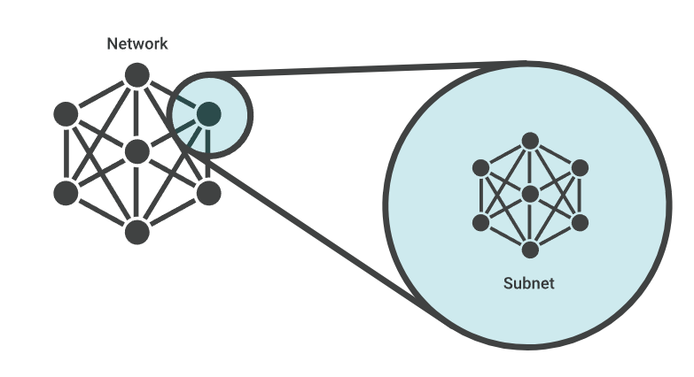
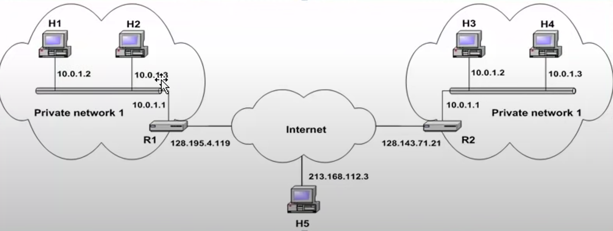
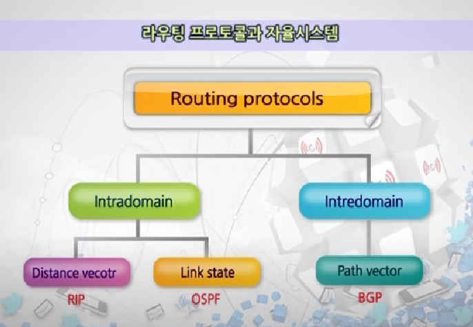

# 컴퓨터네트워크 4주차 스터디노트

## 기술면접예상질문

### 네트워크 레이어, IP 프로토콜

#### IP 주소에 대해서 설명해주세요

- IP 주소는 컴퓨터 네트워크에서 장치들이 서로를 인식하고 통신을 하기 위해서 사용하는 특수한 번호이다.

#### IPV4와 IPV6는 어떤 차이점이 있을까요?

1. 보안강화  
   IPv6 은 보안을 염두에 두고 구축되었다  
   IPv4 구성요소인 ICMP 은 맬웨어를 전달할 가능성이 있다
   반면 IPv6 ICMP 패킷은 IPSec 를 사용하여 더 안전하다
2. 지리적 제한 없음  
   IPv4 주소의 50%는 생성될 때 미국에서 사용하는 용도로 예약
3. 보다 효율적인 라우팅  
   IPv4 헤더는 길이가 가변적이지만 IPv6 에는 일관된 헤더입니다  
   결과적으로 라우팅하기 위한 코드가 간단해지고 하드웨어 처리도 덜 필요해진다
4. 끝과 끝 연결  
   네트워크 주소 변환(NAT) 대신 각 장치가 웹 사이트와 `직접` 통신할 수 있다
5. 자동구성
   IPv6 은 서버 없이도 MAC 주소를 사용하여 IP 주소를 생성

#### 서브넷과 서브넷마스크에 대해 설명해주세요

- 서브넷은 네트워크 내부의 네트워크이다.
  

- IPv4 주소는 네트워크 부분과 호스트 부분으로 구성되어 있다.
  - 네트워크부분: '어떤 IPv4 네트워크에 있는가' 를 나타낸다
  - 호스트부분: '어떤 단말인가' 를 나타낸다
- 서브넷마스크를 통해 IP 주소의 네트워크와 호스트 주소를 분리할 수 있습니다

#### 라우팅이 뭘까요?

- 패킷을 전달하기 위한 경로를 선택하는 과정

##### Public IP와 Private IP 차이는 뭘까요?

- IP 의 분류는 공인IP(고정IP, 유동IP)와 사설IP(고정IP, 유동IP) 로 나눌 수 있다
- 공인IP: 세계에서 단 하나만 존재하는 IP 주소
- 사설IP: 공유기를 이용해 만들 수 있는 가상의 IP주소  
  공유기로 연결된 내부망에 적용되는 IP 주소  
  IPv4의 주소부족으로 서브넷팅된 IP
- 고정IP: 해당 컴퓨터의 IP 주소를 고정적으로 사용
- 유동IP: IP 주소가 수시로 변동

- 공인IP가 필요할 때
  - 서버 역할을 하는 컴퓨터는 고유한 주소가 필요하다

#### 라우팅 프로토콜에 대해서 설명해주세요

- 라우팅 프로토콜은 라우팅 테이블을 **만드는** 것이 주요 임무이다  
  라우팅에서는 라우팅 테이블을 **보는** 것이 핵심
- 라우팅 프로토콜은 내부 게이트웨이 프로토콜과 외부 게이트웨이 프로토콜로 나뉜다 (Autonomous System 내/외)

#### IP는 어떻게 할당될까요?

- ISP 를 통해 공인IP를 할당받거나
- NAT을 통해 사설IP를 할당받을 수 있다.

#### NAT 가 뭘까요?

- 인터넷에 접속할 때는 사설IP 주소를 공인IP 주소로 변환해야한다.  
  이러한 IP 주소 변환 기능을 NAT 라고 한다.
- 공유기가 하나의 공인 IP를 내부 사설 IP로 나누는 기술

#### ICMP 가 뭘까요?

- Internet Control Message Protocol
- ICMP는 네트워크 장치에서 네트워크 통신 문제를 진단하는데 사용하는 네트워크 게층 프로토콜

## 인성면접예상질문

### 최근에 관심가지고 있는 기술에 대해서 설명해주세요

### 기술을 어떤식으로 학습 하는지 설명해주세요

### 안정적인 시스템을 개발하는 팀에서 꼭 지켜야할 개발 프로세스는 뭐라고 생각하시나요?

## 추가공부

### 포트포워딩

- 특정 포트로 들어오는 패킷을 내부 컴퓨터로 넘겨주는 것

### 내부게이트웨이 프로토콜 interior gateway protocol:IGP

- AS(Autonomous System) 내부에서 사용되는 라우팅 프로토콜  
  IS-IS, OSPF, IGRP, EIGRP, RIP 등

### 외부게이트웨이 프로토콜

- AS 간에 사용되는 라우팅프로토콜  
  IBGP 가 속한다

### Autonomous System 자율시스템

- 통신 장치들과 네트워크의 전체 집합체  
  단위 서브넷이 뭉쳐진 덩어리들이 라우터 입장에서는 하나의 AS
- 라우터 입장에서는 인터넷이란 AS들의 연결집합체
- AS는 라우팅 정보를 주고 받는 영역
- 각 AS는 하나 또는 여러 개의 라우팅 프로토콜을 사용할 수 있다  
  AS 간에는 반드시 하나의 라우팅 프로토콜을 사용해야한다

- Intradomain: AS 안에서, Intredomain: AS 간에

### 거리벡터라우팅

- 두 노드 사이의 최소 비용 경로의 최소 거리를 갖는 경로, 경로를 계산하기 위해 `Bellman-Ford` 알고리즘을 사용

#### 알고리즘 동작

- 전체 AS 에 대한 정보를 주기적으로 이웃하고만 공유한다
