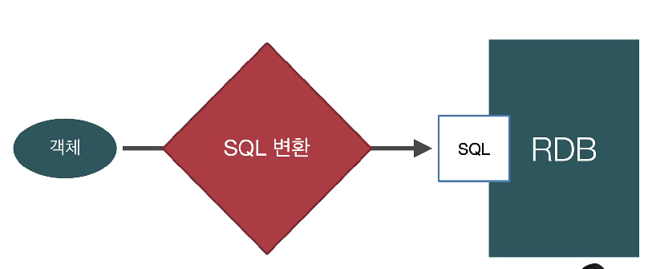

# 자바 ORM 표준 JPA 프로그래밍

## 0.강좌소개

### JPA 의 장점

- 개발속도가 빨라진다 (쿼리 자동생성)
- 유지보수에 쉬워진다

### 어려운 점

- 객체와 테이블을 올바르게 설계하기
- JPA 의 내부 동작방식을 이해하지 못하고 사용한다
  - 디버깅이 어렵고 장애상황에서 대처하기 어렵다
  - JPA 가 **어떤** SQL 를 만들어내는지
  - JPA 가 **언제** SQL 를 만들어내는지

### 강의 목표

- 객체와 테이블 설계 & 매핑
  - 객체와 테이블을 설계하고 매핑
  - 기본키와 외래키 매핑
  - 1:N, N:1, 1:1, N:M 매핑
  - **성능**까지 고려

## 1. JPA 소개

- 객체를 관계형 데이터베이스에 저장
  

### 객체와 관계형 데이터베이스의 차이

1. 상속
2. 연관관계
3. 데이터타입
4. 데이터 식별 방법

### JPA 소개

#### ORM?

- Object-relational mapping (객체 관계 매핑)
- 객체랑 관계형 데이터베이스랑 매핑시켜준다
