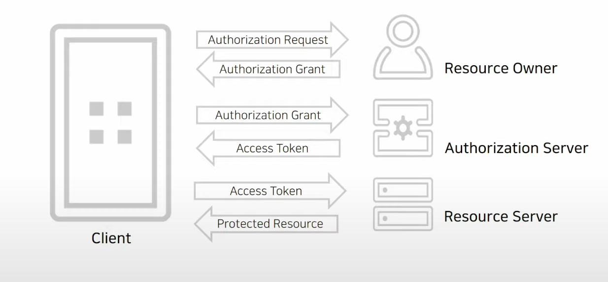

# OAuth2

## OAuth2 용어정리

| 용어                           | 설명                                                                                                                                                                                       |
| ------------------------------ | ------------------------------------------------------------------------------------------------------------------------------------------------------------------------------------------ |
| Authorization Server(권한서버) | 권한을 관리하는 서버로 Access Token, Refresh Token을 발급 및 관리한다.   배달의 민족을 구글 아이디로 가입했다면 해당 구글 계정에 대한 인증과 토큰 발급을 담당하는 서버로 이해할 수 있다 |
| Resource Server(리소스 서버)   | 서비스를 제공하는 서버 배달의 민족을 구글 아이디로 가입했다면, 권한 서버는 구글 서버, 리소스 서버는 배민서버에 해당한다                                                                 |
| Resource Owner(리소스 주인)    | 해당 리소스(계정)의 주인으로, 일반 사용자의 경우 계정의 소유자에 해당한다                                                                                                                  |
| Client                         | Resource Owner를 대리하여 리소스 요청을 하는 애플리케이션 규모가 작은 프로젝트에서는 Resource Server와 같은 애플리케이션일 수 있다                                                      |
| Access Token                   | Authorization Server가 Resource Owner를 식별하여 발급받은 키                                                                                                                               |
| Refresh Token                  | Access Token을 재발급 받을 때 사용하는 키                                                                                                                                                  |

## OAuth 2.0 Roles

- Resource Owner
  - 자원에 대한 접근을 허가해 줄 수 있는 주체
  - e.g.) 페이스북 사용자
- Resource Server
  - 자원을 호스팅하는 서버
  - e.g.) 페이스북 사진첩 서버
- Client
  - Resource Server에서 제공하는 자원을 사용하는 애플리케이션
  - e.g.) 페이스북 사진첩의 사진을 이용해서 스크랩북을 만드는 3rd party 애플리케이션
- Authorization Server
  - 사용자(Resource Owner)의 동의를 받아서 권한을 부여하는 서버

## OAuth 2.0 Protocol Flow

- Client는 Resource Owner에게 Authorization Request을 직접 요청하기도 하지만 대개 Authorization Server를 경우해서 Authorization Request를 한다
- Authorization Server와 Resource Server는 같은 서버에서 구현하는 경우가 많다

