# 한 번에 끝내는 컴퓨터 공학 전공필수 & 인공지능심화

## 네트워크와 인터넷

- 종단시스템(end system): 네트워크 **송수신** 주체(e.g. PC, 스마트폰)
- 프로토콜(protocol): 두 이종 시스템을 연결하기 위한 규약
- 인터넷: 네트워크와 연결된 상태
- OSI 7 계층: 네트워크 구성요소를 7개의 계층으로 역할을 나눈 표준모델
- IP주소: 통신 자료를 최종적으로 전달하기 위한 송/수신 위치정보
- 패킷교환: 종단간에 전송되는 데이터는 패킷 단위로 전달된다

## 통신을 위한 기본 동작

- 요청(Request): 전송하는 장치에서 상대방에 서비스를 요청
- 인지(Indicate): 수신하는 장치에서 작업요청을 확인
- 응답(Response): 수신하는 장치에서 요청받은 작업에 대해 응답
- 확인(Confirm): 전송하는 장치에서 응답데이터를 최종적으로 확인

## 네트워크 유형

- LAN(Local Area Network)
  - 일정그룹의 지역 네트워크(집, 사무실, 학교 등)
  - 소규모로 묶이며 사설망 등을 구축해 연결
- WAN(Wide Area Network)
  - 원거리 통신망으로 넓은 범위 연결(국가, 대륙 등)
- 크기 유형: LAN < WAN < Internet

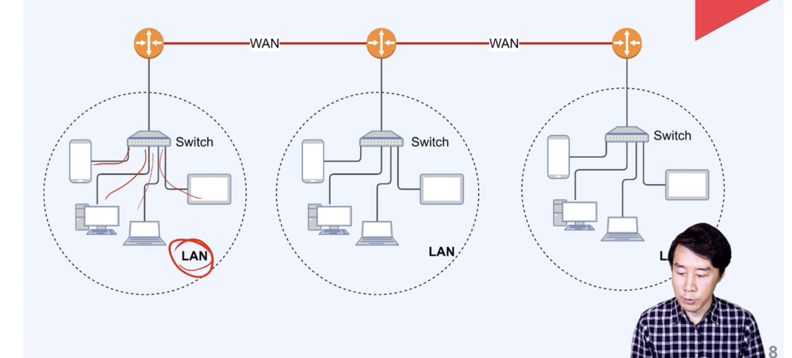

## 네트워크 토폴로지 (구성형태)

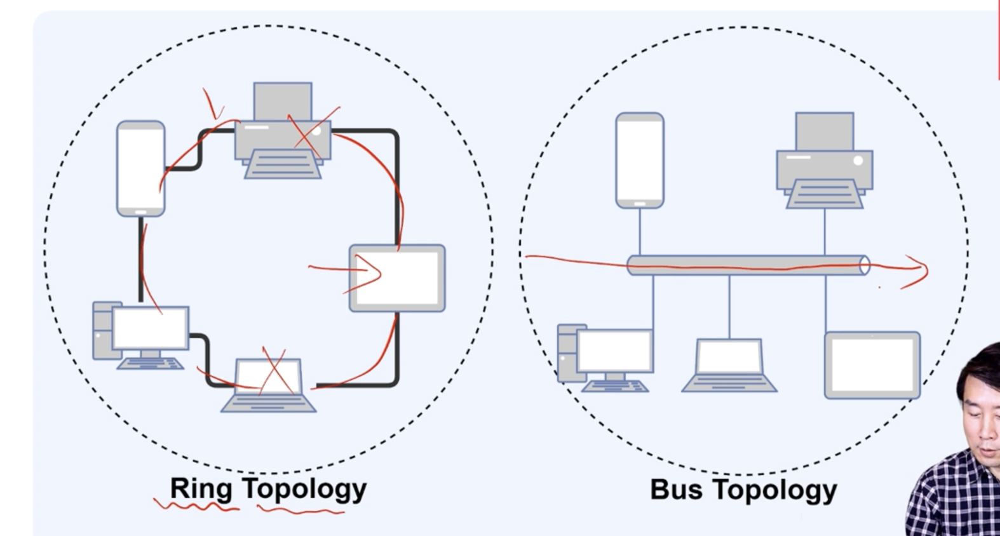

## OSI 7 계층 vs TCP/IP

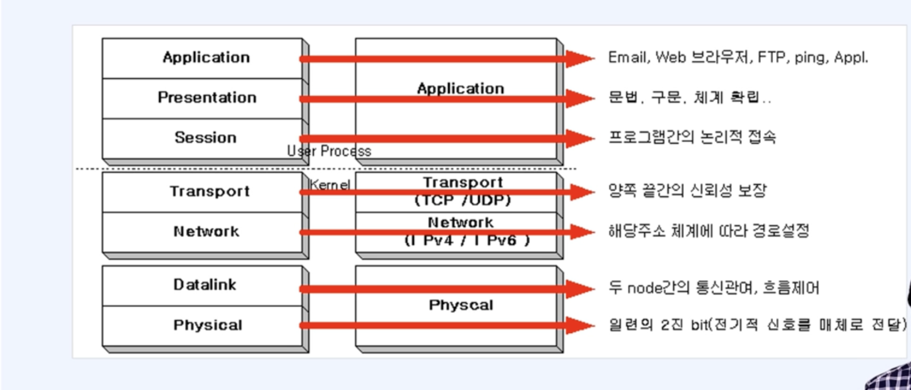
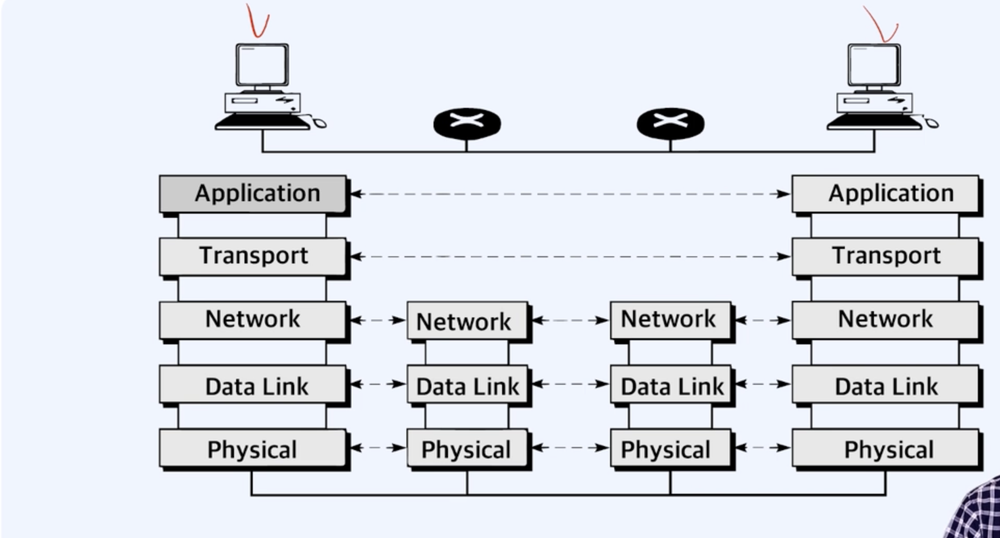

## 물리계층(physical layer)

- 물리적 매체(Transmission medium)를 통한 비트 스트림 전송에 요구되는 기능
- 주요기능

  - 비트의 동기화: 송신자와 수신자는 같은 **클록** 사용
  - 데이터의 속도: 신호가 유지되는 비트의 주기
  - 비트의 표현: 비트를 전송하기 위해 전기적 또는 광학적 신호로 부호화

- 물리계층을 다루기 위한 하드웨어 칩 (이더넷 칩)

### MAC (Medium Access Control)

- 내가 보내는 중에 상대도 보내면 충돌이 발생 -> 자유경쟁 (회선을 경쟁적으로 사용)
- 충돌발생시: 잼신호를 보낸다 -> 일정시간 대기 (16번까지 재시도)

## 데이터 링크계층

- 개요: 노드 대 노드(hop-to-hop) 전달의 책임
- 기능
  - 프레임구성: 네트워크 계층으로부터 받은 비트스트림을 프레임단위로 나눔
  - 물리주소 MAC: 송신자와 수신자의 물리주소를 헤더에 추가
  - 흐름제어: 수신자의 수신 데이터 전송률을 고려하여 데이터 전송하도록 제어
  - 오류제어: 손상 또는 손실된 프레임을 발견/재전송, 트레일러를 통해 이루어짐
  - 접근제어: 주어진 어느 한순간에 하나의 장치만 동작하도록 제어

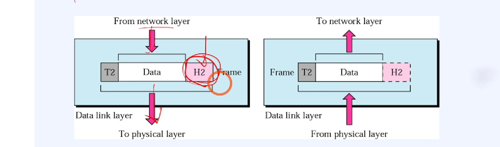

### 데이터링크계층에서 사용하는 주요 프로토콜

- ARP, RARP

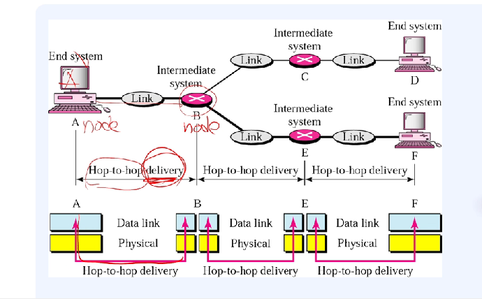

## 네트워크 계층

- 개요: 패킷을 발신지-대-목적지 전달에 대한 책임을 가진다
- 라우팅: 패킷이 최종 목적지로 전달될 수 있도록 경로를 지정하거나 교환가능

### 네트워크 계층 vs 데이터링크 계층

- 데이터링크계층: 물리주소(디바이스 식별, MAC 주소)
- 네트워크계층: 논리주소(IPv4, IPv6)

### 네트워크 계층의 주요 프로토콜

- ICMP: 에러 발생시 에러 발생 원인을 알려주거나 네트워크 상태를 진단해주는 기능
- IGMP: 호스트가 멀티캐스트 그룹 구성원을 인접한 라우터에게 알리는 프로토콜
- IP: 네트워크 기기에서 논리적 식별을 위한 주소

### 네트워크계층 - 발신지 대 목적지 전달

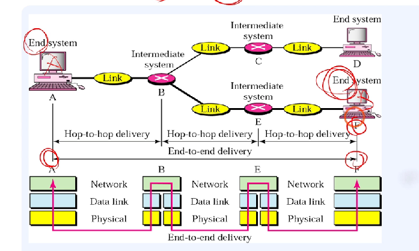

### 네트워크 계층의 전달 흐름

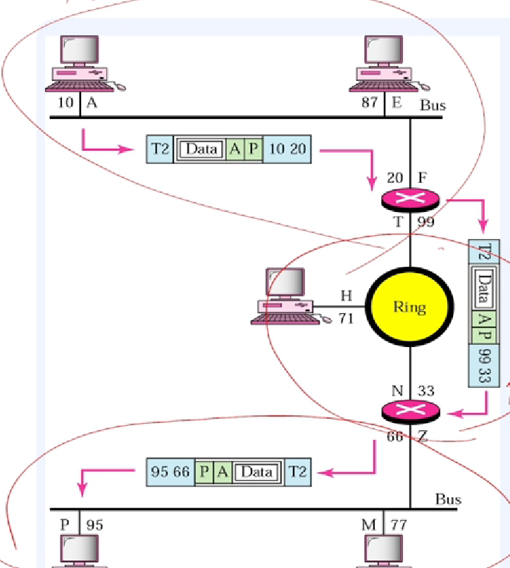

## 전송계층

- 프로세스(프로그램) 대 프로세스 전달에 대한 책임
  - 포트주소 지정
- 분할과 재조립(Segmentation and reassembly)
  - 전달 가능한 세그먼트 단위로 나눔
  - 각 세그먼트는 순서번호를 가지며, 재조립 또는 패킷손실여부 판단
- 연결제어, 흐름제어, 오류제어

### 전송계층의 프로토콜

- TCP(Transmission Control Protocol): 연결형 서비스, 가상회선방식(3-way handshaking 신뢰성보장)
- UDP(User Datagram Protocol): 비연결형 서비스, 데이터그램방식
- SCTP(Stream Control Transmission Protocol): TCP, UDP 특성 결합

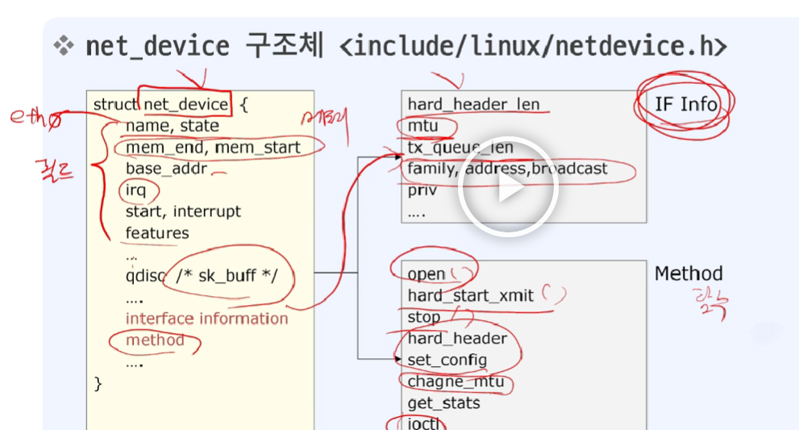

- 세그먼트 단위로 나누어졌다가 종단에서 합쳐진다

### 전송층에서의 전달

- 네트워크계층 host-to-host, 전송계층 port-to-port

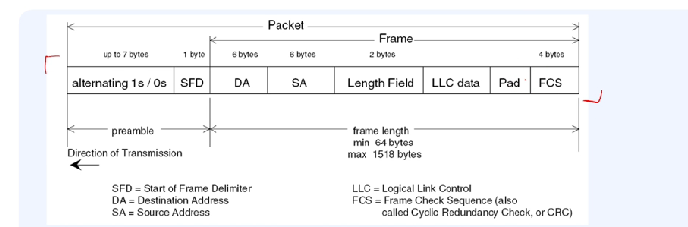

- 예시

- Transport layer: 포트, Network layer: IP, Data link layer: MAC

## 각 계층과 프로토콜의 비교

- physical, data-link, transport --> OS
- application, presentation, session --> APP

## 애플리케이션 프로토콜

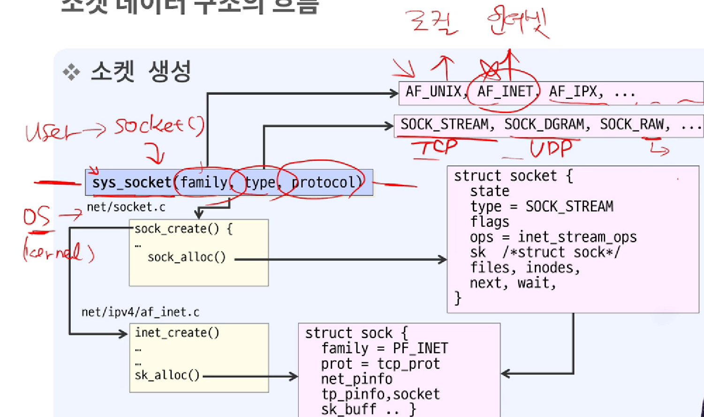

## 정리

- 네트워크란 무엇인가?
  - 범위로 구분: LAN, WAN, INTERNET
- 통신을 위해서는 규약(protocol)이 필요하다
  - OSI 7 Layer, TCP/IP Stack
- 물리계층: 전기적 신호를 인코딩, 디코딩을 통해 컴퓨터에서 받아들인다
- 데이터링크: 물리주소(MAC), 노드 대 노드 책임, 프레임(단위)
- 네트워크계층: 논리(IP) 주소, 발신지-대-목적지 책임, 패킷(단위)
- 전송계층: 포트번호, 프로세스-대-프로세스 책임, 세그먼트(단위)
- 응용계층: 다양한 프로그램 및 프로토콜

## 네트워크 요소

- 인터페이스 이름
  - lo, dummy0, eth0 등과 같은 별칭을 사용  
    lo는 루프백 어드레스로 127.0.0.1의 사용을 위한 논리적인 소프트웨어 주소
- 인터페이스 타입
  - ethernet, isdn, adsl와 같은 네트워크 형태
  - ifconfig -a 명령시 Link encap 항목에서 확인
- 하드웨어 주소
  - 이더넷 하드웨어 MAC 주소
- 네트워크 주소
  - TCP/IP 에서 사용을 위한 IP 주소
- 데이터 처리 능력
  - 한 프레임을 전송할 수 있는 데이터량을 MTU라고 하고,
    패킷을 전송할 때 분할기준
  - 송신 시 네트워크 디바이스가 바쁠 때 시스템에 대기할 수 있는 큐의 크기는 txqueuelen으로 표시된다

## 네트워크 소켓 구현정보

- 정의
  - 로컬호스트의 프로세스와 원격호스트의 프로세스 간의 데이터 교환을 위해 요구되는 정보
- 종류
  - 프로토콜 식별자, 로컬인터넷주소, 로컬포트번호, 원격인터넷주소, 원격포트번호
- 구현
  - 네트워크 드라이버는 주소설정 전송 매개변수 변경, 소통량, 오류통계 지원

## net_device 구조체

## 네트워크디바이스드라이버와 커널의 역할

## Layer model

- VFS Layer: Virtual File System

## 소켓 데이터구조의 흐름 - 소켓 생성

## 소켓 데이터구조의 흐름 - 소켓 생성 후

- fd: file descriptor 파일식별자
- f_op: 함수집합
  - 식별자: dentry, d_inode

## 네트워크 계층 연결유형

- IP는 비연결형 프로토콜이다
- Connection - oriented
  - 송수신을 위한 가상의 연결통로를 만들어 데이터 전송
  - 연결통로가 만들어졌으므로 라우터는 패킷 경로를 다시 계산할 필요가 없다
  - 하나의 메시지에 속하는 모든 패킷이 전달된 후 연결은 종료된다
- Connectionless
  - 각 패킷은 상호독립적으로 취급된다
  - 패킷들은 서로 다른 경로를 통해 전달될 수 있다

## 네트워크 계층의 책임

- 호스트 대 호스트 전송책임
- 라우터 또는 교환기의 패킷라우팅책임

## 주소 지정

- 2진 표기법
  - 주소를 읽기 쉽게 옥텟(8비트) 사이에 공간 삽입
  - 32비트 주소, 4옥텟 주소, 4바이트 주소
- 주소공간의 한계
  - 해결책 -> 클래스기반으로 주소지정
    
- netid와 hostid
  

## 마스크

- 라우터가 네트워크주소와 서브네트워크주소를 찾는데 사용하는 기술
  

## 동적 주소 설정

- 동적 호스트 설정 프로토콜(Dynamic Host Configuration Protocol, DHCP)
  - 요구기반의 동적 정보 제공을 위한 프로토콜
  - DHCP 클라이언트가 서버에게 요청 신호 -> 요청된 물리주소의 항목을 정적 데이터베이스에서 찾음 -> 사용가능한 대기장소(pool)의 주소를 할당하고 동적 데이터베이스에 추가한다

## 주소지정

## IP 데이터그램 구조

- VER: IP버전정의 (IPv4, IPv6)
- HLEN: 헤더의 전체 길이를 4바이트 단위로 표시
- DS: 차별서비스(differentiated services)
  - 서비스 품질(QoS)를 목적으로 데이터그램 등급을 정의
- total length: IP 데이터그램의 총 길이(헤더 + 데이터)를 바이트 단위로 정의
- Identification, Flags, Fragmentation offset - 단편화에 사용
- TTL: 수명
  - 최대 홉(라우터)의 개수를 제어
  - 각 라우터는 이 값을 1씩 감소
  - 이 값이 0이 되면 라우터는 데이터그램을 폐기
- 프로토콜: IP층의 상위계층(TCP, UDP, ICMP, IGMP) 정의

## IP 단편화(fragmentation)

- MTU 길이에 따라 나누어 보내는 것을 단편화라고 한다
  - 물리적인 네트워크를 위해서, 네트워크를 통과할 수 있도록 (라우터에서) 데이터그램을 쪼개야한다
- 라우터는 프레임을 역캡슐화하고, 처리한 다음 다시 캡슐화한다
- 최대 길이는 65,535바이트
