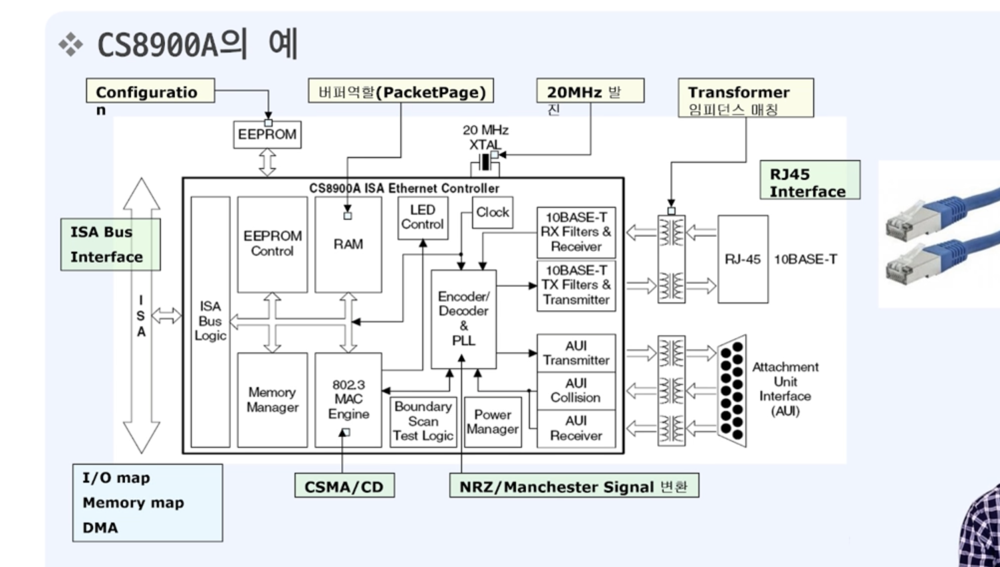

# 한 번에 끝내는 컴퓨터 공학 전공필수 & 인공지능심화

## 네트워크와 인터넷

- 종단시스템(end system): 네트워크 **송수신** 주체(e.g. PC, 스마트폰)
- 프로토콜(protocol): 두 이종 시스템을 연결하기 위한 규약
- 인터넷: 네트워크와 연결된 상태
- OSI 7 계층: 네트워크 구성요소를 7개의 계층으로 역할을 나눈 표준모델
- IP주소: 통신 자료를 최종적으로 전달하기 위한 송/수신 위치정보
- 패킷교환: 종단간에 전송되는 데이터는 패킷 단위로 전달된다

## 통신을 위한 기본 동작

- 요청(Request): 전송하는 장치에서 상대방에 서비스를 요청
- 인지(Indicate): 수신하는 장치에서 작업요청을 확인
- 응답(Response): 수신하는 장치에서 요청받은 작업에 대해 응답
- 확인(Confirm): 전송하는 장치에서 응답데이터를 최종적으로 확인

## 네트워크 유형

- LAN(Local Area Network)  
  - 일정그룹의 지역 네트워크(집, 사무실, 학교 등)
  - 소규모로 묶이며 사설망 등을 구축해 연결
- WAN(Wide Area Network)
  - 원거리 통신망으로 넓은 범위 연결(국가, 대륙 등)
- 크기 유형: LAN < WAN < Internet

## 네트워크 토폴로지 (구성형태)

## OSI 7 계층 vs TCP/IP

## 물리계층(physical layer)

- 물리적 매체(Transmission medium)를 통한 비트 스트림 전송에 요구되는 기능
- 주요기능  
  - 비트의 동기화: 송신자와 수신자는 같은 **클록** 사용
  - 데이터의 속도: 신호가 유지되는 비트의 주기
  - 비트의 표현: 비트를 전송하기 위해 전기적 또는 광학적 신호로 부호화

- 물리계층을 다루기 위한 하드웨어 칩 (이더넷 칩)

### MAC (Medium Access Control)

- 내가 보내는 중에 상대도 보내면 충돌이 발생 -> 자유경쟁 (회선을 경쟁적으로 사용)
- 충돌발생시: 잼신호를 보낸다 -> 일정시간 대기 (16번까지 재시도)
