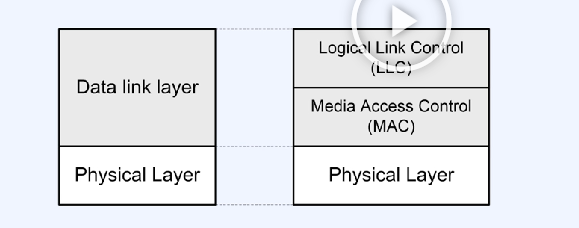
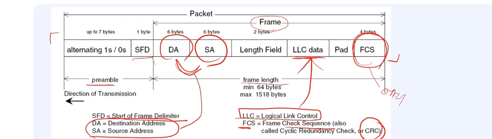
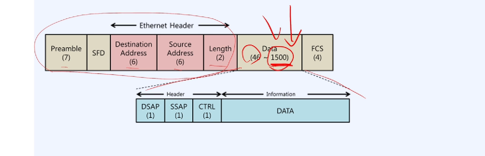
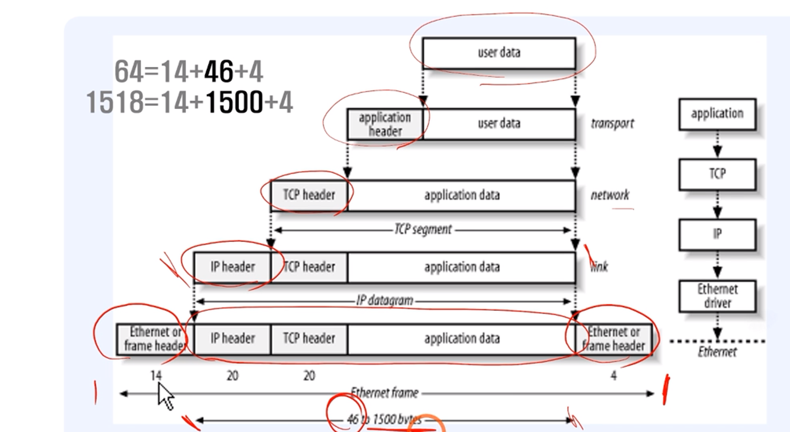

# 한 번에 끝내는 컴퓨터 공학 전공필수 & 인공지능심화

## 네트워크 디바이스

- NIC(Network Interface Controller)
- bps: bit per second

## 이더넷 계층구조

- Data link layer
- LLC(Logical Link Control): 흐름제어와 오류제어
- MAC(Media Access Control): CSMA/CD 접근방법에 대한 동작

## 이더넷 프레임(Frame) 포맷

- 프레임의 길이

## 칩의 레지스터

- 레지스터: 칩의 공간. 제어 목적으로 저장 목적으로 나누어져있다.
- 기본 주소(base address)에 0x000A(ADD_PORT) 를 더해서 결정된다
