# 컴퓨터네트워크-Ch02. 네트워크 계층별역할

## IP와 함께 사용되는 프로토콜

- IP는 다음 홉의 **MAC 주소**를 알아내기 위해 **ARP 프로토콜** 사용
- IP는 메시지를 제어하고 오류제어를 위해 **ICMP 프로토콜** 사용
- IP는 멀티캐스팅을 위해 **IGMP** 사용

## ARP가 사용되는 4가지 경우

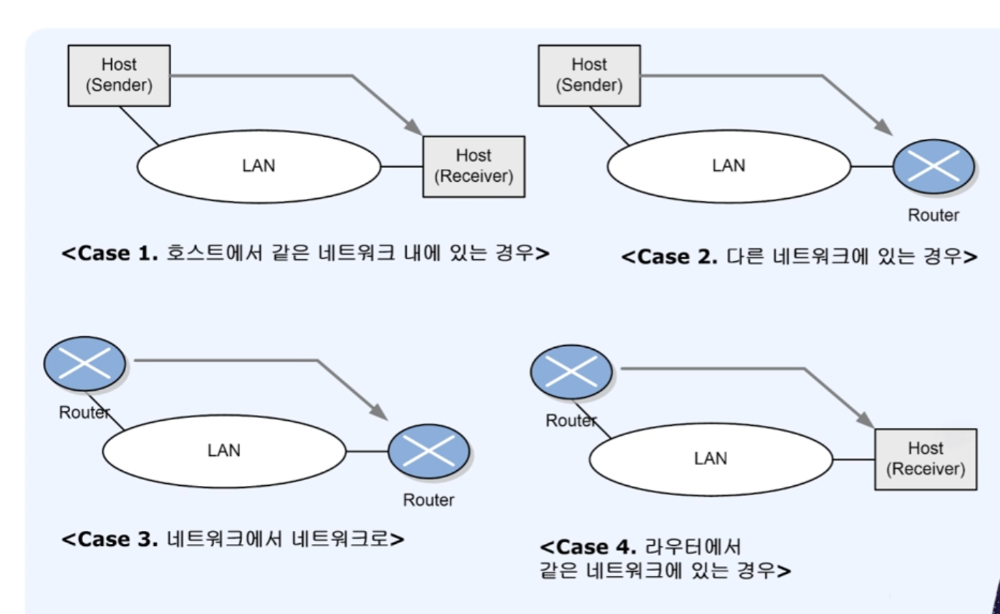

## ARP 맵핑 유형

- 동적 맵핑(Dynamic mapping)
  - 물리주소와 논리주소 쌍 중 하나만 알면 프로토콜을 이용하여 다른 하나를 알아낼 수 있다
  - ARP: 논리주소를 물리주소로 변환
  - RARP: 물리주소를 논리주소로 변환

## ARP 요청과 응답

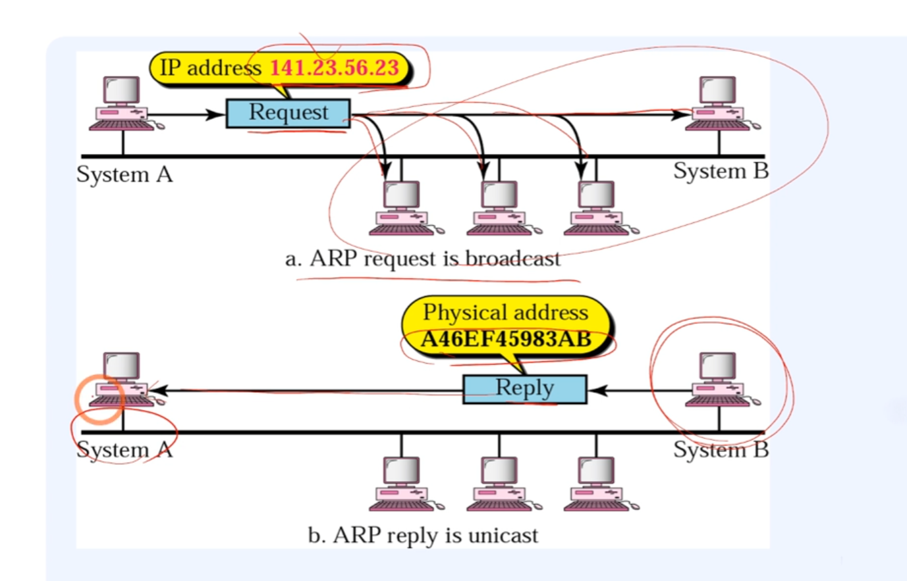

## ARP 패킷 형식

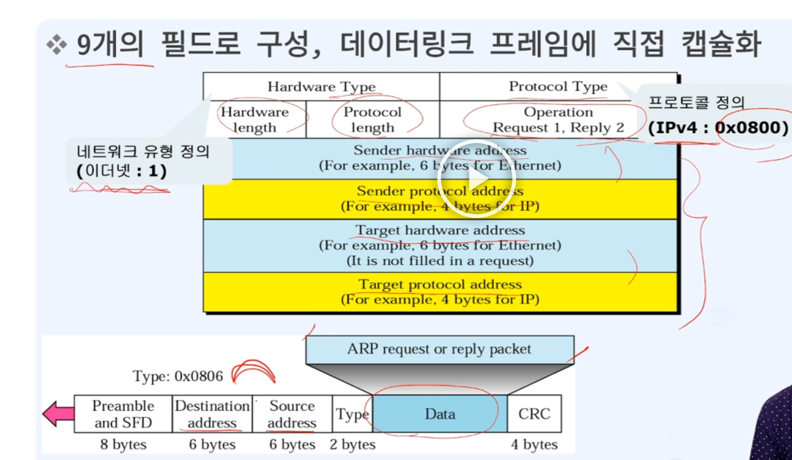

## ICMP 개요

- IP 인터넷 프로토콜의 약점
  - IP는 오류보고와 오류정정메커니즘이 없음
  - IP는 호스트와 관리질의를 위한 메커니즘이 부족
- 이에 대한 해결책으로 ICMP 사용

## IPv6 개요

- IPv4의 문제점
  - IPv4 주소 공간 한계
  - IPv4 최소지연과 자원의 예약불가
  - IPv4 보안메커니즘(암호화와 인증)을 제공하지 않음

## IPv6 표현

- 128bits
- 16진수 4자리씩 표현법
  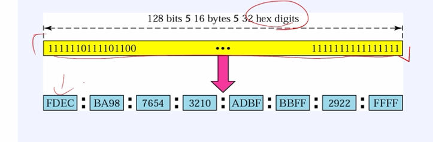
- 생략형(abbreviation)
  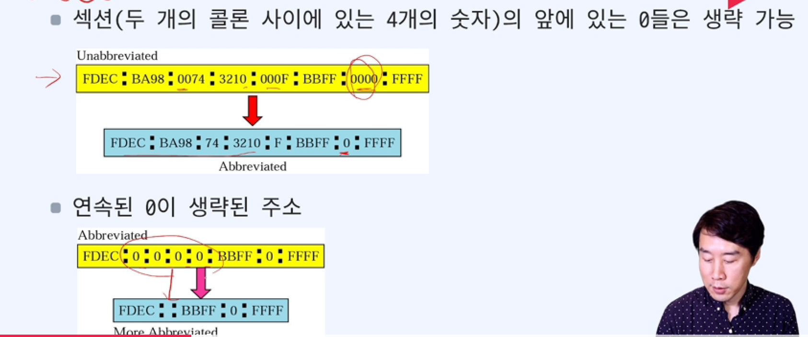

## IPv4 vs IPv6 체계

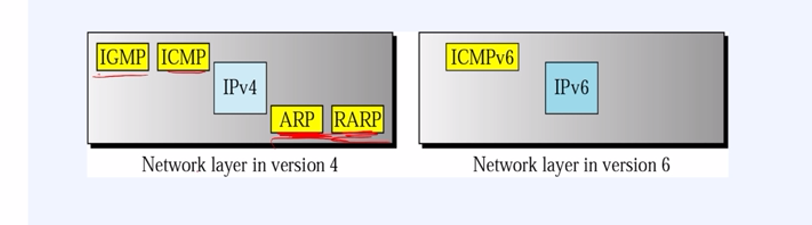

## IPv6 이중스택(dual stack)

- IPv4와 IPv6 동시에 동작
  - 발신지 호스트는 어떤 버전을 사용할 것인가를 결정하기 위해 DNS에 질의
    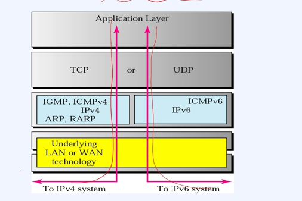

## IPv6 - 터널링

- IPv6를 사용하는 두 컴퓨터가 통신할 때 중간노드가 IPv4를 사용할 경우
  - IPv6 패킷을 IPv4 패킷으로 캡슐화하여 전달한다.

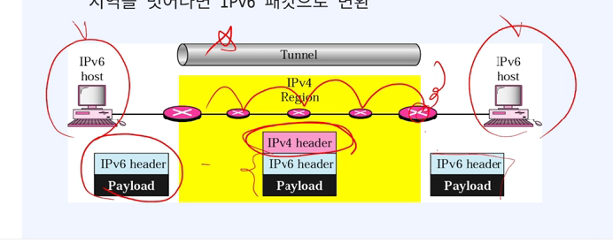

## 프로세스 간 전달

- Data link layer: Nodo-to-Node
- Network layer: Host-to-Host
- Transport layer: Process-to-Process

## 소켓 주소

- IP주소와 포트번호의 조합

## 포트

- TCP나 UDP를 사용할 때의 상호간의 이동통로
- 클라이언트는 서버와 접속할 때 (임시) 포트번호를 할당받아 사용
- server
  - bind()을 통해 자신의 port 번호를 명시함
  - port 번호를 `0`으로 지정한 경우 시스템에서 임의의 포트 번호를 할당
- client
  - connect() 시에 임의의 포트번호를 할당받는다

## 바이트와 세그먼트

- 세그먼트: 다수의 바이트를 묶어서 그룹화
  - 세그먼트에 헤더를 붙이고 IP계층으로 전달

## 계층별 데이터이름

- TCP(transport layer): segment
- IP(network layer): datagram
- Ethernet(datalink layer): frame

## TCP 구조-제어를 위한 코드 비트

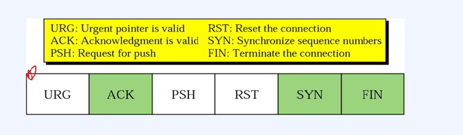

## TCP 플래그

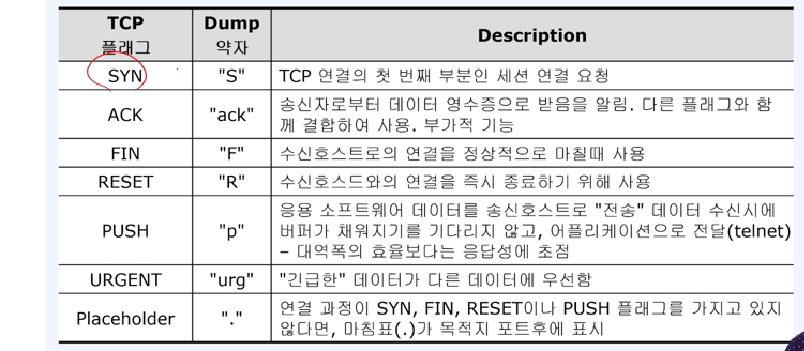

## 3-way handshake: TCP의 연결확정과정

1. 클라이언트가 서버로 SYN(Synchronize)신호보냄
2. 서버가 응답으로 SYN, ACK 신호를 보낸다
3. SYN, ACK를 정상 수신하면 응답으로 다시 ACK를 보낸다

## TCP 상태 천이도 다이어그램

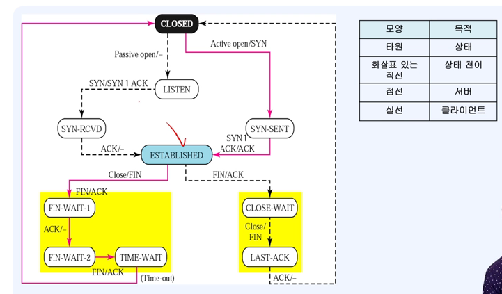

## 소켓 프로그래밍 연결 시나리오

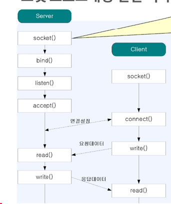

- SERVER
  - socket(): 명시적 연결설정(e.g. 인터넷 프로토콜과 데이터그램으로 연결)
  - bind(): 소켓을 시스템에 부착한다. 소켓은 이때부터 외부로투어의 연결점을 가진다(param. 주소와 주소길이)
  - listen(): 외부로부터 TCP연결을 받아들일 수 있도록 접속 연결 큐를 만들고 대기한다(param. 큐의 크기 결정)
  - accept(): 클라이언트의 요청을 받아들인다  
    하나의 요청처리시 대기현상을 없애기 위해서 fork()함수 이용
  - read(): 서버의 패킷 데이터 읽어오기
  - write(): 데이터보내기

## Socket의 옵션

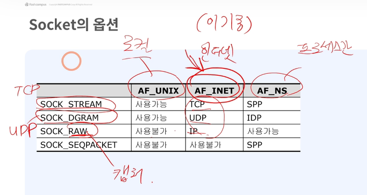

- AF_UNIX: 로컬
- AF_INET: (이기종통신) 인터넷
- AF_NS: 프로세스간 통신

## 흐름제어

- 목적지로부터 확인 응답을 받기 전에 발신지가 송신할 수 있는 데이터의 양을 정의
- TCP는 응용프로그램으로부터 전달된 데이터 버퍼에 부여돼 송신할 준비가 되어 있는 윈도우를 정의
- TCP는 슬라이딩 윈도우 프로토콜에 정의된 최대한 많은 양의 데이터를 송신

## Sliding window

- 송신 측의 슬라이딩 윈도우는 데이터프레임이 보내지면 왼쪽으로 줄어든다
- 송신 측의 슬라이딩 윈도우는 확인응답 ACK를 받으면 오른쪽으로 확장한다

## 오류제어

- 손상된 세그먼트, 유실된 세그먼트, 순서가 어긋난 세그먼트, 중복된 세그먼트들을 찾아내기 위한 기법을 포함
- 사용도구
  - Checksum
  - 확인응답
  - time-out
