# 스프링 DB 2편 - 데이터 접근 활용기술

## 섹션 9. 스프링 트랜잭션 이해

### 학습목표

- 스프링 트랜잭션을 더 깊이 이해하기
  - `@Transactional`을 붙였을 때 내부동작
  - 다양한 기능들

### 복습 (스프링 트랜잭션)

#### 스프링 트랜잭션 추상화

- 각각의 데이터 접근 기술들은 트랜잭션을 처리하는 방식에 차이가 있다  
  e.g. JDBC 트랜잭션 처리와 JPA 트랜잭션 처리가 (코드가) 상이하다 -> 코드를 변경해야한다
- 스프링 트랜잭션 추상화를 통해 데이터 접근 기술들을 동일한 방식으로 사용할 수 있다
- 스프링은 `PlatformTransactionManager` 인터페이스를 제공
  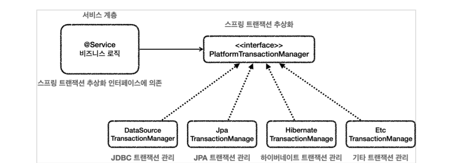
- 서비스는 인터페이스에 의존하고 구현체를 쉽게 갈아끼울 수 있다
- 스프링에서 이미 각 데이터접근기술에 대한 트랜잭션매니저 구현체도 제공해준다
- **스프링부트**는 데이터접근기술을 인식해서 적절한 트랜잭션 매니저를 스프링 빈으로 등록해준다

#### 스프링 트랜잭션 사용방식

- 스프링트랜잭션 `PlatformTransactionManager` 를 사용하는 방식에는 크게 두가지가 있다
  - 선언적 트랜잭션 관리, 프로그래밍 방식 트랜잭션 관리

#### 선언적 트랜잭션 관리 vs 프로그래밍 방식 트랜잭션 관리

- 선언적 트랜잭션 관리(Declarative Transaction Management)
  - `@Transactional` 애너테이션
- 프로그래밍 방식의 트랜잭션 관리

#### 선언적 트랜잭션과 AOP

- `@Transactional` 을 통한 선언적 트랜잭션관리는 프록시방식의 AOP 가 사용된다

#### 전체과정

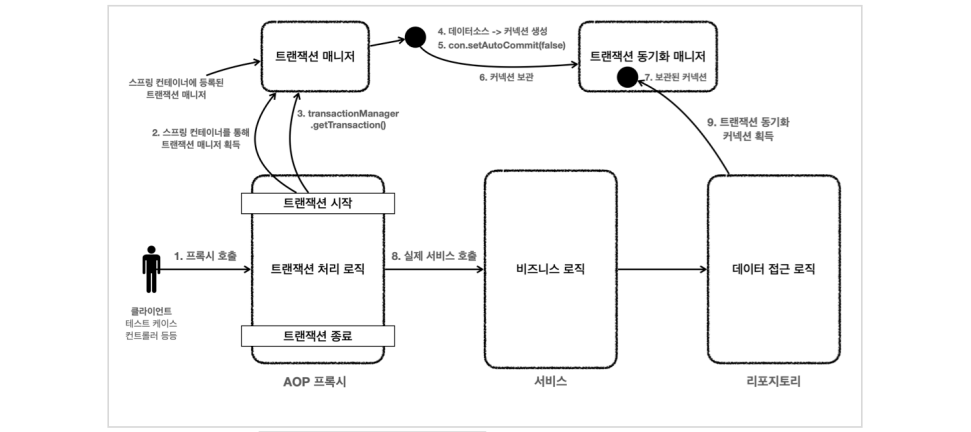

1. 클라이언트의 프록시 호출
2. 스프링 컨테이너를 통해 트랜잭션 매니저 획득
3. transactionManager.getTransaction()
4. 데이터소스 -> 커넥션 생성
5. con.setAutoCommit(false)
6. (트랜잭션 동기화매니저) 커넥션 보관
7. (데이터접근로직에서) 보관된 커넥션 접근
8. 실제 서비스 호출
9. 트랜잭션 동기화 커넥션 획득

### 트랜잭션 적용 확인

- 실제로 스프링 트랜잭션이 적용되고 있는지 확인하는 방법을 알아보자
  - `TransactionSynchronizationManager.isActualTransactionActive()`
  - 현재 쓰레드(Thread local)에 트랜잭션이 적용되어있는지 확인하는 용도
- `logging.level.org.springframework.transaction.interceptor=TRACE`
  트랜잭션 프록시가 호출하는 트랜잭션의 시작과 종료를 로그로 확인할 수 있다

#### 스프링 컨테이너에 트랜잭션 프록시 등록과정

- `@Transactional` 이 클래스나 메서드에 하나라도 있으면, 트랜잭션 AOP는 해당 클래스의 객체 대신 프록시 객체가 스프링 빈에 등록된다
  - 프록시는 클래스 단위로 생성된다. `@Transactional`이 적용 안되는 메서드 같은 경우 실제 객체에 위임한다
- 클라이언트 객체에는 프록시 객체가 의존관계 주입이 된다
- 프록시 객체는 해당 클래스의 객체를 상속해서 만들어지기 때문에 다형성 활용이 가능하다

### 트랜잭션 적용위치

- `Transactional` 적용 위치에 따른 우선순위를 확인해보자
  - 클래스에 `@Transactional(readonly = true)`, 메서드에는 `@Transactional(readonly = false)` 를 적용한 경우
- 스프링에서의 우선순위
  - 더 **구체적**이고 **자세한** 것이 높은 우선순위를 가진다
  - e.g. 메서드는 클래스보다 더 구체적이고 자세하다

### 프록시 내부 호출

- internal() 호출
  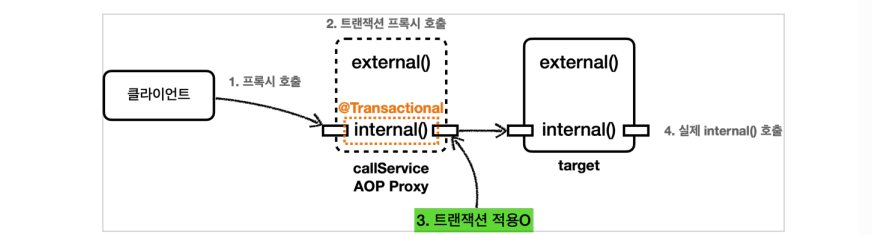
- external() 호출
  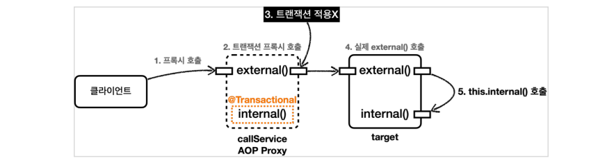

#### 문제원인

- 클래스 내부의 메서드를 호출할 때 `this.internal()` 이 되는데 여기서 `this`는 프록시 객체가 아닌 실제 대상 객체(`target`) 가 된다.

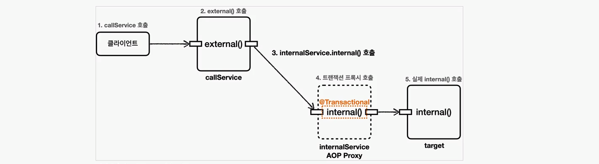

---

#### public 메서드만 트랜잭션 적용

- 스프링 트랜잭션 AOP 기능은 `public` 메서드에만 트랜잭션을 적용하도록 기본 설정이 되어있다
  - 스프링부트 3.0 부터는 `protected`, `package-visible` 에도 트랜잭션이 적용된다
- 트랜잭션은 주로 비즈니스 로직의 시작점에 걸기 때문에 대부분 외부에 열어준 곳을 시작점으로 사용한다

#### 트랜잭션 AOP 주의사항 - 초기화시점

- 스프링 초기화 시점에는 트랜잭션 AOP 가 적용되지 않을 수 있다
- 초기화코드(e.g.`@PostConstruct`) 와 `@Transactional`을 함께 사용하면 트랜잭션이 적용되지 않는다
  - 왜냐하면 초기화 코드가 먼저 호출되고, 그 다음에 트랜잭션 AOP 가 적용되기 때문

##### 대안 `ApplicationReadyEvent`

- `ApplicationReadyEvent`은 트랜잭션 AOP를 포함한 스프링 컨테이너가 완전히 생성되고 난 다음에 호출된다

#### 트랜잭션 옵션

##### value, transactionManager

- 등록된 트랜잭션 매니저가 둘 이상이라면 다음 속성에서 사용할 트랜잭션 매니저의 이름을 지정해준다

##### rollBackFor

- 이 옵션을 사용하면 어떤 예외가 발생할 때 롤백할 지 지정할 수 있다

##### 예외 발생시 스프링 트랜잭션의 기본정책

- 언체크예외 발생시 롤백: `RuntimeException`, `Error`와 그 하위
- 체크예외 발생시에도 커밋: `Exception`

##### isolation

- 트랜잭션 격리 수준을 지정할 수 있다
- 기본 값은 데이터베이스에서 설정한 트랜잭션 격리 수준을 사용하는 `DEFAULT`

##### timeout

- 트랜잭션 수행시간에 대한 타임아웃을 초 단위로 지정가능
- 기본 값은 데이터베이스 시스템의 타임아웃을 사용
- 운영환경에 따라 동작하지 않을 수도 있음

##### readOnly

- 트랜잭션은 기본적으로 읽기 쓰기가 모두 가능하다
- `readOnly=true` 옵션을 사용하면 읽기전용 트랜잭션이 생성된다
- JPA: 플러시를 호출하지 않고, 스냅샷 객체를 생성하지 않아 최적화가 발생한다

#### 예외와 트랜잭션 커밋, 롤백

##### WHY 체크예외는 커밋, 언체크예외는 롤백 ?

- 스프링은 다음과 같이 예외에 대하여 정책을 세운다
  - 체크예외: 비즈니스 상황에서의 예외
  - 언체크예외: (복구불가능한, 처리불가능한)시스템의 예외

#### 트랜잭션이 수행중인데 다시 트랜잭션이 추가로 실행되면?

- 내부 트랜잭션이 외부(처음) 트랜잭션에 참여한다

#### 물리 트랜잭션, 논리 트랜잭션

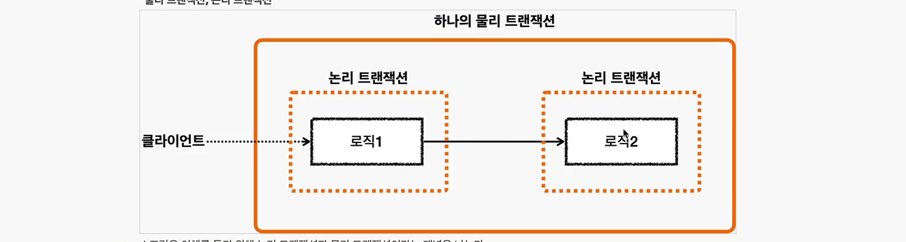

원칙

- 모든 논리 트랜잭션이 커밋되어야 물리 트랜잭션이 커밋된다
- 하나의 논리 트랜잭션이라도 롤백되면 물리 트랜잭션은 롤백된다
- 내부 트랜잭션은 직접 물리 트랜잭션에 관여하지 않는다
  - 외부트랜잭션에서 시작한 물리트랜잭션의 범위가 내부트랜잭션까지 사용된다

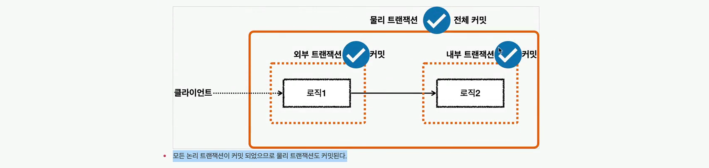
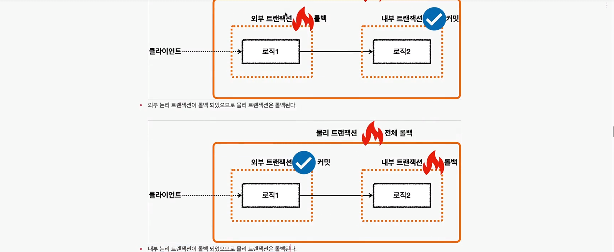

---

#### 외부롤백

- 내부트랜잭션은 커밋되었는데, 외부트랜잭션이 롤백되는 상황

- 논리 트랜잭션이 하나라도 롤백되면 전체 물리트랜잭션은 롤백된다

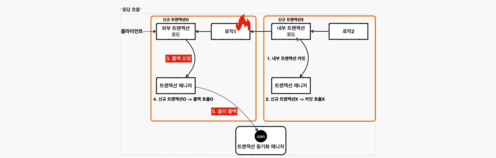

#### 내부 롤백

- 트랜잭션 매니저는 신규 트랜잭션 여부에 따라 커밋이 다르게 동작한다
  - 신규 트랜잭션이 아니면 커밋을 해도 (물리트랜잭션에) 커밋이 호출되지 않는다

- 어떻게 전체 롤백을 시킬까?
  - 내부 트랜잭션은 트랜잭션 동기화 매니저에 `rollbackOnly=true` 표시를 한다

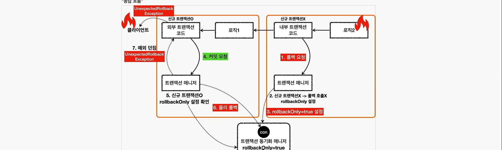

- 개발자는 커밋을 시도했지만, 롤백이 발생했다는걸 알려주기 위해 `UnexpectedRollbackException` 발생한다

#### 내부, 외부 롤백 총정리

- 논리 트랜잭션이 하나라도 롤백하면 물리트랜잭션은 롤백된다
- 내부 논리트랜잭션이 롤백되면 롤백 전용마크를 표시한다
- 외부 트랜잭션을 커밋할 때 롤백 전용마크를 확인한다
  - 롤백 전용마크가 표시되어있으면 물리트랜잭션을 롤백하고, `UnexpectedRollbackException` 발생
- 모든 논리 트랜잭션이 커밋되어야 물리 트랜잭션이 커밋된다
- 하나의 논리 트랜잭션이라도 롤백되면 물리 트랜잭션은 롤백된다

#### 옵션 REQUIRES_NEW

- 외부 트랜잭션과 내부 트랜잭션을 완전히 분리해서 각각 별도의 물리 트랜잭션을 사용하는 방법
  - 커밋과 롤백 각각 별도로 이루어진다
  - 내부 트랜잭션을 시작할 때 `REQUIRES_NEW` 옵션을 사용하면 된다

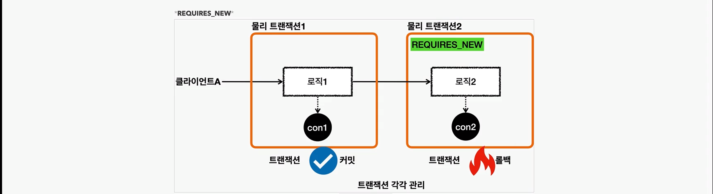

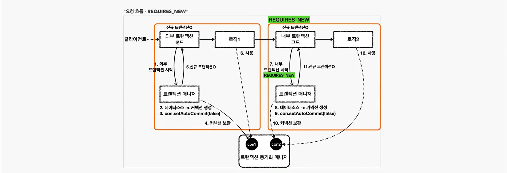

- `REQUIRES_NEW` 를 사용하면 데이터베이스 커넥션이 동시에 2개 사용된다

#### 전파옵션

- 실무에서는 대부분 `REQUIRED` 사용, 아주 가끔 `REQUIRES_NEW`를 사용

##### REQUIRED

- 기본설정
- 기본 트랜잭션이 없으면 생성하고, 있으면 참여한다

##### REQUIRES_NEW

- 항상 새로운 트랜잭션을 생성한다
