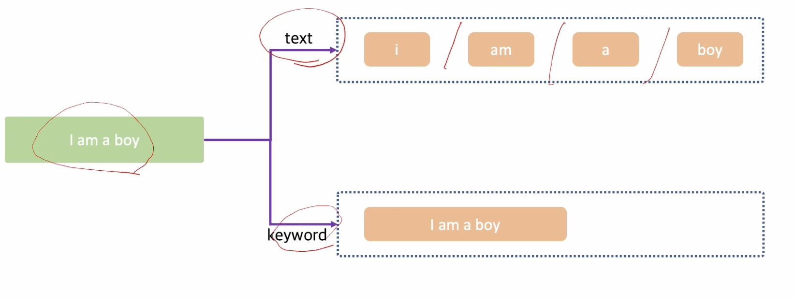

# ElasticSearch Essential

## ElasticSearch 소개

- ElasticSearch란
  - 루씬(자바 라이브러리) 기반의 오픈소스 검색엔진
  - JSON 기반의 문서를 저장하고 검색할 수 있으며 분석작업도 가능합니다
- ElasticSearch의 특징
  - 1. 준실시간 검색시스템: 실시간이라고 생각될만큼 색인된 데이터가 빠르게 검색됩니다
    - `refresh_interval` 변수를 통해 조절가능
  - 2. 고가용성을 위한 클러스터 구성: 한 대 이상의 노드로 클러스터를 구성하여 높은 수준의 안정성을 달성하고 부하 분산이 가능합니다
  - 3. 동적스키마 생성
    - 입력될 데이터들에 대해 미리 스키마를 정의하지 않아도 동적으로 스키마 생성이 가능합니다
  - 4. REST API 기반의 인터페이스
    - REST API 기반의 인터페이스를 제공하여 비교적 사용을 위한 진입장벽이 낮습니다

## 클러스터와 노드 이해하기

- 클러스터의 정의
  - 컴퓨터 클러스터는 여러 대의 컴퓨터들이 연결되어 하나의 시스템처럼 동작하는 컴퓨터들의 집합
- ElasticSearch 도 **여러 대의 노드들**이 각자의 역할을 바탕으로 연결되어 **하나의 시스템처럼 동작**합니다
  - 그래서 어떤 노드에 어떤 요청을 해도 동일한 응답을 줍니다
  - 하지만 불필요한 요청과응답을 줄이기 위해 (로드밸런스를 통해) 각 노드들이 본연의 역할에 충실할 수 있도록 구성해야합니다
- 노드의 종류

  | 종류            | 역할                                  |
  | --------------- | ------------------------------------- |
  | 마스터노드      | 클러스터 상태 관리 및 메타데이터 관리 |
  | 데이터노드      | 문서색인 및 검색요청처리              |
  | 코디네이팅 노드 | 검색요청처리                          |
  | 인제스트노드    | 색인되는는 문서의 데이터 전처리       |

- 마스터 노드와 마스터 후보 노드
  - 마스터 노드가 죽으면 마스터후보노드(master-eligible) 중에서 새로운 마스터가 됩니다

## 인덱스와 샤드 이해하기

| ElasticSearch | RDBMS    |
| ------------- | -------- |
| index         | database |
| mapping       | schema   |
| document      | row      |

- 인덱스란
  - 문서가 저장되는 논리적인 공간
  - 인덱스를 설계하는 것이 ElasticSearch를 사용하기 위해 고려해야하는 첫단계입니다
    - 설계: 문서들을 어떤 인덱스에 어떻게 저장할 것인가?
  - 인덱스 설계에 따라 **문서의 구조** 및 **검색쿼리**들이 달라집니다
    - 사용패턴과 문서의 특성에 따라 설계해야합니다

| 케이스                    | 장점                                                       | 단점                                                        |
| ------------------------- | ---------------------------------------------------------- | ----------------------------------------------------------- |
| 하나의 인덱스를 사용할 때 | 관리해야 할 인덱스의 수가 적어 관리 리소스가 적게 발생한다 | 쿼리와 문서의 구조가 복잡해질 수 있다                       |
| 여러개의 인덱스로 나눌 때 | 각각의 경우에 최적화된 쿼리와 문서구조를 사용할 수 있다    | 관리해야 할 인덱스의 수가 많아 관리 리소스가 발생할 수 있다 |

- 인덱스 설계 정리: 하나의 인덱스로 단순하게 시작해서 사용패턴에 따라 인덱스를 별도로 운영
- 샤드란
  - 인덱스에 색인되는 문서가 저장되는 공간
- 샤드의 종류
  - 프라이머리 샤드: 문서가 저장되는 원본샤드, 색인과 검색 성능에 모두 영향을 줌
  - 레플리카 샤드: 프라이머리 샤드의 복제샤드, 검색성능에 영향을 줌, 프라이머리 샤드에 문제가 생기면 레플리카 샤드가 프라이머리 샤드로 승격
  - 프라이머리 샤드는 문서가 저장되는 원본샤드, 레플리카 샤드는 프라이머리 샤드의 복제 샤드
- 샤드설정
  - 샤드는 인덱스를 생성할 때 설정한다
- 샤드 라우팅
  - 문서가 샤드에 저장되는 순서, 방법
  - 문서들은 샤드에 고르게 저장됩니다
  - 문서가 라우팅 되는 규칙은 (문서의 ID) % (샤드의 개수)이기 때문에 인덱스 생성 이후 프라이머리 샤드 개수 변경은 불가합니다
    - 따라서 인덱스를 생성할 때 프라이머리 샤드의 개수를 설정하는 건 매우 중요합니다
- 인덱스 템플릿을 통해 인덱스 생성 시의 샤드 개수를 미리 설정할 수 있습니다

## 매핑 이해하기

- 매핑이란
  - 문서의 구조를 나타내는 정보
- 매핑의 종류
  - 동적매핑: 처음 색인되는 문서를 바탕으로 매핑정보를 es가 동적으로 생성
  - 정적매핑: 문서의 매핑정보를 미리 정의
- 매핑 정보가 생성된 후에는 타입이 안맞을 경우 파싱 에러가 발생합니다
- 정적매핑 사용하는 이유
  - 문서의 필드들이 가지는 값에 따라 타입을 지정해줄 필요가 있을 때
    - e.g. float 최대값을 넘는 값이 들어갈 경우
  - 불필요한 색인이 발생하지 않게 하기 위해
    - e.g. 문자열 필드마다 자동생성되는 keyword 타입

## 색인(indexing) 과정 이해하기

- 문서를 **분석하고 저장하는 과정**을 색인이라고 정의합니다
  - 분석하여 inverted index를 만드는 과정
  - 색인은 인덱스를 생성하고, 매핑을 확인하고, inverted index를 생성하고 문서를 저장하는 일련의 과정
  - 색인은 프라이머리 샤드에서 일어납니다
- 적절한 수의 샤드 개수를 결정하는 것이 성능에 큰 영향을 미칩니다
  - 노드마다 샤드의 개수가 고르게 분배되지 않으면 용량 불균형이 일어날 수 있습니다
  - 처음부터 완벽한 샤드 배치 계획을 세울 순 없습니다
  - 성능에 문제가 있다면 샤드의 수를 늘리거나 데이터 노드를 스케일 아웃/업 하면서 최적의 수치를 찾아갑니다
- 색인 성능에 문제가 있다면 클라스터 로서의 이점을 살리고 있는지 먼저 살펴봐야합니다
  - 가능한 많은 노드가 색인에 참여하고 있는지, 색인에 참여하는 노드는 CPU를 잘 활용하고 있는지

## 검색 과정 이해하기

- 검색어분석 > inverted index 검색 > 검색결과표시
  - 검색어분석: analyzer 적용을 통해 토큰을 만들어낸다
  - inverted index 검색: 만들어진 토큰으로 검색
- inverted index란?
  - 문자열을 분석한 결과를 저장하고 있는 구조체
- 애널라이저 (analyzer)
  - 문자열을 분석해 inverted index 구성을 위한 토큰을 만들어내는 과정
  - 문자열 > character filter > tokenizer > token filter > tokens
    - 애널라이저: character filter, tokenizer, token filter
- 검색요청은 프라이머리 샤드와 레플리카 샤드 모두가 처리할 수 있습니다
  - 색인요청은 주로 프라이머리 샤드가 처리한다
- 검색 성능에 문제가 있다면 클라스터 로서의 이점을 살리고 있는지 먼저 살펴봐야합니다
  - 가능한 많은 데이터노드가 검색에 참여하고 있는지, 검색에 참여하는 노드는 (샤드의) CPU를 잘 활용하고 있는지
  - number_of_shad 는 변경불가, number_of_replicas는 변경가능

## 검색과 색인 정리

- 애널라이저를 통해 색인과정에서 문자열을 분석하고 토큰들이 생성되며 이 토큰들이 inverted index를 구성합니다
- 애널라이저를 통해 검색어로부터 생성된 토큰들을 inverted index에서 찾는 과정을 검색이라고 합니다
- 즉, 색인과 검색할 때 사용하는 애널라이저가 동일하여야한다.
- 성능
  - 색인과 검색 모두 **적절한 샤드의 수가 성능을 결정**하며, 적절한 샤드의 수가 클러스터로서의 이점을 활용하느냐 아니냐를 결정합니다
  - Elasticsearch는 클러스터로 구성되기 때문에 **모든 노드가 색인과 검색을 처리할 수 있도록 구성**하는 것이 중요합니다

## text와 keyword 타입 이해하기

- text와 keyword 타입
  - 둘 다 문자열을 나타내기 위한 타입입니다
- text 타입은 전문검색(full-text search)를 위해 토큰이 생성됩니다
- keyword 타입은 exact matching 을 위해 토큰이 생성됩니다
  
- keyword 타입이 색인속도가 더 빠릅니다
- 문자열 필드가 동적매핑 되면 text와 keyword 타입 두 개가 모두 생성됩니다
  - 따라서 문자열의 특성에 따라 text와 keyword를 정적매핑 해주면 성능에 도움이 됩니다
  - (예시) text로 정의되면 좋을만한 필드: 주소, 이름, 물품 상세정보, ...
  - (예시) keyword로 정의되면 좋을만한 필드: 성별, 물품 카테고리, ...
