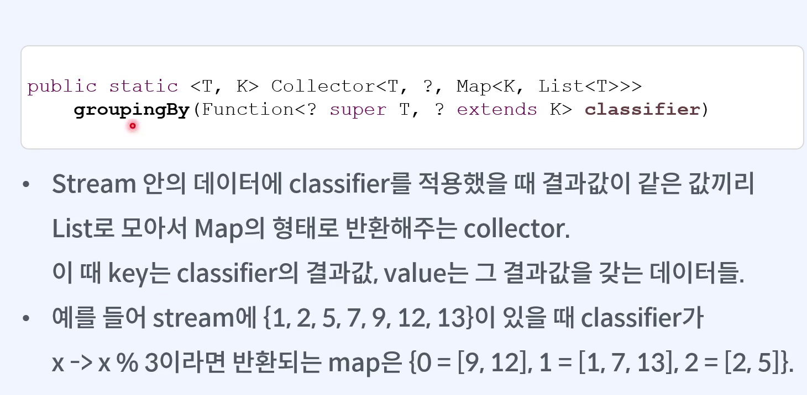
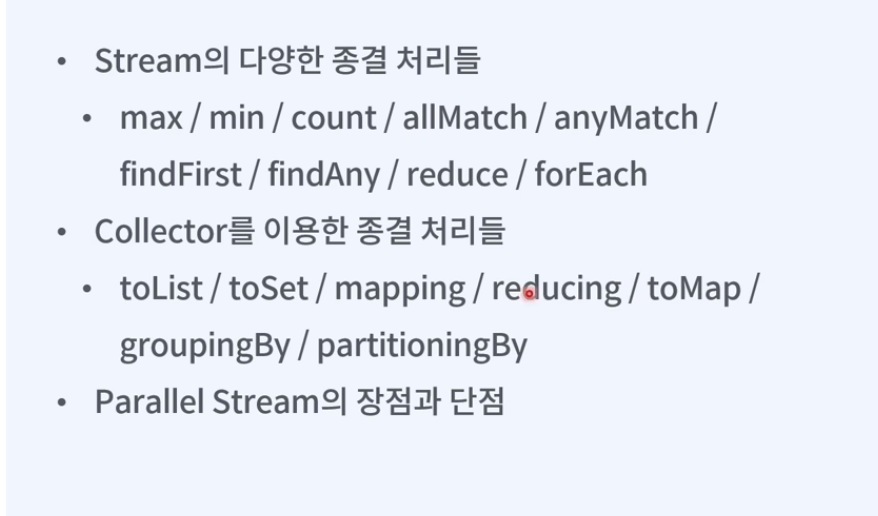

# The Red: JAVA STREAM 강의

## 명령형 프로그래밍 vs 선언형 프로그래밍

### 예시

- 동사형태의 문제해결에 선언형프로그래밍(함수형프로그래밍)이 편리하다

## 1급 시민으로서의 조건

- 함수/메서드의 매개변수로서 전달할 수 있는가
- 함수/메서드의 반환값이 될 수 있는가
- 변수에 담을 수 있는가

### 자바에서는 함수를 오브젝트(객체) 형태로 다루면 되겠다

- 함수를 오브젝트 형태로(1급 시민으로서 사용하기 위해) 만들고 싶을 때마다 새로운 (구현한)클래스를 정의해야하나?

## 함수의 구성요소

- 함수의 이름
- 반환값의 타입(return type)
- 매개변수(parameters)
- 함수의 내용(body)

## Lambda Expression - 이름이 없는 함수(Anonymous function)

- 매개변수 타입이 유추 가능할 경우 타입생략가능
- 매개변수가 하나일 경우 괄호생략 가능
- 바로 리턴하는 경우 중괄호 생략가능

## Functional Interface

- 단 하나의 abstract method 만을 가지는 인터페이스
  - Single Abstract Method interface)
- Supplier: 아낌없이 주는 나무

  ```@FunctionalInterface
  public interface Supplier<T> {
    T get();
  }
  ```

- Consumer: 먹보

  ```@FunctionalInterface
  public interface Consumer<T> {
    void accept(T t);
  }
  ```

- BiConsumer: 더 먹보

  ```@FunctionalInterface
  public interface BiConsumer<T, U> {
    void accept(T t, U u);
  }
  ```

- Predicate: 진실 혹은 거짓

  ```@FunctionalInterface
  public interface Predicate<T> {
    boolean test(T t);
  }
  ```

- Comparator: 비교를 위한 인터페이스

  ```@FunctionalInterface
  public interface Comparator<T> {
    int compare(T o1, T o2);
  }
  ```

## Method reference

- 기존에 이미 선언되어 있는 메서드를 지정하고 싶을 때
- `::` 오퍼레이터를 사용
- 생략이 많기 때문에 사용할 메서드의 매개변수의 타입과 리턴 타입을 미리 숙지해야함

## 메서드 레퍼런스의 4가지 케이스: 기존에 선언되어 있는 메서드를 지정하는 방법

- 클래스의 static method 를 지정할 때

  - `ClassName::staticMethodName`

  - ```Function<String Integer> str2int = Integer::parseInt;
    int five = str2int.apply("5");
    ```

- 선언된 객체의 instance method 를 지정할 때

  - `objectName::instanceMethodName`

  - ```String str = "hello";
    Predicate<String> equalsToHello = str::equals;
    boolean helloEqualsWorld = equalsHello.test("world");
    ```

- 객체의 instance method 를 지정할 때: 해당 클래스의 인스턴스를 매개변수(parameter)로 넘겨 메서드를 실행해주는 함수

  - `ClassName::instanceMethodName`

  - ```Function<String, Integer> strLength = String::length;
    int length = strLength.apply("Hello world!");

    BiPredicate<String, String> strEquals = String::equals;
    boolean result = strEquals.test("hello", "world");
    "hello".equals("world");
    ```

- 클래스의 constructor 를 지정할 때
  - `ClassName::new`

## 스트림

- 데이터의 흐름
- 컬렉션형태로 구성된 데이터를 람다를 이용해 **간결하고 직관적이게** 프로세스하게 해줌
- 기존 loop 형태를 대체
- 손쉽게 병렬처리를 할 수 있게 해준다

## Filter: 거름종이 같은 필터

- 만족하는 데이터만 걸러내는데 사용
- Prediacte 에 true를 반환하는 데이터만 존재하는 stream 을 리턴
- `Stream<T> filter(Prediacte<? super T> prediacate);`

## Map: 데이터의 변형

- 데이터를 변형하는데 사용
- 데이터에 해당 함수가 적용된 결과물을 제공하는 stream을 리턴
- `<R> Stream<R> map(Function<? super T, ? extends R> mapper)`

## Stream의 구성요소


- 여러 개의 중간 처리를 연결할 수 있다
  - Filter, map, sorted, distince, flatMap
- source: 스트림에 데이터를 공급
- intermediate operations: 데이터를 걸러내거나 변환하는 등 처리를 해주고
- terminal operation: 스트림의 데이터를 모아 반환해준다

## Sorted: 데이터의 정렬

- 데이터가 순서대로 정렬된 stream을 리턴
- 데이터의 종류에 따라 Comparator가 필요할 수 있음

```Stream<T> sorted();
Stream<T> sorted(Comparator<? super T> comparator);
```

## Distinct: 중복제거

- 중복되는 데이터가 제거된 stream을 리턴

```Stream<T> distinct();

```

## FlatMap: 스트림의 스트림을 납작하게

- Map + Flatten
- 데이터에 함수를 적용한 후 중첩된 **stream을 연결하여 하나의 stream으로 리턴**

```<R> Stream<R> flatMap(
  Function<? super T,
  ? extends Stream<? extends R>> mapper);
)
```

## NPE- NullPointerException: 함정카드 같은 에러

- Null 상태인 오브젝트를 레퍼런스 할 때 발생
- Runtime error 이기 때문에 실행전까지는 발생 여부를 알기 쉽지 않음

## Optional: 있을 수도 있고 없을 수도 있다

- Stream의 종결처리를 제대로 이해하기 위해서는 Optional 이 필요하다
- Null 일수도, 아닐 수도 있는 오브젝트를 담은 상자

## Optional: 만드는법

- of: Null 이 아닌 오브젝트를 이용해 Optional을 만들 때
- Empty: 빈 Optional을 만들 때
- ofNullable: null인지 아닌지 알지 못하는 오브젝트로 Optional을 만들때

## Optional: 안에 있는 값을 확인하고 꺼내는 법

- isPresent: 안의 오브젝트가 null인지 아닌지 체크, null이 아닐시 true
- get: Optional 안의 값을 추출. Null이라면 에러
- orElse: Optional이 Null이 아니라면 Optional 안의 값을, null이라면 other로 공급된 값을 리턴
- orElseGet: Optional이 null이 아니라면 Opional 안의 값을, null이라면 supplier로 공급되는 값을 리턴
- orElseThrow: Optional이 null이 아니라면 Optional 안의 값을, null이라면 exceptionSupplier로 공급되는 exception을 던짐

## Optional: 응용을 위해 알아야 하는 것들

- ifPresent: Optional이 null이 아니라면 action을 실행
- map: Optional이 null이 아니라면 mapper를 적용
- flatMap: mapper의 리턴값이 또 다른 Optional이라면 한 단계의 Optional이 되도록 납작하게 해줌

## max, min, count


## All Match/any Match


## Find First / Find Any


## Reduce

- 주어진 함수를 반복 적용해 stream 안의 데이터를 하나의 값으로 합치는 작업


## collect(): mapping


- map을 적용한 후 추가적인 Collector를 적용할 수 있게 해준다

- ToMap


- `Function.identity()`

## collect():Grouping By



- Stream 안의 데이터에 classifier 를 적용했을 때 결과값이 같은 값끼리 List로 모아서 Map의 형태로 반환해주는 collector
  - Key 는 classifier의 결과값, value는 그 결과값을 갖는 데이터들


## collect(): Partitioning By


- Grouping By와 비교하면 두 개의 그룹으로 나눌때 유용

## For Each


## Parallel Stream: stream을 병렬로


- numbers.parallelStream(); -> 바로 parallel 로 만들 수도 있고  
  numbers.stream().parallel(); -> 기존의 스트림을 중간에 parallel로 바꾸는 것도 가능하다
- 여러 개의 스레드를 이용하여 stream의 처리과정을 병렬화

### 장/단점


## 종결처리 정리



- Stream의 다양한 종결처리들
  - max: stream의 최대값
  - min: stream의 최소값
  - count: stream의 개수
  - allMatch: 주어진 Predicate을 모든 데이터가 만족할 때 true
  - anyMatch: 주어진 predicate를 하나라도 만족하면 true
  - findFirst: stream 내 첫번째 데이터를 꺼낼 때
  - findAny: 아무거나 하나 꺼낼 때 사용
  - reduce: 주어진 함수를 사용해 데이터를 하나의 값으로 합친다
  - forEach: 값을 리턴없이 주어진 consume을 모든 데이터에 처리할때 사용
- Collector를 이용한 종결처리들
  - toList:
  - toSet:
  - mapping: map을 적용하고 추가적인 collector를 적용할 수 있게 해준다
  - reducing: reduce 작업을 이용해 모아준다
  - toMap: map 형태로 모아준다
  - groupingBy: function 결과값이 같은 것끼리 모아준다
  - partitioningBy: predicate의 값이 true와 false로 모아준다

## Scope Closure Curry

- Scope(스코프 / 유효범위): 변수에 접근할 수 있는 범위
  - 함수 안에 함수가 있을 때 내부 함수에서 외부 함수에 있는 변수에 접근이 가능하다(lexical scope)
    그 반대는 불가능하다
- Closure- 내부 함수가 존재하는 한 내부 함수가 사용한 외부 함수의 변수들 역시 계속 조냊한다. 이렇게 lexcial scope를 포함하는 함수를 closure라 한다
- 이때 내부 함수가 사용한 외부 함수의 변수들은 내부 함수 선언 당시로부터 변할 수 없기 때문에 final로 선언하지 않더라도 암묵적으로 final로 취급된다

```public static Supplier<String> getStringSupplier() {
  String hello = "Hello";
  Supplier<String> supplier = () -> {
    String world = "World";
    return hello + world;
  };

  return supplier;
}
```

- curry: closure의 응용
  - 여러 개의 매개변수를 받는 함수를 중첩된 여러 개의 함수로 쪼개어 매개변수를 한 번에 받지 않고 여러 단계에 나눠 받을 수 있게 하는 기술

```BiFunction<Integer, Integer, Integer> add = (x, y) -> x + y;
=>
Function<Integer, Function<Integer, Integer>> add = x -> y -> x + y;
```

## Lazy Evaluation

- Lambda의 계산은 그 결과값이 필요할 때가(e.g. 종결처리) 되어서야 계산된다
- 이를 이용하여 불필요한 계산을 줄이거나 해당코드의 실행순서를 의도적으로 미룰 수 있다

## Function Composition: 함수 합성


- compose: 파라미터로 들어온 함수를 먼저 실행하고 그 다음 자신을 실행하도록 합성
- andThen: 자신을 먼저 실행하고 그 다음 파라미터로 넘어온 함수를 실행한다
  - 가독성 측면에서 andThen이 우수하다

## 디자인패턴


- 반복해서 등장하는 프로그래밍 문제들에 대한 해법들을 패턴화 해놓은 것


## 디자인패턴의 종류


## 빌더 패턴


## 데코레이터 패턴


## 전략패턴


## 템플릿 메소드 패턴


## 책임 연쇄 패턴


## 디자인 패턴 summary

- Builder pattern: 유저 인스턴스를 유연하게 만드는 방법
- Decorator pattern: 기능을 계속 추가
- Strategy pattern: 전략을 런타임에 갈아끼우는 방법
- template method pattern: 유저의 생성 과정을 템플릿화시키고 유저를 어떻게 검증하고 DB에 넣을지 세부과정을 위임한다.
- chain of responsibility pattern: step을 정의하고 step을 체인으로 정의한다
