# HTML/CSS/JS로 만드는 스타벅스 웹사이트

## HTML, CSS 그리고 JS

- HTML(Hyper Text Markup Language): 페이지의 제목, 문단, 표, 이미지, 동영상 등 **웹의 구조**를 담당

- CSS(Cascading **Style** Sheets): 실제 화면에 **표시되는 방법**(색상, 크기, 폰트, 레이아웃 등)을 지정해 콘텐츠를 꾸며주는 **시각적인 표현(정적)**을 담당

- JS(JavaScript): 콘텐츠를 바꾸고 움직이는 등 페이지를 동작시키는 **동적처리**를 담당

## 개발환경

- 로컬개발환경: 웹사이트를 개발할 우리의 컴퓨터 환경

## 웹표준

- 웹표준(Web Standard): 웹에서 사용되는 표준 기술이나 규칙  
  W3C의 표준화 제정단계의 '권고안(REC)'에 해당하는 기술
  - W3C: 표준화 제정 기구(단체)
- W3C의 표준화 제정단계
  - 1. 초안(Working Draft, WD)
  - 2. 후보권고안(Candidate Recommendation, CR)
  - 3. 제안권고안(Proposed Recommendation, PR)
  - 4. 권고안(W3C Recommendation, REC)

## 브라우저

- 크로스 브라우징: 다르게 작동되는 브라우저에서도, 동일한 사용자 경험(같은 화면, 같은 동작 등)을 줄 수 있도록 하는 기술
  - 최근에는 크로스 브라우징 이슈가 많이 줄었다

## 브라우저 인터페이스

- 창(window)
  
- 탭(Tab)
  
- 주소창(Address bar)
  
- **뷰포트(Viewport)**: 하나의 웹페이지가 출력(렌더링)되는 전체영역
  - 렌더링(Rendering): 브라우저의 뷰포트에 웹 사이트를 출력하는(그림 그려내는) 행위
    

## 웹에서 사용하는 이미지

- 비트맵(Bitmap): 픽셀이 모여 만들어진 정보의 집합  
  레스터(Raster) 이미지라고도 부른다
- 벡터(Verctor): 점, 선, 면의 위치(좌표), 색상 등 **수학적 정보**의 형태(Shape)로 이루어진 이미지

## 비트맵

- 정교하고 다양한 색상을 자연스럽게 표현
- 확대/축소 시 계단현상, 품질저하
- e.g. jpg, png

## 벡터

- 확대/축소에서 자유로움, 용량변화가 없음(수학적 정보이므로)
- 정교한 이미지를 표현하기 어렵다

## 비트맵-JPG(JPEG)(Joint Photographic coding Experts Group)

- JPG는 Full-color와 Gray-scale의 압축을 위해 만들어졌으며, 압축률이 훌륭해 사진이나 예술분야에서 많이 사용된다
- 특징
  - 손실압축(이미지가 손실되면서 압축되는 것, 용량이 획기적으로 줄어든다)
  - 표현 색상도(24비트, 약 1600만 색상)가 뛰어남
  - 이미지의 품질과 용량을 쉽게 조절가능
  - 가장 널리 쓰이는 이미지 포맷

## 비트맵-PNG(Portable Network Graphics)

- PNG는 Gif의 대체 포맷으로 개발되었다
- 특징
  - 비손실 압축
  - 8비트(256색상) / 24비트(약 1600만색상) 컬러이미지 지원
  - Alpha Channel 지원(투명도)
  - W3C 권장포맷

## 비트맵-GIF(Graphics Interchange Format)

- GIF는 이미지 파일 내에 이미지 및 문자열 같은 정보들을 저장
- 특징
  - 비손실 압축
  - 여러 장의 이미지를 한 개의 파일에 담을 수 있음(움짤, 애니메이션)
  - 8비트 색상만 지원(다양한 색상 표현에는 적합하지 않음)

## 비트맵-WEBP

- JPG, PNG, GIF를 모두 대체할 수 있는 구글이 개발한 이미지 포맷
- 특징
  - 완벽한 손실/비손실 압축지원
  - GIF 같은 애니메이션 지원
  - Alpha Channel 지원(손실, 비손실 모두)
  - IE 지원 불가

## 하위호환성

- 옛 버전 환경에서 특정 기술이 호환이 되는지 확인하는 개념

## 벡터-SVG(Scalable Vector Graphics)

- SVG는 마크업 언어(HTML/XML)기반의 벡터 그래픽을 표현하는 포맷
- 특징
  - 해상도의 영향에서 자유로움
  - CSS와 JS로 제어가능(색상이나 일부영역 추가/제거 정도로 가볍게 사용)
  - 파일 및 코드 삽입가능

## 특수문자용어

- `: 백틱, 그레이브
- `~`: 틸드, 물결표시
- `!`: Exclamation mark, 느낌표
- `@`: At sign, 앳, 골뱅이
- `#`: Sharp, Number sign, 샵, 우물정
- `^`: 캐럿(~ 이상일때 사용)
- `&`: Ampersand, 엠퍼센드
- `*`: 애스터리스크, 별표
- `-`: 하이픈, 대시, 마이너스
- `_`: Underscore, Low dash, 밑줄
- `=`: Equals sign
- `"`: Quotation mask
- `'`: Apostrophe, 작음따옴표
- `:`: colon, 콜론
- `;`: semicolon, 세미콜론
- `,`: comma, 쉼표
- `.`: period, dot
- `?`: Question mark, 물음표
- `/`: 슬래시
- `|`: 버티컬 바
- `\`: backslash, 백슬래시, 역 슬래시
- `()`: Parenthesis, 퍼렌서시스, 소괄호, 괄호
  - 외우는 팁: 둥근 괄호는 작은 괄호다
- `{}`: Brace, 중괄호
  - 외우는 팁: 둥근 괄호에서 튀어나왔다
- `[]`: bracket, 브래킷, 대괄호
- `<>`: Angle bracket, 앵글 브래킷, 꺽쇠괄호

## 오픈소스 라이센스

- 오픈소스란 어떤 제품의 소스코드나 설계도를 공개해놓은 것
- 라이센스: 저작권
- 중요한 것은 개인이 사용가능한가, (상업목적으로)기업이 사용가능한가

## Apache License

- 아파치 소프트웨어 재단에서 자체 소프트웨어에 적용하기 위해 만든 라이센스  
  개인적/상업적 이용, 배포, 수정, 특허신청이 가능

## MIT License

- MIT에서 소프트웨어 학생들을 위해 개발한 라이센스  
  개인 소스에 이 라이센스를 사용하고 있다는 표시만 지켜주면 되고, 나머지 사용에 대한 제약은 없음
  - 대부분 프로젝트에서 자동으로 오픈소스가 같이 빌드된다

## BSD License

- 버클리 캘리포니아대학에서 개발한 라이센스, MIT와 동일한 조건

## Beerware

- 오픈소스 개발자에게 맥주를 사줘야하는 라이센스

## vs code 프로젝트 단위

- vs code에서 프로젝트 단위는 폴더이다.

## Live Server

- Live Server는 개발을 위해 임시로 로컬 서버를 오픈하는 것입니다. 제품(Product)는 실제 호스팅 서버에(사용자들이 접근가능한) 업로드 해야합니다.

## `<!DOCTYPE html>`

- 문서(페이지)의 HTML **버전**을 지정
- DOCTYPE(DTD, Document Type Definition)은 마크업 언어에서 문서 형식을 정의하며, 웹 브라우저가 어떤 HTML **버전**의 해석방식으로 페이지를 이해하면 되는지를 (브라우저에게) 알려주는 용도
- `<!DOCTYPE html PUBLIC "-//W3C//DTD(..)`: XHTML

## `<html>`

- 문서의 **전체범위**: HTML 문서가 어디에서 시작하고, 어디에서 끝나는지 알려주는 역할

## `<head>`

- 문서의 **정보**를 나타내는 범위
  - 웹 브라우저가 해석할 웹 페이지의 제목, 설명, 사용할 파일위치, 스타일(CSS) 같은 웹페이지의 **보이지 않는 정보**를 작성하는 범위

## `<body>`

- 문서의 **구조**를 나타내는 범위
  - 사용자 화면을 통해 보여지는 로고, 헤더, 푸터, 내비게이션, 메뉴, 버튼, 이미지 같은 웹페이지의 **보여지는 구조**를 작성하는 범위

## lang

- HTML가 동작하는 환경의 언어(language)를 지정해준다

## `<link>`

- 외부 문서를 가져와 연결할 때 사용 (대부분 CSS 파일)
- `rel`(relationship) 속성: 가져올 문서와의 관계
- `href`(Hyper Text Reference) 속성: 가져올 문서의 경로

## favicon(Favorite Icon)

- HTML Favicon을 적용할 때는 이름을 favicon으로 하길 권장하며  
  주로, favicon.ico 또는 favicon.png로 사용된다

## `<meta>`

- `<meta>`는 HTML 문서의 제작자, 내용, 키워드 같은 여러 **정보**를 검색엔진이나 브라우저에게 제공
  - `charset`속성: (Character set)문자인코딩 방식
  - `name`속성: 정보의 종류, `content`: 정보의 값  
    e.g. `<meta name="author" content="HEROPY"/>` 제작자
  - `name="viewport"`: **모바일에서** 웹 페이지의 가로 너비를 모바일 환경의 가로 너비와 일치시키거나,(`width=device-width`) 웹 사이트가 처음 출력될 때 확대/축소 여부나 정도(`initial-scale=1.0`)를 결정하겠다는 것 같은 정보를 명시
- 문자인코딩(Encoding)이란 문자나 기호들을 컴퓨터가 이용할 수 있는 (바이너리)신호로 만드는 것을 의미한다.

## 경로

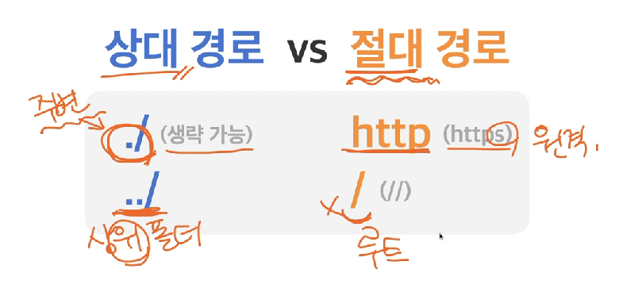

- `./images/heropy.png` 또는 `images/heropy.png`

## 개발자도구-element.style

- `element.style`은 CSS의 인라인 선언방식으로 스타일이 삽입됩니다
- 새로고침시 초기화

## Minify

- `파일명.min.확장자`에서처럼 min키워드는 파일이 난독화나 경량화되었다는 것을 의미합니다

## Emmet

- Emmet은 CSS선택자를 활용해 사용하는 기능
  - `*`은 곱하기, `{}`은 내용을 삽입, `$`은 순서대로 숫자입력을 의미한다

## 요소(element)

- `<태그>내용</태그>`

## 상위(조상)요소, 하위(후손)요소

- 부모요소: 바로 위 상위요소
- 상위(조상)요소: 모든 상위의 요소
- 자식요소: 바로 아래 하위요소
- 하위(후손)요소: 모든 하위의 요소

## 빈(empty) 태그

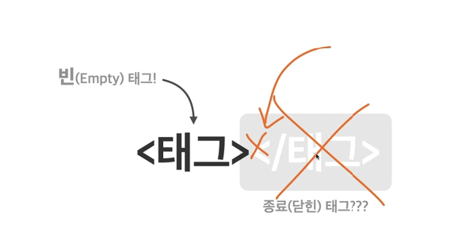

- HTML5에서는 2가지 빈태그형태2가지 빈태그형태
  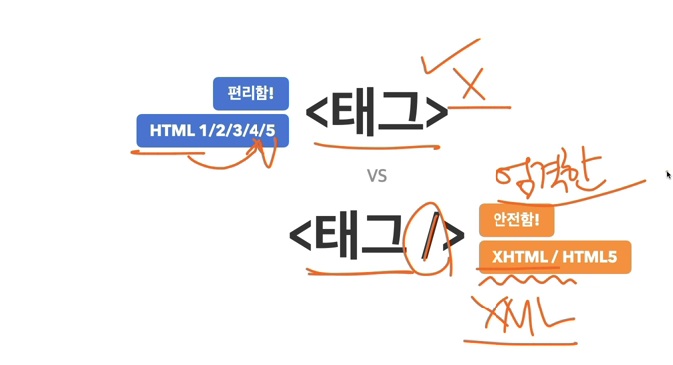
  - 빈 태그 뒤에 `/` 붙이기를 권장

## 속성과 값

- 태그의 기능을 확장하는 수단
  - 빈 태그들에게 유용
    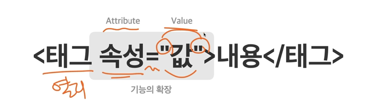

## `<input />`

- 사용자가 데이터를 입력하는 (빈)요소(태그)
  - 어떤 데이터 타입을 입력받을 것인가?
    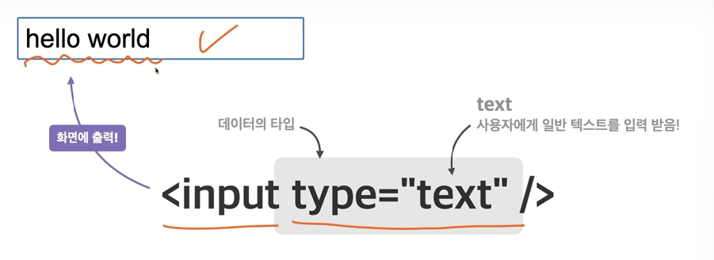
    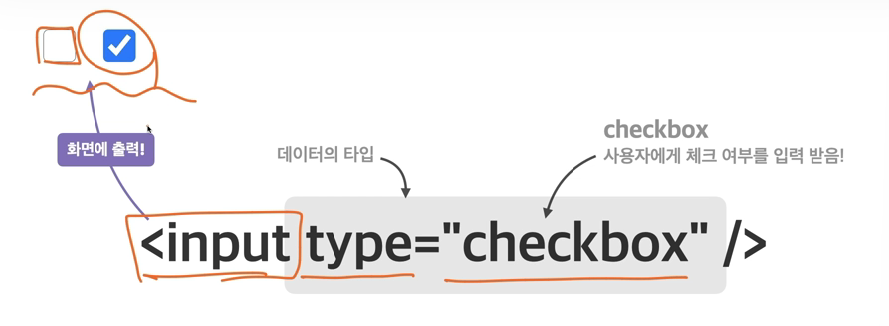

## 글자와 상자

- (글자, 상자) 요소가 화면에 출력되는 특성
  - 인라인(Inline) 요소: **글자**를 만들기 위한 요소
  - 블록(Block)요소: **상자(레이아웃)**을 만들기 위한 요소

## Inline

- Inline(글자요소): 요소가 수평으로 쌓인다
  - Inline은 글자를 의미하는 요소이므로 줄바꿈 행위가 띄어쓰기로 들어갈 수 있다
  - 포함한 콘텐츠 크기만큼 **자동**으로 줄어듬
  - width, height를 지정할 수 없다
  - margin, padding을 정상적으로 사용할 수 없다(좌, 우는 가능)
  - 자식요소로 Block을 넣을 수 없다
    -> 글자 안에 상자를 넣을 수 없다
- e.g. ``: 콘텐츠 영역을 설정하는 용도

## Block

- 요소가 수직으로 쌓인다
- (가로 넓이)부모 요소의 크기만큼 자동으로 **늘어남**  
  (세로넓이) 콘텐츠 크기만큼 자동으로 **줄어듬**
- width, height를 지정할 수 있다
- margin, padding을 정상적으로 사용할 수 있다
- 자식요소로 Inline, Block 둘 다 넣을 수 있다

---

## `
` (Division)

- 특별한 의미가 없고 구분을 위한 요소
- 블록(상자)요소

## `<h1>` (Heading)

- 제목을 의미하는 요소
- 블록(상자)요소

## `
` (Paragraph)

- 문장을 의미하는 요소
- 블록(상자)요소

## `` (Image)

- 이미지를 삽입하는 요소
  - 필수속성: `src`, `alt`
- 인라인(글자)요소

## `<ul>` (Unordered List)

- 순서가 필요 없는 **목록**의 집합
- 블록(상자)요소

## `<li>` (List Item)

- 목록(list) 내 각 **항목**(item)
- 블록(상자)요소

## `<a>` (Anchor)

- 다른/같은 페이지로 이동하는 하이퍼링크를 지정하는 요소
  - `target` 속성: 링크 URL의 **표시**하는 위치

## ` ` (Break)

- 줄바꿈 요소, 인라인(글자)요소

## `<input>`

- 사용자에게 데이터를 입력받는 요소
  - `type` 속성: 입력받을 데이터의 타입
    - `checkbox` 값: 사용자에게 체크 여부를 입력받는다
      - `checked`속성: 미리 입력요소 체크된 상태로 만든다
    - `radio` 값: 사용자에게 체크 여부를 **그룹에서 1개만** 입력받음 (name으로 그룹을 지정한다)
      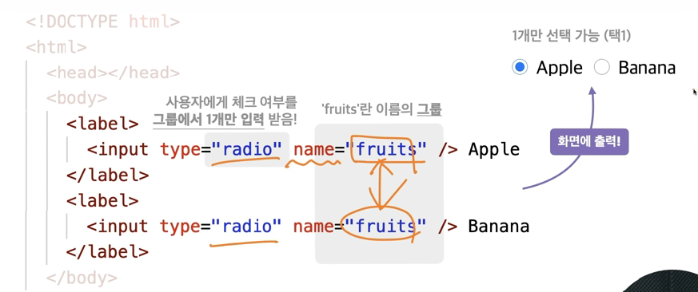
  - `value` 속성: 미리 입력된 값(데이터)
  - `placeholder` 속성: 사용자가 입력할 값(데이터)의 힌트
  - `disabled` 속성: 입력요소 비활성화, 화면에 보이지만 입력할 수 없는 상태로 만든다
- inline-block 요소

## `<label>`

- 라벨이 가능한 요소(input)의 제목
- 인라인(글자)요소
  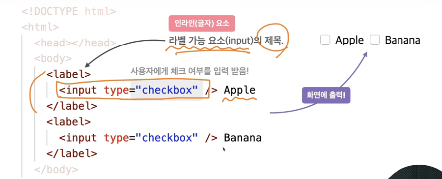

## `<table>`

- 행(row)와 열(column)의 집합
- 테이블요소 (block와 유사한 요소)
- 테이블을 만들 때는 행(row)이 먼저다 (`<tr>`)
- `<tr>` Table Row: 행(Row)를 지정하는 요소
- `<td>` Table-Data, cell: 열(Column)을 지정하는 요소
- `colspan` 속성(Column Span): 열을 몇 칸 확장할 것인지를 의미

## 래핑(Wrapping)

- 요소(텍스트)를 어떤 요소로 묶어주는(감싸는) 행위

## 전역속성

- 'title'속성: 요소의 정보나 설명을 지정
- 'style'속성: 요소에 적용할 스타일(CSS)을 지정
- 'class'속성: 요소를 지칭하는 **중복가능한 이름**
- 'id'속성: 요소를 지칭하는 **고유한 이름**
- 'data'속성: 요소에 **데이터를**(문자) 지정

## `<script>`의 `defer`속성

- HTML 구조가 준비된 후 (문서 분석 이후)에 JavaScript를 해석하겠다는 의미

## 선택자 (Selector)

- 스타일(CSS)을 적용할 대상
- `선택자 {속성: 값; 속성: 값;}`
  - 속성(Property): 스타일(CSS)의 종류
  - 값(Value): 스타일(CSS)의 값

## CSS 선언방식

- 내장방식
- 링크방식: 병렬방식(여러 css가 동시에 연결된다)
- 인라인방식
- `@import`방식: **CSS 문서 안에서** 또 다른 CSS 문서를 가져와 연결하는 방식, 직렬연결(앞의 문서가 연결되어야 뒤의 문서가 연결된다)

## CSS 선택자

- 기본
- 복합
- 가상클래스
- 가상요소
- 속성

## CSS선택자-기본(순서가 의미)

- (0)전체선택자 `*`: 모든 요소를 선택
- (1)태그선택자: 태그 이름으로 요소를 선택
- (10)클래스선택자 `.클래스이름`: HTML class(전역) 속성의 값으로 요소선택
- (100)아이디선택자 `#id이름`: HTML id(전역) 속성의 값으로 요소선택

## CSS선택자-복합(기본선택자를 조합해서 사용)

- 일치선택자 (e.g.`span.orange`): 기본선택자 ABC와 XYZ를 동시에 만족하는 요소 선택
- 자식선택자 `ABC > XYZ`: 선택자 ABC의 자식 요소 XYZ 선택
- 하위선택자 `ABC XYZ`: 선택자 ABC의 **하위(후손)** 요소 XYZ 선택  
  띄어쓰기가 선택자의 기호
- 인접형제선택자(Adjacent Sibling Combinator) `ABC + XYZ`: 선택자 ABC의 **다음 형제요소** XYZ **하나**를 선택
  - 형제: 같은 부모를 공유하는 요소
- 일반형제선택자(General Sibling Combinator) `ABC ~ XYZ`: 선택자 ABC의 **다음 형제요소** XYZ **모두** 선택

## (동작관련) 가상클래스 선택자 `:`

- hover(`ABC:hover`): 선택자 ABC 요소에 **마우스 커서가 올라가 있는 동안** 선택
- active(`ABC:active`): 선택자 ABC 요소에 **마우스 클릭하고 있는동안** 선택
- focus(`ABC:focus`): 선택자 ABC 요소에 **포커스되면** 선택
  - focus가 될 수 있는 요소는 **HTML 대화형 콘텐츠**입니다. (e.g. `input`, `a`, `button`, `label`, `select` ...)  
    대화형 콘텐츠 요소가 아니더라도 `tabindex` 속성을 사용한 요소도 focus가 될 수 있습니다
  - focus는 한 페이지에서 한 요소만 가능하다

## (선택) 가상클래스 선택자

- first child(`ABC:first-child`): 선택자 ABC가 형제 요소 중 첫째라면(if) 선택
- last-child(`ABC:last-child`): 선택자 ABC가 형제 요소 중 막내라면(if) 선택
- nth-child(`ABC:nth-child(n)`): 선택자 ABC가 형제 요소 중 (n)번째라면 선택, n은 0부터 시작
  - `.fruits *:nth-child(2n+1)`, `.fruits *:nth-child(2n)`
- 부정선택자(`ABC:not(XYZ)`): 선택자 XYZ가 아닌 ABC 요소 선택

## 가상요소 선택자: 가상의 (인라인요소의)요소를 만들어 삽입

- `ABC::before`: 선택자 ABC 요소의 내부 앞에 (인라인요소의)내용(content)을 삽입
  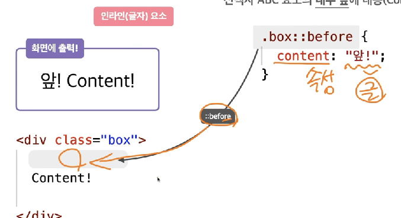
- `ABC::after`: 선택자 ABC 요소의 내부 뒤에 내용(content)를 삽입

## 속성(attribute) 선택자

- `[ABC]`: 속성 ABC를 포함한 요소 선택
- `[ABC="XYZ"]`: 속성 ABC를 포함하고 값이 XYZ인 요소 선택

## 스타일 상속

- 부모 혹은 조상에게 적용된 스타일이 자식, 후손에게 상속되서 적용되는 것
- 글자/문자 관련 속성들
  - font-style: 글자 기울기
  - font-weight: 글자 두께
  - font-size: 글자 크기
  - line-height: 줄 높이
  - font-family: 폰트(서체)
  - color: 글자 색상
  - text-align: 정렬
- 강제상속: `inherit`

## 선택자 우선순위

1. 점수가 높은 선언이 우선한다
2. 점수가 같으면, 가장 마지막에 해석된 선언이 우선한다

- 점수
  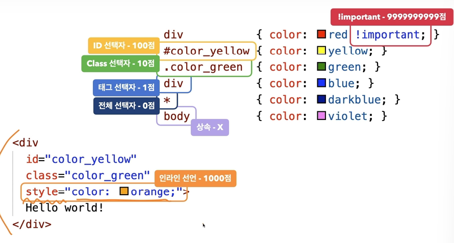
- e.g.
  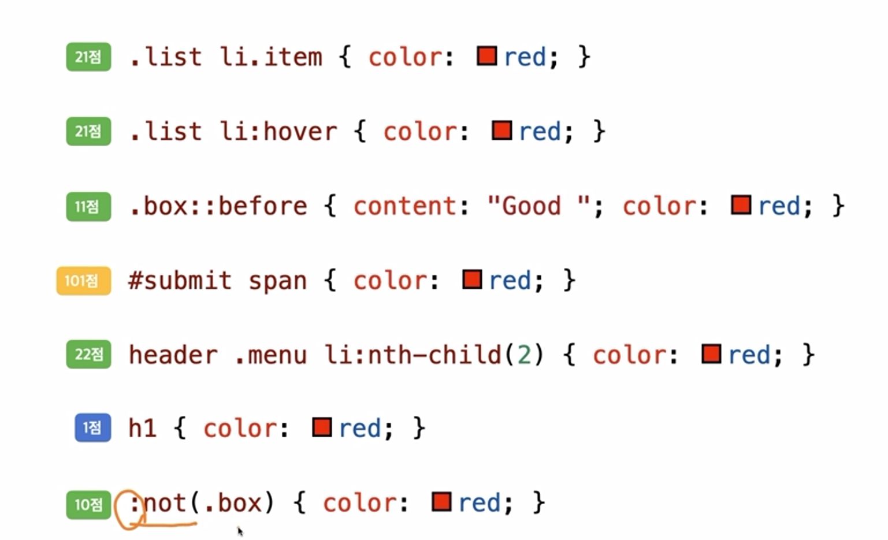

## CSS 구조

- 박스모델: HTML 요소의 기본모양(shape, **box**)을 만드는 요소(가로, 세로, 내부여백, 외부여백)
- 문자, 글꼴(폰트): 크기, 두께
- 배경: 배경색상, 배경이미지
- 배치: 특정 요소를 원하는 위치에 놓는 것
- 플렉스(정렬): 요소들을 수평정렬할 수 있다
- 전환: 요소의 전/후 상태를 애니메이션 처리
- 변환: 요소를 회전하거나 이동하거나 크기를 조절해주는 요소에 변화를 주는 것(2D, 3D)
- 띄움: (플렉스(정렬) 이전에 수평정렬을 위해 사용되었음) 요소를 공중으로 띄운다. 요소를 띄우면 요소 주위로 문자가 흐를 수 있게된다
- 애니메이션
- 그리드: 행과 열을 가지는 **레이아웃**을 짤 수 있다
- 다단
- 필터

## CSS-속성(Properties)

- HTML 속성(Attributes)
- CSS 속성(Properties)
- JS 속성(Properties)

### 속성에 기본값이 있는지 확인해라

## 박스모델-width, height

- width, height: 요소의 가로/세로 너비
  - 기본값(auto): 브라우저가 (block인지 inline인지에 따라)너비를 계산
  - 단위: px, em, vw
- ``-auto: 포함한 콘텐츠 크기만큼 자동으로 줄어듬
- `
`-auto: width: 부모요소의 크기만큼 자동으로 늘어남, height: 포함한 콘텐츠 크기만큼 자동으로 줄어듬

## 박스모델-max-width, max-height

- 요소가 커질 수 있는 최대 가로/세로 너비
  - 기본값(none): 제한없음
  - 단위: px, em, vw

## 박스모델min-width, min-height

- 요소가 작아질 수 있는 최소 가로/세로 너비
  - 기본값(0): 제한없음
  - 단위: px, em, vw

## 단위

- px: 픽셀(화면의 점)
- %: 상대적 백분율
- em: 요소의 글꼴크기
- rem: 루트요소(html)의 글꼴크기
- vw: 뷰포트 가로너비의 백분율
- vh: 뷰포트 세로너비의 백분율

## 박스모델-margin

- 요소의 외부여백(공간)을 지정하는 단축속성
  - 음수 사용가능
- 기본값(0): 외부여백 없음
- auto: 브라우저가 여백을 계산 -> 가운데정렬
- 단위: px, em, vw
- 단축속성: 각각의 방향을 한번에 제어
  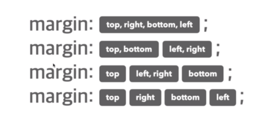

## 박스모델-padding

- 요소의 내부여백(공간)을 지정하는 단축속성
  - 결과적으로 요소 (자체) 크기가 커진다
- 기본값(0): 내부여백 없음
- 단위: px, em, vw
- %: 부모 요소의 가로 너비에 대한 비율로 지정

## 박스모델-border

- 요소의 테두리 선을 지정하는 단축속성
  - 결과적으로 요소 (자체) 크기가 커진다
- 기본값(0): 내부여백 없음
- border: 선-두께(border-with) 선-종류(border-style) 선-색상(border-color)
  기본값: 선-두께->medium, 선-종류->none, 선-색상->black

## CSS-색상표현

- 색상이름-브라우저에서 제공하는 색상이름 (e.g. red, tomato, royalblue...)
- Hex색상코드-16진수 색상 (e.g. #000, #FFFFF...)
- RGB-빛의 삼원색 (e.g. rgb(255, 255, 255))
- RGBA-빛의 삼원색+투명도 (e.g. rgba(0, 0, 0, 0.5))

## border-radius

- 요소의 모서리를 둥글게 깍음
  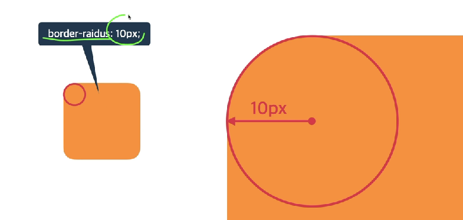
- 기본값(0): 둥글게 없음
- 단위: px, em, vw

## box-sizing

- 요소의 크기 계산 기준을 지정
- 기본값(content-box): 요소의 내용(content)으로 크기 계산
- 값 border-box: 요소의 내용 + padding + border로 크기 계산
  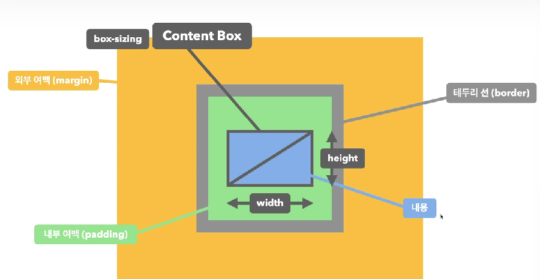

## overflow

- 요소의 크기 이상으로 내용이 넘쳤을 때, 보여짐을 제어하는 단축속성
- 기본값(visible): 넘친 내용을 그대로 보여줌
- 값 hidden: 넘친 내용을 자라냄
- 값 auto: 넘친 내용이 있는 경우메나 잘라내고 스크롤바 생성
