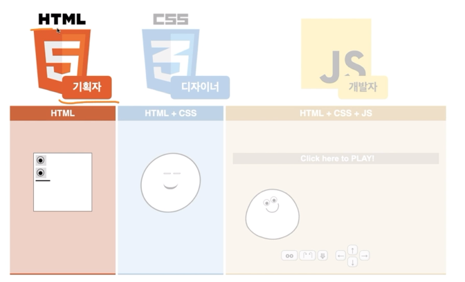
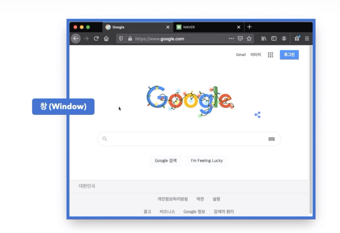
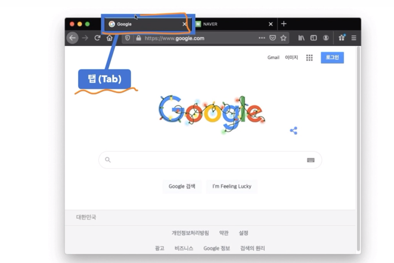
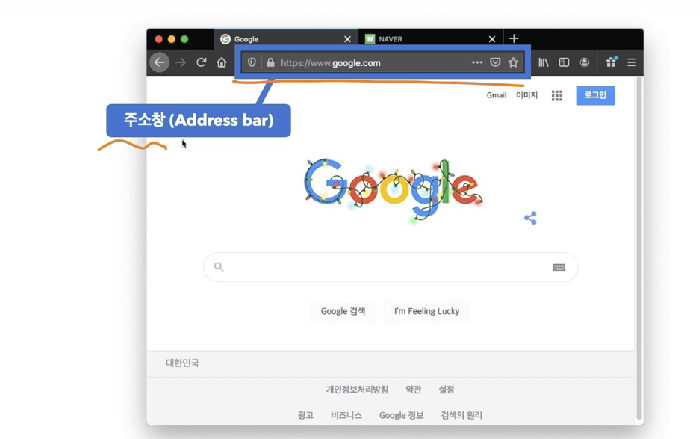
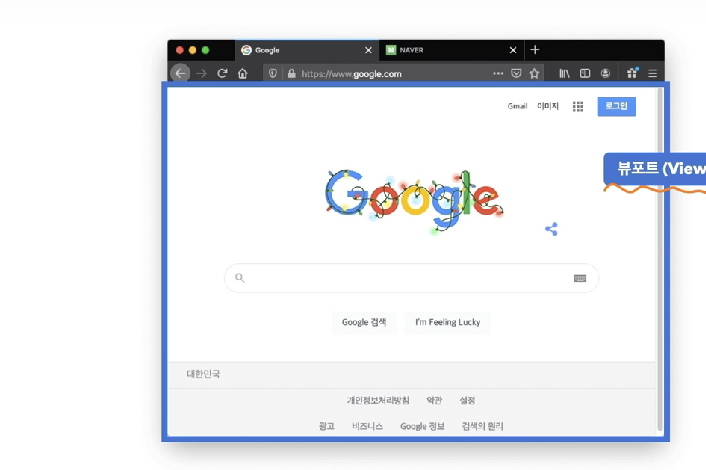

# HTML/CSS/JS로 만드는 스타벅스 웹사이트

## HTML, CSS 그리고 JS

- HTML(Hyper Text Markup Language): 페이지의 제목, 문단, 표, 이미지, 동영상 등 **웹의 구조**를 담당

- CSS(Cascading **Style** Sheets): 실제 화면에 **표시되는 방법**(색상, 크기, 폰트, 레이아웃 등)을 지정해 콘텐츠를 꾸며주는 **시각적인 표현(정적)**을 담당

- JS(JavaScript): 콘텐츠를 바꾸고 움직이는 등 페이지를 동작시키는 **동적처리**를 담당

## 개발환경

- 로컬개발환경: 웹사이트를 개발할 우리의 컴퓨터 환경

## 웹표준

- 웹표준(Web Standard): 웹에서 사용되는 표준 기술이나 규칙  
  W3C의 표준화 제정단계의 '권고안(REC)'에 해당하는 기술
  - W3C: 표준화 제정 기구(단체)
- W3C의 표준화 제정단계
  - 1. 초안(Working Draft, WD)
  - 2. 후보권고안(Candidate Recommendation, CR)
  - 3. 제안권고안(Proposed Recommendation, PR)
  - 4. 권고안(W3C Recommendation, REC)

## 브라우저

- 크로스 브라우징: 다르게 작동되는 브라우저에서도, 동일한 사용자 경험(같은 화면, 같은 동작 등)을 줄 수 있도록 하는 기술
  - 최근에는 크로스 브라우징 이슈가 많이 줄었다

## 브라우저 인터페이스

- 창(window)
  
- 탭(Tab)
  
- 주소창(Address bar)
  
- **뷰포트(Viewport)**: 하나의 웹페이지가 출력(렌더링)되는 전체영역
  - 렌더링(Rendering): 브라우저의 뷰포트에 웹 사이트를 출력하는(그림 그려내는) 행위
    
