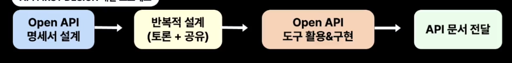

# 오늘도 여러분의 API는 안녕하신가요?: API First design과 codegen 활용하기

## API FIRST DESIGN 정의하기

- Open API 명세 기반의 API 계약서를 우선순위 1순위로 고려하여 협업하여 설계하는 것

## API FIRST DESIGN 개발 프로세스

## 과정1. Open API 명세서 설계

- 백엔드, 프론트개발자가 함께 요구사항을 분석하여 필요한 open api 명세서를 기반으로 하는 계약서를 작성

## 과정2. 반복적 설계(토론 + 공유)

- 이해관계자들과 함께 작성된 API를 보며 공유하며, 토론하며, 여러 번의 피드백을 걸쳐 계약서를 다듬는다

## 과정3. Open API 도구 활용 & 구현

- API 문서
- Code Generators
- Mock Server
- API Gateway
