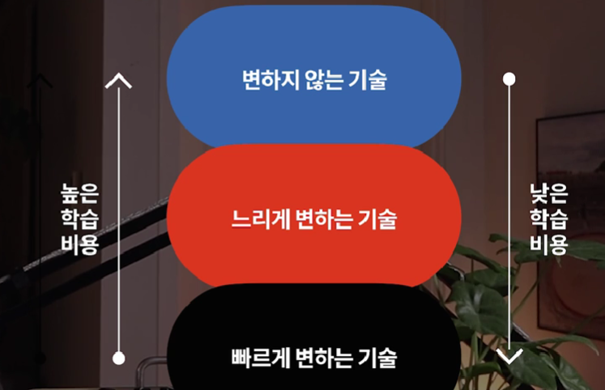

# 김민태의 프론트엔드 아카데미

## 기술의 세가지 유형

- 변하지 않는 기술: 거의 변하지 않는다고 생각이 들 정도로 느린 기술
  - 네트워크, 운영체제, 컴퓨터시스템, 논리학, 대수학
- 느리게 변하는 기술: 어느정도 시간의 흐름에 따라 변하는 기술
  - 프로그래밍 언어, 프로그래밍 패러다임, 자료구조, 보안, 알고리즘
- 빠르게 변하는 기술: 빠르게 변하는 기술
  - 프레임워크, 라이브러리, UI, UX, 디자인패턴

- 느린 변화의 기술을 익히면 빠른 변화의 기술을 쉽게 익힐 수 있다
- 프로그래밍 학습은 장기전. 전략을 가지고 꾸준히 공부해야한다
  - 빠르게 공부해야하는 것들과 느리게 공부해야하는 것들을 나누어 전략을 짠다

## 프로그래밍 역량이란?

- 일관성, 유연성, 확장성, 독립성
- 프로그래밍 역량에 대한 구체적인 이미지(목표)를 가지고 학습전략을 가지고 공부하라

## 자바스크립트 변천사

- HTML를 간단하게 조작하기 위한 목적으로 나온 (스크립트)언어

### 주요버전

- ES2015 - 모던 자바스크립트
- ES 5.0 - 현역에 실행되는 버전
  - 트랜스파일러: ES2015 이후 버전을 5.0 버전으로 변환해서 웹 브라우저에서 동작시킨다

## 웹앱(웹애플리케이션)의 구성요소

- 필수구성요소: html(UI를 만든다), css, js(HTML 조작)
- 브라우저:웹앱에게 런타임 환경을 제공
  - 예전에는 브라우저만이 웹앱을 실행시키는 유일한 환경 (+nodjs)
- 자바스크립트로 2D, 3D 그래피곧 표현가능

### HTML 를 언제 만드는가?

- CSR: 브라우저에서 js의 실행결과로 HTML(UI)를 주도적으로 만드는 방법
- SSR: 웹서버 주도로 HTML를 만들고 전송하는 방법

## 모던자바스크립트와 개발환경

- 프론트엔드의 개발환경이 왜 이렇게 복잡해졌을까?
  - 웹앱의 규모가 커지고 복잡해졌기 때문이다

## Javascript vs Typescript

- Typescript 는 javascript 의 슈퍼셋이다
  - typescript는 javascript의 모든 기능을 제공하고 거기에 더해 추가기능을 제공
  - typescript: 명시적인 유형설명 (데이터에 대한 설명)

## nodejs npm
