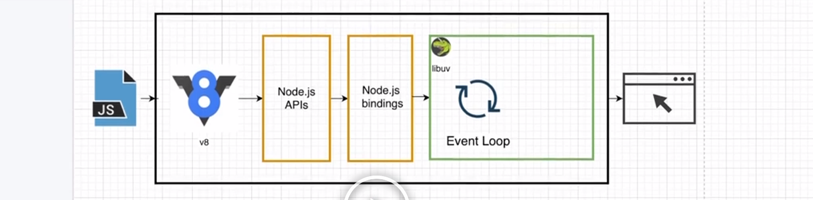
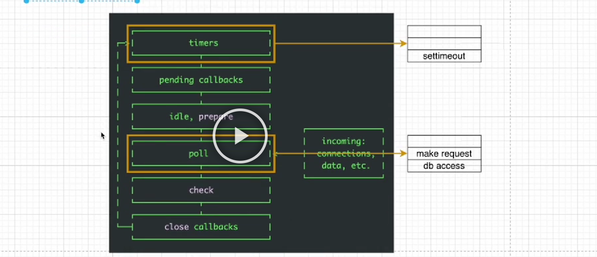

# Nodejs

## nodejs란

- Node.js is a Javascript runtime built on Chrome's V8 Javascript engine
- Nodejs 는 V8 엔진을 사용하며 V8엔진 최선 ECMAScript 기준으로 계속 업데이트 한다

## runtime

- 런타임이란 프로그래밍 언어가 구동되는 환경
- Node.js는 자바스크립트 런타임

## Node.js REPL

- REPL은 Read-Eval(evaluation)-Print Loop
  - 사용자가 특정 코드를 입력하면 그 코드를 평가하고 코드의 실행결과를 출력해주는 것을 반복해주는 환경

## 브라우저와 Node.js 모두에서 사용할 수 있는 API

- console api
- 브라우저에서만 사용할 수 있는 API - window
- Node.js에서만 사용할 수 있는 API - process

## 브라우저 API vs nodejs API

- 다른 API

- 비슷한 API

## v8 & libuv

## 만약 인터넷에 어떤 파일을 다운로드해야하는 상황이라면?

## libuv

- 이벤트 루프를 기반으로 하는 비동기 I/O에 대한 지원을 제공하는 다중 플랫폼 C 라이브러리
- libuv를 쓰면 각 플랫폼(window, linux)의 가장 빠른 비동기 IO 인터페이스로 통일된 코드를 돌릴 수 있다
- 이 라이브러리는 파일 시스템, DNS, 네트워크, 파이프, 신호처리, 폴링 및 스트리밍을 처리하는 메커니즘 제공
- 입출력: 컴퓨터 내부 또는 외부의 장치와 프로그램 간 데이터를 주고 받는 것

## 동기와 비동기

- 동기 (Synchronous, 시간을 맞춤)
- 비동기 (Asynchronous, 시간을 맞추지 않음)
- 동기는 이전 것이 끝나야 다음 것을 할 수 있지만 비동기는 그렇지 않다

## Javascript 는 synchronous 언어

- 브라우저 -> window 객체, nodejs -> global 객체로 비동기 작업이 이루어진다

## blocking & non-blocking

- blocking 작업이 발생하는 동안 이벤트 루프가 javascript를 계속 실행할 수 없기 때문에 발생
- nodejs 에서는 파일 I/O에 비동기 함수가 제공된다 (동기는 xxxxSync)

## 프로세스와 스레드

- 프로세서는 CPU의 부분
- CPU core: 명령을 받고 계산 또는 작업을 수행
- Threads are scheduled to cores and processors
- 스레드는 프로세스 내에서 일을 처리하는 세부 실행 단위

## 스레드와 자원공유

- 멀티쓰레드는 각각 stack만 할당받고 code, data, heap 영역은 공유합니다

## 프로세스

## 이벤트 루프

- 노드는 libuv에서 제공하는 event loop를 사용하기 때문에 여러 비동기 작업을 같이 수행할 수 있다
- 노드에서 비동기함수나 파일시스템, 네트워크작업(OS.Kernel)은 이벤트 루프로 전달된다
- 이벤트루프는 이벤트를 계속 listen 하고 OS에 전달한다

## libuv 정리

- 코드가 호출스택에 쌓인 후 실행한다. 이때 비동기 작업이라면 이벤트 루프는 비동기 작업을 위임한다
- libuv는 비동기작업이 OS커널인지 thread pool에서 처리가능한지 판단하여 비동기 함수를 처리한다
- 비동기 작업을 처리하고 콜백함수를 호출한다

## Event Loop

- 이벤트 루프는 nodejs가 여러 비동기 작업을 관리하고 순서대로 실행할 수 있게 해주는 구현체

## Event loop 구조

- 각 박스는 특정 작업을 수행하기 위한 페이즈
- 한 페이즈에서 다음 페이즈로 넘어가는 것을 틱(Tick)이라고 한다
- 각 단계에는 각각의 큐가 있습니다

