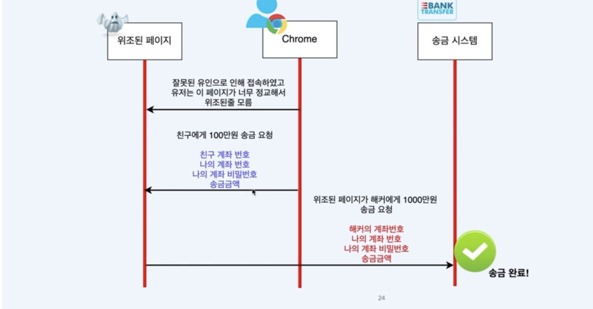
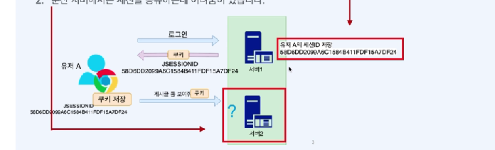
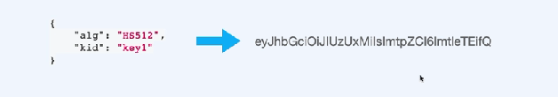
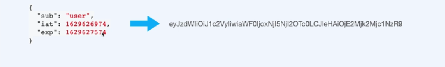
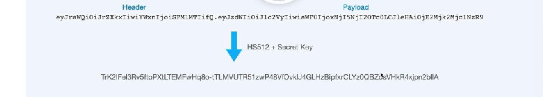

# 아키텍처

## Spring security 내부구조


## 용어들

- SecurityContextHolder
  - SecurityContextHolder는 SecurityContext를 제공하는 static 메소드(getContext())를 지원합니다
- SecurityContext
  - SecurityContext는 접근 주체와 인증에 대한 정보를 담고 있는 Context 입니다
  - 즉 Authentication 을 담고 있습니다
- Authentication
  - Principal 과 GrantAuthority를 제공합니다
  - 인증이 이루어지면 해당 Authentication이 저장됩니다
- Principal
  - 유저에 해당하는 정보입니다
  - 대부분의 경우 Principal로 UserDetails를 반환합니다
- GrantAuthority
  - ROLE_ADMIN, ROLE_USER 등 principal이 가지고 있는 권한을 나타냅니다
  - prefix로 'ROLE\_'이 붙습니다
  - 인증 이후에 인가를 할 때 사용합니다
  - 권한은 여러 개 일 수있기 때문에 `Collection<GrantedAuthority>`형태로 제공됩니다

## PasswordEncoder

- Password 관리

  - Password는 암호화해서 저장해야한다
  - 입력받은 password와 저장된 password를 비교할 수 있어야한다 (복호화 X)

- 인터페이스 PasswordEncoder
  

- PasswordEncoder 종류
  

## Security Filter

- Spring Security는 사실상 Filter로 동작한다
- Filter들을 제외하거나 추가할 수 있고
- Filter들의 동작 순서를 정할 수 있다
- 많이 쓰이는 필터들
  - SecurityContextPersistenceFilter
  - BasicAuthenticationFilter
  - UsernamePasswordAuthenticationFilter
  - CsrfFilter
  - RememberMeAuthenticationFilter
  - AnonymousAuthenticationFilter
  - FilterSecurityInterceptor
  - ExceptionTranslationFilter

## Filter


## SecurityContextPersistenceFilter

- SecurityContextPersistenceFilter 는 보통 두번째로 실행되는 필터
  - 첫번째는 Async 요청에도 Security Context를 처리할 수 있도록 해주는 WebAsyncManagerIntegrationFilter
  - 세션에 저장된 securityContext가 있다면 가져오고 없으면 생성
- SecurityContext를 찾아와서(없으면 생성) SecurityContextHolder에 넣어주는 역할

## BasicAuthenticationFilter

- 로그인 과정 없이도 로그인데이터를 Base64로 인코딩해서 모든 요청에 포함해서 보내면 BasicAuthenticationFilter가 이를 인증한다
- 아이디와 비밀번호가 반복해서 노출되기 때문에 보안에 취약
  - BasicAuthenticationFilter 사용시 https 사용 권장

## UsernamePasswordAuthenticationFilter

- Form 데이터로 username, password 기반의 인증을 담당하는 필터
  

## CsrfFilter

- CsrfFilter는 Csrf Token을 사용하여 위조된 페이지의 악의적인 공격을 방어한다
  - CsrfAttack:가짜 홈페이지에 접속하여 본 홈페이지에 악의적인 요청을 하게끔 하는것
  - 예방법: 위조된 페이지인지 송금시스템에서 제공하는 올바른 페이지인지 구분하면 된다 -> CSRF 토큰을 통해서 가능하다 -> 우리가 만든 페이지에서 송금을 요청하면 csrf토큰을 함께 송신
  - Thymeleaf 에서는 페이지를 만들 때 자동으로 Csrf Token을 넣어준다
    `<input type="hidden" name="_csrf" value=""/>`
    

## RememberMeAuthenticationFilter

- RememberMeAuthenticationFilter는 일반적인 세션보다 훨씬 오랫동안 로그인 사실을 기억할 수 있도록 해준다
  - 사용법: `<input type:"checkbox" id="remember-me" name="remember-me" class="" autocomplete="">`
- 장시간 남아있는 RememberMe 쿠키를 사용하여 세션을 다시 연결시켜준다

## AnonymousAuthenticationFilter

- 인증이 안된 유저가 요청을 하면 Anonymous유저로 만들어 Authentication에 넣어주는 필터
  - 다른 필터에서 Anonymous유저인지 정상적으로 인증된 유저인지 분기처리 할 수 있다

## FilterSecurityInterceptor

- 넘어온 authentication 의 내용을 기반으로 최종 인가 판단을 내린다
- 인증(Authentication)을 가져오고 만약에 인증에 문제가 있다면 Authentication Exception 을 발생시킵니다. 인증에 문제가 없다면 해당 인증으로 인가를 판단합니다. 인가가 거절되면 AccessDeniedException 을 발생합니다.

## ExceptionTranslationFilter

- FilterSecurityInterceptor에서 발생할 수 있는 두 가지 Exception 을 처리해주는 필터
  1. AuthenticationException: 인증에 실패할 때 발생
  2. AccessDeniedException: 인가에 실패할 때 발생
     즉, 인증이나 인가에 실패했을 때 어떤 행동을 취해야하는지를 결정해주는 Filter입니다.

## Spring Security Config 설정

- 필터 Off
  - e.g. `http.httpBasic().disable()`
- 로그인&로그아웃 페이지 관련기능

  ```java
  http.formLogin()
      .loginPage("/login")
      .defaultSuccessUrl("/")
      .permitAll();
  ```

  - 폼 로그인의 로그인 페이지를 지정하고 로그인에 성공했을 때 이동하는 URL을 지정

  ```java
  http.logout()
      .logoutRequestMatcher(new AntPathRequestMatcher("/logout"))
      .logoutSuccessUrl("/")
  ```

  - 로그아웃 URL을 지정하고 로그아웃에 성공했을 때 이동하는 URL을 지정합니다.

- Url Matchers
  - antMatchers, mvcMatchers, regexMatchers, requestMatchers
- 인가관련 설정: 경로별로 권한을 설정한다

  - authorizeRequests(): 인증/인가설정을 시작합니다
  - hasRole(): 권한을 검증합니다

    ```java
    http.authorizeRequests()
        .antMatchers(HttpMethod.POST, "/notice").hasRole("ADMIN")
    ```

    - ROLE*ADMIN에서 `ROLE*`은 생략가능

  - authenticated(): 인증이 되었는지를 검증합니다

    ```java
    http.authorizeRequests()
        .anyRequest().authenticated()
    ```

  - permitAll()

- Ignoring

  - 특정 리소스에 대해 SpringSecurity 자체를 적용하고 싶지 않을 때 사용
  - permitAll과 다르게 아예 SpringSecurity 대상에 포함되지 않음 (필터의 대상이 되지 않음 -> 성능 최적화)

  ```java
  @Override
  public void configure(WebSecurity web) {
    // 정적 리소스 spring security 대상에서 제외
    web.ignoring().antMatchers("/images/**", "/css/**");
    web.ignoring().requestMatchers(PathRequest.toStaticResources().atCommonLocations());
  }
  ```

  - css, javascript, images, web jars, favicon

## 스프링 시큐리티 테스트

- 인증을 받지 않은 상태로 테스트를 하면 SpringSecurity에서 요청자체를 막기 때문에 테스트가 제대로 동작조차 하지 못한다
  - 따라서 이런 문제는 프로젝트에 spring-security-test를 사용해서 해결할 수 있습니다
  - spring-security-test를 사용하면 테스트 직전에 Mock User를 인증시켜놓고 테스트를 구동할 수 있습니다

## `@WithMockUser`

- MockUser를 생성하고 Authentication을 만듭니다

  - User는 org.springframework.security.core.userdetails.User입니다
    - 개발자의 User와 Cast 오류발생가능

  | 멤버변수    | 예시                                                              | 설명                          |
  | ----------- | ----------------------------------------------------------------- | ----------------------------- |
  | roles       | USER                                                              | 권한(ROLE\_은 자동으로 붙음)  |
  | authorities | ROLE_USER                                                         | 권한(사용하면 roles를 무시함) |
  | username    | user123                                                           | 유저명                        |
  | password    | password123                                                       | 패스워드                      |
  | setupBefore | TestExecutionEvent.TEST_METHOD, TestExecutionEvent.TEST_EXECUTION | 언제 유저가 세팅되는지 정함   |

## `@WithUserDetails`

- `WithMockUser`와 마찬가지로 MockUser를 생성하고 Authentication을 만듭니다
  - `WithMockUser`와 다른 점은 가짜 user를 가져올 때 UserDetailsService의 Bean을 지정해줄 수 있습니다.

## `@WithAnonymousUser`

- 익명유저를 Authentication에서 사용합니다

## `@WithSecurityContext`

- SecurityContext를 만들어 주입

## `with(user())`

- `MockMvc`에 User를 직접 주입

## CustomFilter 만들기

- 커스텀 필터를 구현하기 위해서는 다른 필터와 마찬가지로 Filter Interface를 구현해야합니다
  - Filter Interface를 구현하면 중복 실행 문제가 있으므로 OncePerRequestFilter를 구현합니다

## 세션의 장단점

- 장점
  - JSESSIONID는 유의미한 값이 아니라 서버에서 세션(사용자)정보를 찾는 Key로만 활용된다
- 단점
  - 서버에 세션(사용자)정보를 저장할 공간이 필요하다
  - 분산 서버에서 세션을 공유하기 어렵다



## 토큰 인증방식

- 유저가 로그인을 하면 서버에서는 토큰을 생성한 뒤 (사용자 정보를) 저장하지 않고 (stateless) 토큰값을 보내줍니다
- 서버에서는 이 토큰을 (사용자정보) 의미 값으로 해석하고 그 값을 토대로 유저를 인증합니다
- 장점
  - 세션 관리를 할 필요가 없어 별도의 저장소가 필요하지 않다
  - 서버 분산 & 클러스터 환경에 좋다
- 단점
  - 한번 제공된 토큰은 회수가 어렵다 -> 유효기간을 짧게 관리
  - 토큰에는 유저 정보가 있어 안정성이 우려된다 -> 민감 정보를 포함시켜서는 안된다

## JWT의 구조

- Json Web Token
- HEADER`.`PAYLOAD`.`SIGNATURE

## JWT-Header

- HEADER는 JWT를 검증하는데 필요한 정보를 가진 객체
  - Signature에 사용한 암호화 알고리즘이 무엇인지, Key의 ID가 무엇인지 정보를 담고 있다
  - 이 정보를 Json으로 변환해서 UTF-8로 인코딩한 뒤 Base64 URL-Safe로 인코딩한 값이 들어있습니다 (암호화하지 않았다)



## JWT-Payload

- Payload에는 실질적으로 인증에 필요한 데이터가 저장되어 있다
  - 데이터의 각각 필드들을 Claim이라고 한다
  - 대부분의 경우 Claim에 username, 토큰발행시간(iat), 토큰만료시간(exp)를 포함한다. (민감정보를 포함시켜서는 안된다)
- Payload는 Json으로 바꾼뒤 UTF8로 인코딩하고 Base64로 변경한 데이터이다 (Header와 마찬가지로 암호화하지 않았다.)



## JWT-Signature

- Signature는 토큰 자체의 진위여부를 판단하는 용도로 사용된다
- Header와 Payload를 합친 뒤 비밀키로 Hash를 생성하여 암호화한다



## JWT-Key Rolling

- SecretKey를 여러 개를 사용하고 수시로 추가하고 삭제해줘서 변경한다면 SecretKey 중에 1개가 노출되어도 다른 Secret Key와 데이터는 안전한 상태가 된다. 이를 Key Rolling이라고 합니다
- Secret Key 1개에 KeyId를 연결시켜 둡니다. JWT토큰 헤더에 kid를 포함하여 제공하고 서버에서 토큰을 해석할 때 kid로 Secret Key를 찾아서 Signature를 검증합니다

## JWT Util 만들기

- 의존성 추가

```java
//jjwt
implementation 'io.jsonwebtoken:jjwt-api:0.11.2'
runtimeOnly 'io.jsonwebtoken:jjwt-impl:0.11.2'
runtimeOnly 'io.jsonwebtoken:jjwt-jackson:0.11.2'
```

- JwtKey
  - JWT Secret Key 를 관리하고 제공합니다
  - Key Rolling을 지원합니다
- JwtUtils
  - JWT 토큰을 생성하거나 Parsing하는 메소드를 제공합니다
- SigningKeyResolver

  - SingningKeyAdapter 를속상속
  - JWT의 헤더에서 kid를 찾아서 Key(SecretKey + 알고리즘)을 찾아옵니다
    -Signature를 검증할 때 사용합니다

- JWT Filter - JwtAuthorizationFilter

1. Cookie에서 JWT Token을 구합니다
2. JWT Token을 파싱하여 username을 구합니다
3. username으로 User를 구하고 Authentication을 생성합니다
4. 생성된 Authentication을 SecurityContext에 넣습니다
5. Exception이 발생하면 응답의 쿠키를 null로 변경합니다
