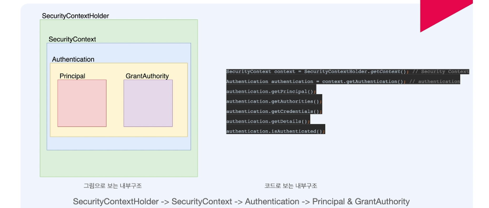
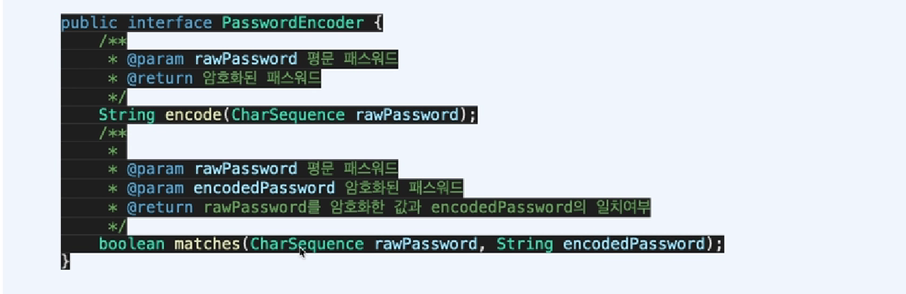
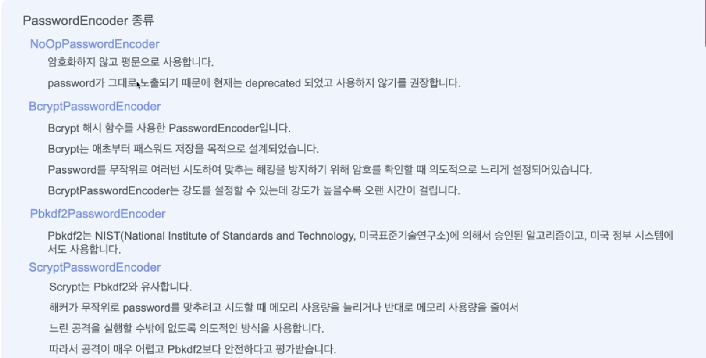
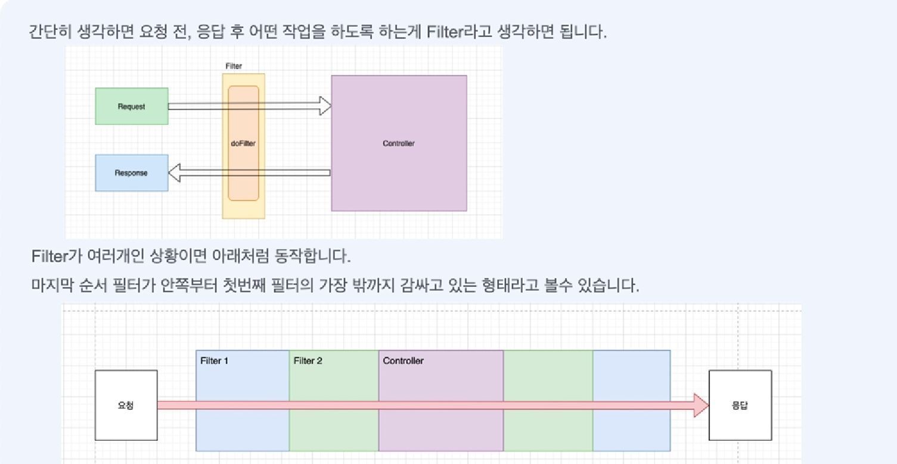
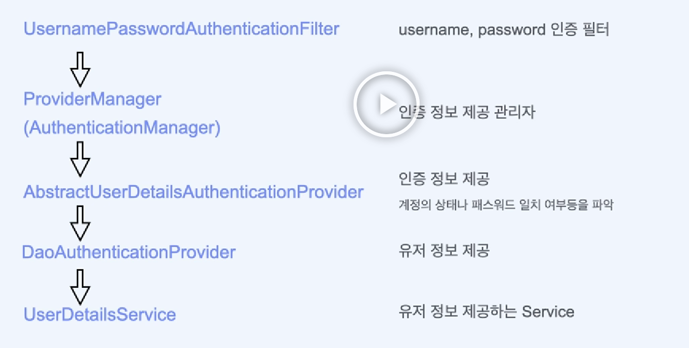

# 아키텍처

## Spring security 내부구조

## 용어들

- SecurityContextHolder
  - SecurityContextHolder는 SecurityContext를 제공하는 static 메소드(getContext())를 지원합니다
- SecurityContext
  - SecurityContext는 접근 주체와 인증에 대한 정보를 담고 있는 Context 입니다
  - 즉 Authentication 을 담고 있습니다
- Authentication
  - Principal 과 GrantAuthority를 제공합니다
  - 인증이 이루어지면 해당 Authentication이 저장됩니다
- Principal
  - 유저에 해당하는 정보입니다
  - 대부분의 경우 Principal로 UserDetails를 반환합니다
- GrantAuthority
  - ROLE_ADMIN, ROLE_USER 등 principal이 가지고 있는 권한을 나타냅니다
  - prefix로 'ROLE\_'이 붙습니다
  - 인증 이후에 인가를 할 때 사용합니다
  - 권한은 여러 개 일 수있기 때문에 `Collection<GrantedAuthority>`형태로 제공됩니다

## PasswordEncoder

- Password 관리

  - Password는 암호화해서 저장해야한다
  - 입력받은 password와 저장된 password를 비교할 수 있어야한다 (복호화 X)

- 인터페이스 PasswordEncoder
  

- PasswordEncoder 종류
  

## Security Filter

- Spring Security는 사실상 Filter로 동작한다
- Filter들을 제외하거나 추가할 수 있고
- Filter들의 동작 순서를 정할 수 있다
- 많이 쓰이는 필터들
  - SecurityContextPersistenceFilter
  - BasicAuthenticationFilter
  - UsernamePasswordAuthenticationFilter
  - CsrfFilter
  - RememberMeAuthenticationFilter
  - AnonymousAuthenticationFilter
  - FilterSecurityInterceptor
  - ExceptionTranslationFilter

## Filter

## SecurityContextPersistenceFilter

- SecurityContextPersistenceFilter 는 보통 두번째로 실행되는 필터
  - 첫번째는 Async 요청에도 Security Context를 처리할 수 있도록 해주는 WebAsyncManagerIntegrationFilter
  - 세션에 저장된 securityContext가 있다면 가져오고 없으면 생성
- SecurityContext를 찾아와서(없으면 생성) SecurityContextHolder에 넣어주는 역할

## BasicAuthenticationFilter

- 로그인 과정 없이도 로그인데이터를 Base64로 인코딩해서 모든 요청에 포함해서 보내면 BasicAuthenticationFilter가 이를 인증한다
- 아이디와 비밀번호가 반복해서 노출되기 때문에 보안에 취약
  - BasicAuthenticationFilter 사용시 https 사용 권장

## UsernamePasswordAuthenticationFilter

- Form 데이터로 username, password 기반의 인증을 담당하는 필터
  
