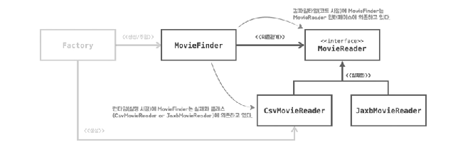
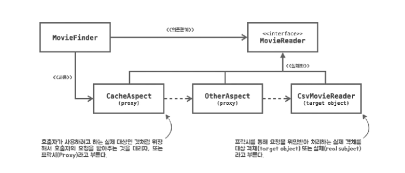
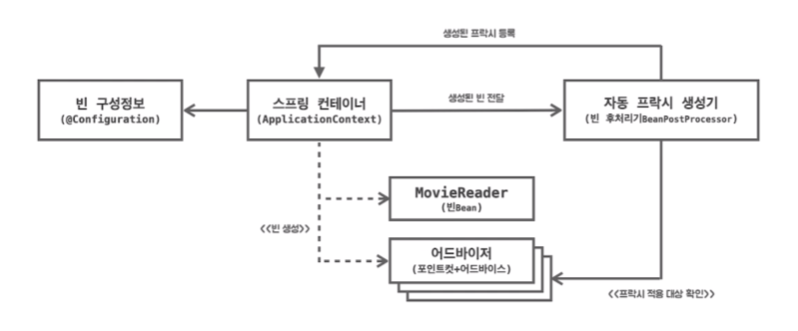
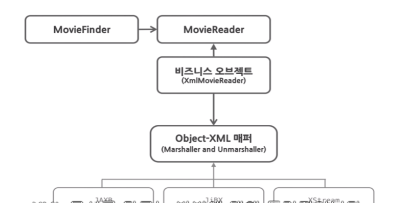
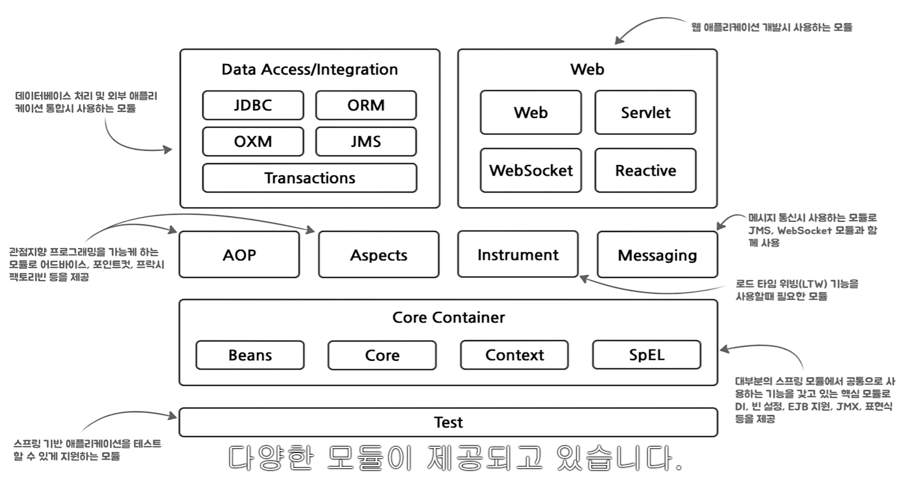

# 스프링러너의 스프링 아카데미: spring을 활용한 유여한 백엔드 개발 트레이닝

## 합성

- 합성은 다른 객체의 인스턴스를 자신의 인스턴스 변수로 포함해서 재사용하는 방법
  - 객체는 인터페이스를 사용해 참조하라  
    **인터페이스는 정의된 메시지를 통해서만 재사용이 가능하므로** 구현을 효과적으로 캡슐화 가능하다
  - 즉, 합성은 메시지를 통해 느슨하게 결합되며, 따라서 코드를 재사용하기 위해서는 상속보다는 합성을 선호하는 것이 더 좋은 방법이다

## 상속(템플릿 메소드 패턴)의 단점

- 캡슐화를 위반한다
  - 반면 합성에서 인터페이스를 활용하면 정의된 메시지를 통해서만 재사용이 가능하므로 캡슐화가 가능하다
  - <https://unluckyjung.github.io/oop/2021/03/17/Inheritance-and-Encapsulation/>
- 설계를 유연하지 못하게 만든다
  - 반면 합성에서는 갈아끼우기가 비교적 더 쉽다

## 팩토리

- 객체를 생성하고 관계를 구성하는 것 또한 하나의 관심사이기 때문에 분리할 필요가 있다
- 이러한 객체 생성방법을 결정하고 생성한 객체를 반환하는 역할을 수행하는 객체를 Factory 라고 부른다

## 제어의 역전

- 프로그램의 제어흐름의 구조가 뒤바뀌는 것
- 모든 객체가 능동적으로 자신이 사용할 객체를 결정하고, 언제 어떻게 그 객체를 만들지를 스스로 관장한다.
  즉 모든 종류의 흐름을 **사용하는 쪽**에서 제어하는 구조다
- 제어 역전원리가 적용된 코드는 자신이 **사용할 객체**를 스스로 결정하지 않는다.
- 자바 프로그램의 흐름은 메인 메소드와 같이 프로그램이 시작되는 지점에서 사용할 객체를 결정하고 결정한 객체를 생성하고, 생성된 객체에 있는 메소드를 호출한다. 다시 호출된 객체 메소드 안에서 또다시 사용할 객체를 결정,생성,호출을 반복
  - 즉, 각 객체는 프로그램 흐름을 결정하거나 사용할 객체를 구성하는 작업에 능동적으로 참여한다.

## SOLID 원칙

- SOLID는 깔끔한 설계를 위해 적용 가능한 다섯가지 소프트웨어 설계 원칙이다
- 함수와 데이터 구조를 클래스로 배치하는 방법, 그리고 이들 클래스를 서로 결합하는 방법으로 구성되어 있다
- 모듈과 컴포넌트 내부의 구조를 이해하기 쉽고, 변경에 유연하게 만드는데 목적을 두고 있다

## 개방폐쇄원칙

- 소프트웨어 개체(클래스나 모듈)은 확장에는 열려 있어야하고 변경에는 닫혀 있어야한다.

- `MovieFinder` 변경은 내부 다른 코드를 **변경**하지 않고 `MovieReader`를 갈아끼울 수 있다(**확장**)

## 의존성 역전원칙

- 상위 정책은 하위 정책에 의존하면 안된다. 하위 정책이 상위 정책에 정의된 추상 타입에 의존해야 한다.
- 이전에는 `MovieFinder`가 직접 `CsvMovieReader`를 의존하고 있었다. 이는 상위 정책인 `MovieFinder`가 하위 정책인 `CsvMovieReader`에 의존하고 있는 것
  - 이런 환경에서는 추상화된 `MovieReader`의 다형성이 동작하기 어렵다 -> `MovieFinder`가 직접 구체적인 하위객체를 생성하므로 다른 구현체를 사용할 수 없다
- 개선 후에는 런타임의 생성자를 통해 객체를 주입받아 사용하므로 다형성을 적극 활용 가능하고 재사용성이 높아진다

## 관심사의 분리

- 관심이 같은 것끼리는 한 곳으로(객체) 모으고, 다른 것은 따로 떨어뜨려 서로 영향을 주지 않도록 분리하는 것
  - 관심사가 같은 코드를 모아 **응집**시키고,
    관심사가 다른 코드는 소프트웨어 설계 원칙에 따라 분리하고 서로 낮은 **결합**을 갖도록 한다.
  - 그렇게 독립적이고 유연하게 확장할 수 있는 모듈로 만든다
- 함께 두기 곤란한 성격이 다르고 변경의 이유와 시기가 다르고 생성방식과 의존관계가 다른 코드가 함께 있다면, (관심사가 다르다면) 분리하면 된다

## 높은 응집도

- 응집도가 높다는 건 하나의 모듈, 클래스가 하나의 책임 또는 관심사에만 집중이 되어 있다는 뜻입니다
- 불필요하거나 직접 관련이 없는 외부의 관심과 책임이 얽혀있지않고 하나의 공통 관심사는 하나의 클래스에 모여 있다.

## 낮은 결합도

- 결합도가 낮다는 건 하나의 클래스가 변경이 일어날 때 관계를 맺고 있는 다른 클래스에 영향을 주지 않는다는 뜻
- 책임과 관심사가 다른 클래스 또는 모듈과는 낮은 결합도(**느슨한 연결형태**)를 유지하는게 좋다
  - 느슨한 연결은 관계를 유지하는 꼭 필요한 최소한의 방법만 간접적인 형태로 제공하고 나머지는 서로 독립적이고 알 필요없게 만들어주는 것
- 결합도가 낮아지면 변화에 대응하는 속도가 높아지고 구성이 깔끔해집니다. 또한 확장하기에도 편리하다

## 계층화

- 복잡한 소프트웨어를 계층으로 나눔으로써 관심사를 분리하는 애플리케이션 아키텍처 패턴입니다

## 디자인 패턴

- 소프트웨어 설계시 자주 발생하는 문제에 대해 반복적으로 적용할 수 있는 해결방법

## 전략 패턴

- 전략 패턴은 자신의 기능 맥락에서 필요에 따라 변경이 필요한 알고리즘을 추상화를 통해 통째로 외부로 분리시키고 이를 구현한 구체적인 알고리즘 클래스를 필요에 따라 바꿔 사용할 수 있게 하는 디자인패턴
- `MovieFinder`는 전략 패턴의 콘텍스트에 해당한다
  - 콘텍스트는 자신의 기능을 수행하는데 필요한 기능 중에서 변경 가능한 알고리즘(메타데이터 읽기 알고리즘)을 `MovieReader`라는 인터페이스로 추상화하고 이를 구현한 클래스(전략)을 바꿔가면서 사용할 수 있게 하는 것

## 템플릿 메소드 패턴

- 어떤 작업을 처리하는 일부분을 서브 클래스로 캡슐화해서 전체 구조는 바꾸지 않으면서도 특정 행위를 수행하는 전략만 바꾸는 패턴
  

## 의존관계(dependency)

- 의존관계 정의: 어떤 클래스가 다른 클래스에 접근할 수 있는 경로를 가지거나 해당 클래스의 객체의 메소드를 호출하는 경우, 두 클래스 사이에 의존관계가 있다고 말한다.
  - 의존관계가 형성되면 `MovieReader`의 기능이 추가되거나 변경되었을 때 그 영향이 `MovieFinder`에게 전달된다
  - 의존관계는 객체와 객체가 협력하기 위해서는 반드시 필요하다
- **객체지향설계 핵심**은 협력을 위해 필요한 의존관계는 유지하면서도 변경을 방해하는 의존 관계는 제거하는데 있다
  - 객체지향설계란 의존관계를 관리하는 것이고 객체가 변경을 받아들일 수 있게 의존관계를 정리하는 기술

## 의존관계주입(Dependency Injection, DI)

- 코드 시점의 의존관계와 실행시점의 의존관계가 서로 다를 수 있다(다시말해 클래스 사이의 의존관계와 객체(인스턴스) 사이의 의존관계는 동일하지 않을 수 있다)
  - e.g. 코드상에서 `MovieFinder`클래스는 `MovieReader` 인터페이스에게 메시지를 전송하지만 실행시점에 실행되는 메소드는 협력하는 객체의 실제 클래스가 무엇인지에 따라 다르다(메세지를 수신하는 클래스에 따라 달라진다)
- **정의**:외부의 독립적인 존재가 객체를 생성한 후 이를 전달해서 의존관계를 해결하는 방법
- 방법: 생성자주입(생성하는 시점), 설정자주입(생성 후), 메서드 주입(메서드 실행시)

## 다형성

- 의존관계주입은 객체 지향 프로그램의 코드시점 의존관계와 실행시점 의존관계가 다를 수 있다는 사실에 기반으로 한다

## 스프링 IoC 컨테이너

- 스프링은 제어의 역전 원칙에 따라 객체의 생성, 의존관계주입과 가능 기능을 제공하는 IoC 컨테이너로 빈 팩토리를 제공한다
- 애플리케이션 콘텍스트는 빈 팩토리 특징을 그대로 가지고 있으면서 스프링 AOP 통합, 국제화지원, 이벤트기반애플리케이션, 웹애플리케이션을 위한 기능을 제공한다
- 빈팩토리(애플리케이션 콘텍스트)는 컨피규레이션 메타데이터라는 빈 구성 정보를 읽어 빈을 생성하고 관리한다

## 빈

- 스프링 빈은 스프링 컨테이너가 생성, 관계설정, 사용 등을 제어해주는 제어의 역전 원리가 적용된 객체
  - 객체 단위의 애플리케이션 컴포넌트를 말한다
- 다시말해, 컨테이너에 의해 생성 및 조립된 후 관리(초기화 소멸 등)되는 객체를 빈이라 부른다

## 정리:스프링 IoC 컨테이너와 빈

- 스프링은 IoC 컨테이너인 애플리케이션 콘텍스트나 빈 팩토리로 빈 구성 정보를 읽어 애플리케이션을 구성합니다
- 스프링 애플리케이션은 객체의 생성과 의존관계설정, 사용, 제거 등의 작업을 애플리케이션 코드 대신 독립적인 컨테이너가 담당한다.
  - 즉, 컨테이너가 코드 대신 객체에 대한 제어권을 가지고 있으므로 IoC라고 부른다.
- 컨테이너는 제어의 역전원리가 적용된 스프링 핵심 컴포넌트
- 빈 생성시 의존관계주입이 일어난다
- 빈 구성정보를 바탕으로 비즈니스 오브젝트를 이용해 애플리케이션을 구성하고 생애를 관리한다.

## 빈 구성정보(Configuration Metadata)

- 스프링 컨테이너가 빈 객체 생성 및 구성, 조립시 사용하는 설정정보
- 컨테이너 기능을 설정하거나 조정이 필요할 때도 사용
- 스프링은 빈 구성정보를 읽고 `Bean Definition`이라는 인터페이스로 추상화된 객체를 만들어 사용
  - IoC 컨테이너는 `Bean Definition`으로 만들어지는 객체를 사용해 애플리케이션을 구성합니다 -> 특정 파일포맷이나 형식에 제한되거나 종속되지 않는다
- 자바 코드로 작성하는 빈 구성정보는 관심사가 같은 컴포넌트들을 함께 묶어 모듈화가 가능하다 -> 여러 개의 구성정보를 작성하고 조합할 수 있다

## 빈 스코프

- 스프링 컨테이너는 빈을 생성할 때 단 하나의 빈을 만들지,
  아니면 빈이 요청될 때마다 새로운 빈 객체를 만들지 결정하는 메커니즘
- 싱글톤 스코프: 단 하나의 빈 객체만 만들 때  
  프로토타입 스코프: 빈이 요청될 때마다 새로운 빈을 생성하기

## 싱글톤 스코프

- 스프링 컨테이너 내에서 단 하나만 생성이 되고, 그 빈을 의존하는 모든 빈에 유일한 객체를 공유한다.

## @Import, @ImportResource

- `@Import` 애노테이션은 다른 클래스에서 빈 구성 정보를 불러오기 위해 사용한다
- XML 형식으로 작성된 빈 구성정보가 있다면 `@ImportResource`으로 XML 파일 위치를 지정해주면 된다

## @ComponentScan

- `@ComponentScan`으로 자동 클래스 탐지 기능을 활성화하면 지정된 패키지 경로에서 스테레오타입(e.g. `@Component`)으로 선언된 클래스를 찾아 빈으로 등록하고 관리한다
  - 패키지를 지정하지 않으면 ComponentScan 애노테이션이 선언된 클래스를 기준으로 탐색한다

## Stereotype Bean

- 각 스테레오 타입 애노테이션은 빈의 역할과 관련이 있다
- `@Service`는 다른 빈이 필요로 하는 서비스를 제공하는 복잡한 비즈니스 기능을 가진 빈을 정의하는데 사용
- `@Repository`는 데이터베이스와 같이 데이터 접근 기술이 사용되는 빈을 정의하는데 사용

## 자동 와이어링(Autowired)

- 스프링은 빈이 생성된 후 자동으로 의존관계를 주입해주는 기법
- 생성자가 **하나** 뿐이라면 `@Autowired` 생략가능
  - 두개 이상의 생성자일 경우에는 스프링이 어떤 생성자로 생성해야할지 모르기 때문에 문제가 발생한다
- 처음은 타입을 기반으로(선언되어 있는 타입) 해당하는 빈을 찾아 의존관계주입을 해결하고,  
  만약 같은 타입의 빈이 2개 이상 존재하면 (설정된 빈의)이름으로 의존관계를 구성해주는 전략을 가진다
- ComponentScan을 통해서 자동으로 빈이 등록이 될 때는 클래스의 이름을 기반으로 빈의 이름이 등록된다
- `@Bean`으로 자바 구성클래스에서 어노테이션으로 등록할 경우 메소드 이름을 기반으로 빈의 이름이 등록된다

## 테스트 컨텍스트 프레임워크

- 스프링은 테스트에 사용되는 스프링 컨테이너를 생성 및 관리하고 테스트에 적용할 수 있는 기능을 가진 테스트 프레임워크를 제공한다
- 테스트 컨텍스트 프레임워크는 JUnit 또는 TestNG와 같은 테스트 프레임워크와 잘 통합되어 동작한다

## `@ExtendWith`, `SpringExtension.class`

- `@ExtendWith`: JUnit 이 테스트 실행 전략을 확장할 때 사용하는 애노테이션
- `SpringExtension.class`: 스프링의 테스트 컨텍스트 프레임워크에서 제공하는 JUnit 지원클래스로,  
  JUnit이 테스트를 실행하는 과정에서 테스트가 필요로 하는 스프링 컨테이너를 구성하고 관리해줍니다
  - 스프링 컨테이너를 구성할 때 `@ContextConfiguration` 어노테이션이 지정이 되어있다면 해당 어노테이션이 저장한 빈 구성정보를 바탕으로 스프링 컨테이너를 만든다

## 엔터프라이즈 애플리케이션 계층

- 소프트웨어를 계층으로 나누고 분리시키는 건 서로 변경의 주기가 다르고,
  또 다른 맥락에서는 구체적인 세부 기술로부터 도메인 논리를 보호하기 위함도 있다
  - 도메인계층은 핵심업무논리외에는 없는 것이 가장 좋다
  - 변화의 이유와 시기가 다르면 분리할 필요가 있다
- e.g. 영화 데이터를 읽고 검색하는 도메인 로직과 사용자 입력을 처리하고 그 결과를 출력하는 프리젠테이션으로 분리하는 것

## 분리된 인터페이스 패턴

- 추상화를 별도의 독립적인 패키지가 아니라 클라이언트에 속한 패키지에 포함하는 구조를 분리된 인터페이스 패턴이라고 한다.
  - MovieFinder와 MovieReader 인터페이스를 하나의 패키지로 모음으로, 결과적으로, domain 패키지를 완벽하게 독립시킬 수 있다. 성격이 다른 MovieReader 가 필요하다면 다른 패키지를 추가하고 새로운 MovieReader 구현체를 만들면 상위 수준의 협력관계를 재사용할 수 있다
- 의존성 역전원칙에 따라 상위 수준의 협력흐름을 재사용하기 위해서는 추상화가 제공하는 인터페이스의 소유권 역시 역전 시켜야한다.

## 소프트웨어의 두가지 가치

- 행위적 가치: 사용자가 가진 문제를 해결해주는 것
  - 이를 위해 소프트웨어 사용자가 기능명세서나 요구사항문서를 구체화하고 충족하도록 개발
- 구조적 가치: 변경하기 쉬운 소프트웨어를 만드는 것
- 소프트웨어를 만든 이유는 기계의 행위를 빠르고 쉽게 변경하는 방법이 필요했기 때문이다
  - 그러기 위해서는 애플리케이션의 형태, 코드의 배치 방식, 코드의 상호연결방식에 의존

## 변경하기 쉬운 소프트웨어 만들기

- 소프트웨어를 부드럽게 유지하는 방법은 선택사항을 가능한 많이, 가능한 오랫동안 열어두는 것
  - 열어둬야할 선택사항이란? -> 상대적으로 중요치 않은 구현 세부사항
- 좋은 아키텍처는 선택사항을 열어둠으로써 향후 소프트웨어에 변경이 필요할 때 어떤 방향으로든 쉽게 변경할 수 있도록 해야한다

## 소프트웨어를 구성하는 두 가지 요소

- 정책: 모든 업무 규칙과 업무 절차를 구체화한 것
- 구현세부사항: 입출력장치, 데이터베이스 등 시스템을 사용 또는 구동하는데 필요한 것
  - 구현세부사항은 사람, 외부 시스템, 프로그래머가 정책과 소통할 때 필요한 요소지만, 정책이 가진 행위에는 영향을 미치지 않는다
- 세부사항을 몰두하지 않은 채 고수준의 정책을 만들 수 있다면 이러한 구현세부사항에 대한 결정을 오랫동안 미루거나 연기할 수 있다

## 외부에서 내부로 접근하는 의존방향

- 변경하기 쉬운 소프트웨어를 만들기위해 애플리케이션을 내부와 외부를 분리하고, 내부는 핵심 도메인 개념을 구현한 코드를 배치하고, 외부 영역은 입출력 장치나 데이터베이스 등의 구체적인 기술을 사용하는 구현세부사항과 상호작용 코드를 배치합니다. 이를 통해서 **애플리케이션의 핵심을 외부의 기술적인 부분들과 분리시키는 것**이 핵심입니다.
- 이렇게 분리된 영역은 테스트하기 쉽고 필요에 따라 어렵지 않게 변경할 수 있다
- 반드시 지켜야할 원칙은 외부에서 내부로 접근하는 의존방향
- e.g. `MovieFinder`는 (`MovieReader` 인터페이스에 정의된 영화목록불러오기를 통해 취득한 영화목록으로) 사용자 명령을 수행합니다. 이는 애플리케이션의 정책이자, 핵심 도메인 개념을 구현한 코드로 내부 영역에 배치합니다
- `MovieReader` 인터페이스를 실체화한 `CsvMovieReader`나 `JaxbMovieReader`는 모두 파일을 기반으로 영화 메타데이터 읽기 구현세부 사항으로 외부영역에 배치합니다
  - 필요에 따라 파일이 아닌 데이터베이스나 외부 시스템으로부터로도 영화 메타데이터를 읽을 수 있도록 변경할 수 있습니다

## 객체지향패러다임: 협력하는 객체

- 객체지향의 핵심은 애플리케이션 기능을 구현하기 위해서 협력에 참여하는 객체들 사이의 상호작용이다
  - 객체들은 협력에 참여하기 위해 역할을 부여받고 역할에 적합한 책임을 수행합니다

## 객체지향과 스프링

- IoC와 DI는 객체의설계와 생성, 관계, 사용에 관한 기술이다

- 스프링은 어떻게 객체가 설계되고, 만들어지고, 어떻게 관계를 맺고, 사용되는지에 관심을 두는 프레임워크이다
  - 스프링의 관심은 객체와 그 관계이다. 하지만 객체를 어떻게 설계하고, 분리하고, 개선하고, 어떤 의존관계를 가질지 결정하는 일은 스프링이 아니라 개발자의 역할이며 책임이다. 스프링은 단지 원칙을 잘 따르는 설계를 적용하고자 할 때 필연적으로 등장하는 번거로운 작업을 편하게 할 수 있도록 도와주는 도구일뿐이다. -> 스프링을 사용한다고 좋은 객체지향설계와 깨끗하고 유연한 코드가 저절로 만들어지지 않습니다.

## 프로파일 - 환경에 따른 빈 구성기능

- 환경에 따라 다른 빈을 등록할 수 있게 하는 메커니즘
  - e.g. 개발서버와 QA서버 또는 프로덕션 서버에서 사용하는 데이터소스 유형이 다를 때
  - 성능검증서버에서 배포시에만 모니터링 인프라를 활성화시킬 때
  - 고객별로 사용자화된 애플리케이션을 제공할 때
- 보다 정교한 조건으로 빈 구성이 필요하다면 Conditional 애노테이션과 Condition 인터페이스를 사용할 수 있다

## 로깅

- 스프링이 출력하는 로그를 볼려면 지원되는 로깅 프레임워크를 애플리케이션 의존성에 추가하고 로거 설정 정보를 작성하면 된다.

## 이식가능한 서비스 추상화(Portable Service Abstraction)

- 이식가능한 서비스 추상화는 환경과 세부 기술의 변화와 관계없이 **일관된 방식으로 기술에 접근**할 수 있게 해줍니다
- POJO로 개발된 코드는 특정 환경이나 구현방식에 종속되지 않아야한다
  - 엔터프라이즈 자바 플랫폼을 사용하는 우리는 다양한 자바 EE 기술을 사용할 수 밖에 없다.
  - 특정 환경과 기술에 종속적이지 않다는 것은 자바 EE 기술을 사용하지 않는다는 뜻이 아니라 **POJO가 세부기술에 직접 노출되지 않도록 만든다는 뜻이다**
- 스프링은 엔터프라이즈 애플리케이션에 사용되는 다양한 기술의 서비스 추상화 기능을 제공해 POJO를 보호할 수 있도록 지원하고 있다
  - 캐시, 메일, 메시징과 같이 스프링이 정의한 추상화 API를 직접 이용하는 방식도 제공되며, 또는 AOP나 템플릿 콜백 패턴과 결합하여 직접 API를 사용하지 않지만 스프링에 의해 제어되는 트랜잭션 서비스 추상화 또는 원격 호출 서비스 추상화 등이 있다

- MovieFinder 와 MovieReader 는 각자 담당하는 코드의 기능적인 관심에 따라 분리되고 서로 불필요한 영향을 주지 않으면서 독자적으로 확장 가능하도록 만든 것이다
- 같은 애플리케이션 로직을 담은 코드지만 역할에 따라 분리를 했습니다

- OXM서비스 추상화는 이와 조금 다르다. 애플리케이션의 비즈니스 로직과 그 하위에서 동작하는 저수준의 XML 기술이라는 아예 다른 계층의 특성을 갖는 코드를 분리한 것이다

- XmlMovieReader는 XML 문서를 다루는 방식에 대해서는 독립적이다. Unmarshaller 인터페이스와 의존관계주입을 통해 추상화된 API로 저수준의 Object-XML Mapping 기술을 사용하기 때문이다.
  - 어떤 구현기술을 사용하든 상관없이 XmlMovieReader의 코드는 변하지 않는다
  - 즉, XmlMovieReader와 Object-XML Mapping 기술의 결합도가 낮다는 뜻이다

## 메타데이터 읽기

- 메타데이터 위치를 결정하는 것과 메타데이터를 읽는 행위도 변화의 이유와 시기가 다르기 때문에 분리할 필요가 있다

## 메타데이터 검증하는 방법

1. 빈을 생성하고 등록할 때 setter 메서드와 검증로직을 함께 동작시킨다
2.

## 빈의 생명주기 콜백

- 스프링 컨테이너는 빈의 생성부터 초기화, 소멸에 이르는 생명 주기에 관여할 수 있는 확장 지점을 제공하고 있다
  - e.g. `InitializingBean` 인터페이스와 `DisposableBean` 인터페이스
  - `InitializingBean` 콜백 인터페이스는 빈의 의존관계 주입이 끝난 후 호출된다
  - `DisposableBean` 콜백 인터페이스는 객체가 소멸될 때 네트워크 연결해제 등의 리소스 정리가 필요하다면 활용할 수 있다
- 스프링은 콜백 인터페이스 외에도 JSR 250으로 정의되어 있는 자바 표준 애노테이션을 사용해서 빈 생명 주기에 관여할 수 있다

## JSR 250

- 자바플랫폼을 위한 공통 애노테이션에 관한 스펙으로 자주 사용되는 여러 애노테이션을 표준화한 것이다. 스프링에도 사용가능하다
  - 이를 통해 선언적 프로그래밍 스타일이 가능하도록 계획하였다
- 이러한 표준 애노테이션들은 엔터프라이즈 자바에 먼저 도입이 되어 EJB나 서블릿 등에 적용된 이후에 표준 자바 플랫폼에도 적용이 되어 있는 상태이다
- `@Resource`: 리소스에 대한 참조를 선언할 수 있는 애노테이션으로 스프링 autowired와 같이 의존관계 주입시 사용할 수 있다
- `@PostConstruct`: 의존관계주입이 이루어진 후에 초기화를 수행하는 메소드에 사용을 할 수 있다
- 특정 규약과 환경에 종속되지 않도록 객체를 작성하기 위해서는 초기화 또는 소멸 시 필요한 작업은 자바 표준 애노테이션을 이용해서 해결을 하는게 좋다
  - 하지만 보다 정교하게 제어하기 위해서는 스프링이 제공하는 콜백 인터페이스를 사용해야할 때도 있다

## 코드 변경없고 설정값 바꾸기

- 애플리케이션 외부 설정 파일이나 시스템 환경변수 등에서 설정정보를 작성해둔 뒤 애플리케이션이 실행될 때 설정정보를 읽어 메타데이터 위치를 설정하기
- 애플리케이션 환경에 따라서 스프링 컨테이너 구성을 달리하는 방법: JVM 아규먼트를 설정해서 해당 아규먼트에 따라서 프로파일이 구성되고 프로파일에 따라서 스프링 컨테이너가 동적으로 구성되기

## Environment 인터페이스

- 스프링은 외부 설정파일이나, VM 아규먼트(시스템환경변수) 그 외의 **다양한 방식으로부터 일관된 방식으로 환경정보를 읽을 수 있는** 런타임 환경 서비스 추상화 인터페이스
- Environment 용도는 애플리케이션이 동작 시 필요한 설정 정보를 외부에서 일관된 방식으로 읽고 사용하기 위해서 작성된 컴포넌트

## `@Value`

- `@Value`는 외부 설정 정보를 주입하는데 사용한다
  - 이때 필요한 외부설정 정보는 스프링 런타임 환경 추상화를 통해 취득할 수 있다

## 환경추상화(Environment Abstraction)

- 프로파일과 프로퍼티 소스로 구성되며, 컨테이너에 통합된 서비스 추상화이다
- 이를 통해 실행환경에 따라 빈을 구성할 수 있고, 일관된 방식으로 외부 설정정보를 관리하고 접근할 수 있다
- 개발자는 environment 인터페이스나 애노테이션을 이용해 환경 추상화 APi를 이용할 수 있다

## 빈 정의 프로파일(profiles)로 환경에 따라 컨테이너 구성하기

- 빈 정의 프로파일은 실행 환경에 따른 빈 구성 메커니즘으로 profile 애노테이션을 사용해 프로파일 별로 빈을 등록할 수 있게 합니다
  - 실행환경이란 개발, 운영 또는 성능 측정 등으로 애플리케이션이 실행되는 환경을 뜻하고
  - 프로파일은 OS 환경변수나 JVM 시스템 프로퍼티, Environment API 등을 통해서 활성화할 수 있습니다

### 프로파일 활성화 방법들

## 애플리케이션 설정정보를 다루는 PropertySource 추상화

- 프로퍼티소스는 키=밸류 형식으로 작성된 설정정보로 다양한 소스를 일관된 방식으로 사용할 수 있게 해주는 서비스 추상화입니다
- 사용할 수 있는 소스로 운영체제의 환경변수나 JVM 시스템 프로퍼티, 서블릿 설정 매개변수, 프로퍼티 파일 등이 있습니다

- 설정정보를 취득할 때는 Environment 인터페이스가 제공하는 getProperty 메소드나 애노테이션을 이용할 수 있습니다

## 스프링 환경(Environment)에 프로퍼티 파일 등록하기

- `@PropertySource`를 이용하면 환경에 프로퍼티 파일을 쉽게 등록할 수 있다.
  - 애노테이션 설정된 경로값은 리소스 로더로 읽어 들인다. 때문에 클래스패스나 파일 또는 서블릿 경로 등 다양한 소스를 사용할 수 있다

## @Value를 사용한 빈 프로퍼티 값 설정하기

- Value 애노테이션을 사용하면 환경설정정보 또는 컨테이너에 등록된 빈을 사용해 빈 프로퍼티 값을 설정할 수 있습니다
- Value 애노테이션은 필드, 설정자 메소드, 메소드 파라미터나 생성자에 사용할 수 있습니다
- e.g. 프로퍼티 파일로 작성된 설정정보를 환경(environment)에 등록하였습니다. 이후 Value 애노테이션을 통해 필요한 값을 빈 프로퍼티로 설정할 수 있습니다
- Value 애노테이션으로 빈 프로퍼티 값을 설정할 때 두가지 방식을 지원합니다
  - 프로퍼티 치환자를 사용하는 방식입니다. 달러와 중괄호를 이용해 명시된 프로퍼티 키에 연결된 값으로 바꿔치기 한 후에 빈 프로퍼티 값으로 설정하는 방식입니다.
  - 스프링 컨테이너는 프로퍼티 치환에 대한 기본적인 전략을 가지고 있습니다. 전략을 변경할 필요가 있다면 PropertySourcesPlaceholderConfigurer를 직접 빈으로 등록을 하면 됩니다(반드시 정적 메소드로 선언해야하는 제약이 있습니다)
    
  - 두번째는 스프링 표현언어를 이용해서 빈 프로퍼티 값을 설정하는 것입니다.
  - 스프링 표현언어(SpEL)는 런타임 시 객체의 그래프를 조회하고 조작하는 스프링 전용 표현식 언어로 표현식을 통해 다른 빈 객체나 프로퍼티에 접근할 수 있고, 다양한 연산도 할 수 있습니다
  - 샵과 중괄호로 작성된 표현식의 평가결과를 빈 프로퍼티 값으로 설정합니다
    

## 저수준 자원에 접근할 수 있는 서비스 추상화 -> 리소스 인터페이스

- 자바의 URL 클래스로는 자바 웹 애플리케이션 개발시 사용되는 서블릿 컨텍스트 경로나 클라우드 스토리지 서비스에 있는 자원과 같은 것들은 표현할 수 없다. 그래서 스프링은 일관된 방식으로 저수준 자원에 접근할 수 있는 서비스 추상화를 제공한다

## 리소스 인터페이스

- 스프링은 리소스 인터페이스를 통해서 다양한 외부자원정보를 읽어 들일 수 있습니다
- 스프링은 파일이나 원격지에 있는 자원에 일관된 방식으로 접근하고 사용할 수 있는 추상화 인터페이스로 **리소스 인터페이스**를 제공합니다
- 스프링은 컨테이너가 사용할 설정 정보 파일을 다루는 것부터 외부 리소스 정보가 필요할 때는 항상 리소스 추상화 인터페이스를 사용하고 있습니다

## 리소스 로더

- getResource 메소드를 통해서 주어진 위치에 자원을 취득할 수 있도록 도와주는 컴포넌트입니다
- 모든 애플리케이션 컨텍스트는 이 리소스 로더 인터페이스로 구현하고 있습니다
  - 그래서 콘텍스트별로 적합한 리소스 객체를 손쉽게 얻을 수 있도록 제공해주고 있다
  - 이때 접두어를 이용하면 다른 방식의 리소스도 손쉽게 얻을 수 있다

## ResourceLoaderAware, XXXXAware

- 리소스 로더를 외부에서 의존관계주입을 받을 수 있도록 도와준다
- 스프링 컨테이너는 Aware로 정의되어 있는 다양한 인터페이스를 이해하고, 이 인터페이스에 따라서 필요한, 적절한 의존객체를 주입해줍니다

## 캐시(Cache)

- 캐시란 자주 사용하는 데이터나 값을 미리 복사해놓는 임시저장소로, 운영체제나 CDN, DNS 등의 네트워크 계층, 애플리케이션 및 데이터베이스를 비롯해서 다양한 기술 계층에서 적용돼서 활용 될 수 있다
- 캐시를 사용하면 지연 시간을 현격하게 줄이고 컴퓨팅의 성능을 향상시킬 수 있다
- 객체 캐싱(Object cashing)은 기존에 사용된 객체를 캐시에 저장해두었다가 다시 참조될 때 사용하는 방법
  - 생성하는데 많은 시간이 소비되는 객체를 사용하고 난 뒤에 메모리에서 삭제하는게 아니라 메모리에 저장을 해두었다가 다시 그 객체가 필요할 때 메모리에서 바로 읽어옴으로써 객체 생성을 소비하는데 시간을 줄이는 것이다
- 자바 생태계에는 캐시를 다루는 다양한 라이브러리가 있다
- e.g. 자바 8를 기반으로 개발된 고성능 캐시 라이브러리 카페인
  - 카페인은 자바 표준 캐싱 API인 JCache(JSR 107)과 함께 스프링을 포함해 다양한 자바 생태계의 프레임워크를 지원하고 있다
- JCache는 자바의 표준 API

## 캐시관리

- 캐시로 사용할 메모리의 크기는 애플리케이션이 동작하는데 영향을 주지 않을 정도로 적절한 크기여야 한다. 이러한 제한 사항을 바탕으로 캐시를 구성할 때는 최대 개수, 만료 시간과 같은 것들을 설정하여 효율적으로 캐시를 사용하도록 하는 것

## POJO

- 객체지향적 원리에 충실하고 특정 규약과 환경에 종속되지 않게 재활용될 수 있는 방식으로 설계된 객체다
  - 변경을 수용할 수 있는 구조를 갖추기 위해 우리에게 필요한 것은 서비스 추상화이다

## 캐시 추상화(Cache Abstraction)

- 스프링은 3.1버전 이상부터 캐시 추상화를 지원한다. 애플리케이션의 코드에 영향을 주지 않고 다양한 캐싱 솔루션을 일관된 방식으로 사용할 수 있게 지원해준다
  4.1버전 이상부터는 자바의 표준 캐싱 API인 JCache, JSR-107을 지원한다
- 스프링 캐시 추상화의 중심에는 캐시 인터페이스와 캐시 매니저 인터페이스가 있다
- 캐시 매니저인터페이스를 통해서 캐시를 생성하고 구성하고 사용을 관리할 수 있다

## 횡단 관심사와 객체지향 프로그래밍의 한계

## 

- 객체지향 기술은 매우 성공적인 프로그래밍 방식이지만 한편으로는 점점 복잡해져 가는 소프트웨어의 요구조건과 기술적인 난해함을 모두 해결하는데는 한계가 있다
- 엔터프라이즈 애플리케이션에는 캐싱 외에도 보안, 로깅, 트랜잭셩 등의 애플리케이션 전반에 걸쳐 필요로 하는 기능들이 있다.
  - 이러한 기능들을 횡단 관심사라고 한다.
- 횡단관심사를 처리하는 로직을 위임을 통해서 외부로 분리한다 하더라도 구체적인 코드는 제거되겠지만 위임을 통해 기능을 사용하는 코드는 핵심 코드와 함께 그대로 남는다
  - 횡단 관심사가 핵심 기능 모듈에 침투하면 내부 복잡도가 올라가고 객체 지향의 장점을 잃어버릴 수 있다
  - **관점 지향 프로그래밍AOP**은 이러한 횡단 관심사를 깔끔하게 해결해주는 프로그래밍 패러다임이다

## 관점 지향 프로그래밍 Aspect Oriented Programming

- 객체지향 기술의 한계와 단점을 극복하도록 도와주는 보조적인 프로그래밍 기술
- 스프링도 AOP를 지원하며, 포조에 엔터프라이즈 서비스를 선언적으로 제공하는데 이 AOP가 사용되고 있다

## 프락시와 데코레이터 패턴, 프락시 패턴

- `CachingMovieReader`는 `CsvMovieReader`나 `XmlMovieReader`를 대신하기 위해 만들어진게 아닙니다. 단지 캐시를 통해 빠르게 메타데이터를 반환하는 책임을 맡고 있을 뿐입니다.
  - 스스로는 비즈니스 로직을 담고 있지 않기 때문에 실질적인 비즈니스 로직 책임은 `CsvMovieReader`나 `XmlMovieReader`에 위임해야 합니다.
- 클라이언트와 핵심 기능 사이에서 마치 자신이 클라이언트가 사용하려는 실제 대상인 것처럼 위장해서 그 클라이언트의 요청을 받아주는 객체를 **프락시**라고 부릅니다.
- 프락시를 통해 최종적으로 요청을 위임받아 처리하는 실제 객체를 **타겟 오브젝트, 대상객체**라고 부릅니다.
- 프락시의 특징은 대상 객체와 같은 인터페이스를 구현했다는 것과 프락시가 대상 객체를 제어할 수 있는 위치에 있다는 것입니다.
- 프락시는 사용 목적에 따라서 두 가지로 구분할 수 있습니다
  - 첫번째는 대상 객체에 부가기능을 부여해 주기 위함으로써 디자인 패턴에는 **데코레이터 패턴**이라고 부릅니다
  - 두번째는 클라이언트가 대상 객체에 접근하는 방법을 제어하기 위해 사용하며 디자인패턴에서는 **프록시 패턴**이라고 부릅니다
- 두가지 모두 대리객체라는 개념의 프락시를 두고 사용한다는 점에서는 동일하지만 목적에 따라 디자인패턴에서는 다른 패턴으로 구분합니다.
  - 스프링에서는 두가지 패턴 모두 적절히 사용해서 지원합니다
- 데코레이터 패턴 이름유래: 마치 제품이나 케이크를 여러 겹으로 포장하고 그 위에 장식을 붙이는 것처럼 실제 내용물은 동일하지만 부가적 효과를 부여해줄 수 있기 때문이다.
  - 따라서 데코레이터 패턴에서는 프락시가 꼭 한 개로 제한되지 않는다.
  - 프락시가 직접 대상 객체를 사용하도록 고정시킬 필요도 없습니다
  - 이를 위해서 데코레이터 패턴에서는 같은 인터페이스를 구현한 대상 객체와 여러 개의 프락시를 사용할 수 있다. 프락시가 여러 개인 만큼 순서를 정해서 단계적으로 위임하는 구조를 만들어내면 된다

## 프락시 구성과 프락시 작성의 문제점

- 캐싱 기능을 구현하는 코드는 (다른 컴포넌트에서도 필요하므로) 중복된 구조로 만들어질 가능성이 높다.
- 프락시 구조를 만들기 위해 추상화를 비롯해 부가기능 클래스와 프락시 생성 등의 과정이 필요하다
- 이를 위해 자바에서는 동적으로 프락시를 생성할 수 있는 기술이 있다

## 리플렉션과 프락시

- 자바 기본 플랫폼에 내장된 리플렉션 API는 동적으로 프락시를 생성할 수 있는 기능이 제공됩니다.
- 리플렉션은 자바의 코드 자체를 추상화해서 접근할 수 있도록 만들어진 API로 객체의 메서드나 필드 등의 정보를 추출하거나 이용할 수 있습니다

## 자바 동적 프락시 기술

- 자바의 동적 프락시 기술을 사용하면 프락시를 위한 별도 클래스를 작성하지 않아도 되고, 부가 기능 또한 대상 객체와 무관하게 재사용할 수 있습니다
  - 프락시 기술의 번잡함이나 부가기능의 코드 중복 등의 문제를 해결할 수 있습니다
- 한계는 대상 객체에 부가기능을 부여하고 프락시를 생성하는 코드는 꽤나 복잡하고 다루기 어렵다. 또한 대상객체에 부가기능을 부여하기 위해서는 매번 부가기능 객체를 만들고 대상 객체에 의존관계 주입을 해줘야한다. 또한 자바에는 JDK에서 제공하는 동적 프락시 외에도 프락시를 다룰 수 있도록 지원해주는 많은 기술들이 존재한다. 즉 특정 기술을 이용해 프락시를 생성하면 추후 기술이 한계나 다른 필요에 의해 프락시 기술에 대한 변동이 매우 어려워진다

## 프락시 팩토리 빈

- 스프링 AOP 모듈은 다양한 프락시 기술을 일관된 방식으로 사용할 수 있도록 프락시 팩토리 빈이라는 서비스 추상화를 제공한다.
- 프락시 팩토리 빈은 프락시를 생성해서 빈 객체를 등록해주는 팩토리 빈입니다
- 프락시 팩토리 빈은 순수하게 프락시를 생성하는 작업만 담당하고 프락시를 통해 제공할 부가기능은 별도 객체로 생성해, 스프링 컨테이너에 빈으로 등록해 줄 수 있습니다

## 클래스 프락시: e.g. CGLIB

- 클래스 프락시는 예로들면 CGLIB 같은 바이트 코드 생성 라이브러리를 이용해서 대상객체 타입을 상속해서 서브 클래스로 만들어 이를 프락시로 사용합니다
- 두가지 제약
  - 파이널 클래스와 파이널 메소드에서는 사용할 수 없다
    final 클래스는 상속을 할 수 없고, final 메소드는 오버라이딩 할 수 없기 때문이다
  - 대상 클래스의 생성자가 두번 호출된다  
    같은 대상 클래스타입의 빈이 두 개 만들어지기 때문이다.
  - 즉, 인터페이스 기반 프락시를 생성하는 방법에 비해 부자연스럽다. 왜냐하면 프락시를 생성하기 위하여 동적으로 클래스를 상속할 뿐더러 상속받은 객체의 public 메소드를 모두 오버라이드 해서 프락시 기능으로 바꿔치는 방식으로 동작하기 때문이다
- 스프링은 인터페이스가 없이 개발된 레거시 코드나 외부에서 개발된 인터페이스 없는 라이브러리 같은 것들을 이 프락시 기법을 적용할 수 있도록 지원해주기 위해서 이 클래스 프락시를 지원해주고 있다.
  - 즉, 결코 인터페이스를 사용하지 않고 클래스만 사용해서 프로그래밍 하다가 프락시가 필요한 경우에 이를 이용하라는 의미가 아니다
  - 스프링은 여전히 인터페이스를 통한 객체지향적인 합성 기법과 이를 바탕에 둔 제어의 역전과 의존 관계 주입을 사용하라고 권하고 있다

## 프락시 팩토리 빈의 한계

- 1. 부가기능을 적용하기 위해 프락시를 생성하는 부분: 실수하기도 쉽고 굉장히 반복적인 작업이다
     
- 2. 어드바이스가 대상 객체나 메소드를 가리지 않고 부가기능을 적용한다
  - e.g. `MovieReader` 객체는 `loadMovies()` 외에도 toString, getClass 등 자바 오브젝트 타입이 가지는 다양한 메소드를 가지고 있다. 이러한 모든 메소드에 부가기능을 적용한다
    

## 빈 후처리기를 이용한 자동 프락시 생성기 적용하기

- `BeanPostProcessor` 인터페이스를 구현해서 만들 수 있는 빈 후처리기
- 빈 후처리기는 스프링 빈 객체로 만들어지고 난 후에 빈 객체를 다시 가공할 수 있게 해준다
  - 가공한다는 것은 강제로 빈의 의존관계를 변경, 또는 프로퍼티를 통한 새로운 값의 설정, 더 나아가 만들어진 빈을 대체할 수도 있습니다

- 빈 후처리기 중에 하나인 `DefaultAdvisorAutoProxyCreator`가 바로 어드바이저를 이용한 자동으로 프락시를 생성하는 기능을 제공합니다
  - **어드바이저**는 부가기능과 함께 부가기능을 제공할 대상객체나 메소드를 선정하는 알고리즘을 담고 있는 객체입니다
  - 이 빈 후처리기를 이용하면 스프링이 생성하는 빈 객체의 일부를 프락시로 포장하고, 프락시로 빈을 대신 등록할 수 있습니다

## Advisor = pointcut + advice

- 어드바이스는 부가기능입니다
- 포인트컷은 대상객체나 메소드 선정 알고리즘

## 부수효과(side effect)

- 함수의 결과값 이외에 다른 상태를 변경시킬 때 부수효과가 있다고 말한다.

## 스프링 AOP

- AOP는 **모듈화된 부가기능**과 적용 대상의 조합을 통해 여러 객체의 산재해서 나타나는 횡단 관심사를 손쉽게 개발하고 관리할 수 있는 기술입니다
- 스프링은 자바 JDK에서 지원하는 동적 프락시 기술을 이용해 복잡한 빌드 과정이나 바이트 코드 조작 없이도 AOP를 적용할 수 있는 프락시 기반 AOP 기술을 지원합니다

- 스프링 AOP는 애플리케이션의 부가기능을 모듈화하고 핵심개념과 상호작용할 수 있게 합니다.
- 스프링은 IoC와 DI를 바탕으로 프락시 기반 AOP 개발을 지원합니다.
  - 프락시 방식의 AOP는 디자인패턴인 데코레이터 패턴, 또는 프락시 패턴을 응용해서 기존 코드에 영향을 주지 않은 채로 부가기능을 대상 객체에 제공할 수 있는 객체지향 프로그래밍 모델로부터 출발했습니다.
  - 여기에 pointcut 이라는 적용대상 선택기법과 자동 프락시 생성이라는 적용기법까지 접목하면 비로소 AOP라 부를 수 있는 부가기능 모듈화가 가능합니다.

## 스프링 AOP API

- 스프링 AOP API란 스프링이 관점 지향 프로그램밍을 지원하기 위해 구축한 저수준 API로, 순수 자바 언어로 작성되었습니다.

- 예제
  

## org.aopalliance.aop.Advice

- AOP Alliance 프로젝트는 AOP와 Java에 관심이 있는 여러 소프트웨어 엔지니어링 인력간의 공동 오픈소스 프로젝트입니다.
- Alliance는 기존 미들웨어 환경(e.g. J2EE) 또는 개발환경(e.g. JBuilder, Eclipse)를 향상시키기 위해 AOP 사용을 촉진하고 표준화하고 Java/JavaEE AOP 구현 간의 상호운용서을 보장하여 더 큰 AOP 커뮤니티를 구축하는 것을 목표로 합니다

## 어드바이스

- 어드바이스는 대상객체에 적용하는 순수한 부가기능을 담은 객체입니다
  - org.aopalliance.aop.Advice 인터페이스를 기반으로 용도에 따라 여러 가지 확장 인터페이스를 제공합니다
- `MethodInterceptor`
  - 가장 기본적인 어드바이스로 대상 객체의 메소드가 호출되는 전 과정을 모두 참여할 수 있는 어드바이스다. 파라미터로 MethodInvocation 객체를 받을 수 있는데, 대상 객체의 메소드 정보를 취득하거나 실행 후 결과를 받을 수 있다

## 포인트컷 API

- 포인트컷은 부가기능을 적용할 메소드(조인 포인트) 선정 알고리즘을 담은 객체
- 포인트컷 API는 어드바이스를 적용할 메소드를 선정하는 기능
- 클래스필터(ClassFilter)와 메소드매쳐(MethodMacher) 두 가지 기능을 통해 포인트컷을 선정한다
- org.springframework.aop.Pointcut 인터페이스를 바탕으로 다양한 구현체가 제공된다
- `AnnotationMatchingPointcut`
  - 대상 객체나 메소드에 특정 애노테이션이 선언되어 있으면 조인 포인트로 선정되는 포인트컷
- `NameMatchMethodPointcut`
  - 대상 객체의 메소드 이름이 매치되면 조인 포인트로 선정하는 포인트컷
- `AspectJExpressionPointcut`
  - AjpectJ 포인트컷 표현식으로 조인 포인트를 선정하는 포인트컷

## 어드바이저 API

- 어드바이저는 어드바이스(부가기능)과 포인트컷(메소드 선정 알고리즘)을 묶은 객체
- org.springframework.aop.Advisor 인터페이스를 바탕으로 다양한 구현체가 제공된다
- `DefaultPointcutAdvisor`
  - 포인트컷과 어드바이스를 의존관계 주입받아 동작하는 가장 기본적인 어드바이스

## ProxyFactoryBean

- 프락시 팩토리 빈은 프락시 기술을 추상화해 일관된 방법으로 프락시를 만들 수 있게 도와주는 서비스 추상화로, 포인트컷과 적용되는 어드바이스 순서 등을 제어할 수 있습니다
- 프락시를 만들기 위해 JDK 다이나믹 프락시와 CGLIB 프락시를 지원합니다

## 스프링 AOP 프락시의 종류

- JDK 다이나믹 프락시는 스프링의 기본 프락시 생성 전략이며 인터페이스를 기반으로 프락시를 만듭니다
- CGLIB는 바이트코드 생성 기술을 이용, 상속 기반으로 클래스 프락시를 만듭니다

## 빈 후처리기를 이용한 자동 프락시 생성기

- 패턴을 이용해 자동으로 AOP 프락시 적용 대상을 선정하고 프락시를 구성할 수 있다
- `DefaultAdvisorAutoProxyCreator`
- `BeanNameAutoProxyCreator`
- 스프링 컨테이너가 제공하는 확장지점인 빈 포스트 프로세서를 이용해 컨테이너가 구성될 때 대상 객체를 프락시로 대체합니다.
  - 덕분에 프락시 팩토리 빈을 사용해 수동으로 프락시를 구성하지 않아도 손쉽게 프락시를 구성할 수 있습니다

## `DefaultAdvisorAutoProxyCreator`

- 스프링 컨테이너에 등록된 어드바이저를 사용해 프락시 적용대상을 확인하고 적용 대상이면 프락시로 구성합니다
- 빈 구성정보를 통해 XmlMovieReader 빈을 등록했지만, 자동 프락시 생성기에 의해 XmlMovieReader 빈은 프락시로 대체된 후 스프링 컨테이너에 등록됩니다

## AspectJ

- AspectJ는 자바 언어를 확장해 관점 지향 프로그래밍을 할 수 있게 지원하는 기술입니다
- 스프링은 자바 애노테이션 기반의 AspectJ 문법과 Aspect 정의 방법을 차용해 Aspect를 만들 수 있게 해줍니다.
  - Aspect는 AspectJ에서 사용되는 개념으로 스프링 AOP의 어드바이저와 유사한 역할을 수행합니다
  - 즉, Aspect는 부가기능과 적용대상 선정 알고리즘을 포함한 객체를 뜻합니다 -> AspectJ 애노테이션 스타일

## @AspectJ 애노테이션 스타일

- AspectJ 애노테이션 스타일은 AspectJ 문법과 Aspect를 정의하는 방법을 활용해서 AOP를 적용하는 방법이다
- POJO 클래스에 포인트컷과 다양한 어드바이스 애노테이션을 이용해 애스펙트를 작성한다
- AspectJ 애노테이션 스타일을 사용하기 위해서는 AspectJ 런타임 라이브러리인 aspectjweaver.jar 가 필요하다

## 포인트컷 표현식 언어

## 어드바이스 메소드와 애노테이션

## ProceedingJointPoint

- 조인 포인트(메소드 실행지점) 정보를 가진 파라미터. 이외에도 포인트컷 파라미터를 받을 수도 있다
- 조인포인트는 어드바이스가 적용될 수 있는 지점을 가리킵니다. 클래스의 초기화, 객체생성, 메소드 실행 시점 등 다양한 조인 포인트가 존재하는데 스프링 AOP의 조인포인트는 항상 빈의 메소드를 가리킵니다

## 모듈화: 계층 구조로 모듈화

- 단일 코드 베이스의 엔터프라이즈 애플리케이션은 규모가 커지면 커질수록 복잡성이 가중될 가능성이 매우 높습니다. 이때 헤매지 않을려면 소프트웨어 구조를 한 눈에 볼 수 있도록 경계를 나눌 필요가 있습니다
- 소프트웨어는 물리적 형체라는 것이 존재하지 않으므로 구조를 단순화하기 위해서는 서로 관련성이 높은 클래스의 집합을 논리적인 단위로 통합해야합니다
- 소프트웨어의 전체적인 구조를 표현하기 위해 관련된 클래스의 집합을 하나의 논리적인 단위로 묶는 구성요소를 모듈이라고 부르며, 이를 자바에서는 패키지로 표현합니다.
- 또한 관심사에 따라 분리된 코드를 모듈로 볼 수 있다

- 모듈은 특징에 따라 여러 유형으로 분류할 수 있으며, 그들이 다루는 관심사나 기능에 따라 달라집니다
  - 최상위 수준에서는 두 가지로 분류할 수 있습니다
  - 첫번째는 수직적 관심사에 따른 모듈입니다. 이 모듈은 비즈니스와 응용 프로그램에 특화된 기능을 제공하고, 비즈니스 도메인의 특정 문제를 해결합니다
    - e.g. 도메인과 데이터원본이 수직적 관심사를 해결하는 모듈입니다
  - 두번째는 수평적 관심사에 따른 모듈입니다. 비즈니스나 응용 프로그램에 특화되지 않은 일반적인 기능으로 공통적인 저수준의 기능 또는 프레임워크를 제공합니다
    - e.g. 로깅과 보안과 캐싱과 같은 기능을 담은 모듈
- 모듈은 관심사에 따라 모듈 설계에 영향을 줍니다
  - 수직적 관심사를 해결하는데 설계한 모듈은 재사용성이 최우선 순위가 아닙니다. 비즈니스 도메인의 요구사항을 효과적으로 처리하도록 설계하는 것이 먼저입니다
  - 수평적 관심사를 다루는 모듈에서는 재사용성이 매우 중요합니다. 범용적으로 여러 곳에서 사용될 수 있어야 하기 때문입니다
- 모듈을 설계할 때 명심해야할 법칙은 이 두 가지 관심사를 섞지 않는 것입니다

- MovieBuddy 애플리케이션의 핵심기능을 분리하고, 인터페이스를 도입하고 의존관계 주입을 통해 런타임의 의존관계를 구성하는 과정에서 우리는 계층화를 바탕으로 모듈화 했습니다.
  이 모듈은 비즈니스 도메인을 해결하는데 집중하고 있습니다.
  또한 환경과 세부기술의 변화와 관계없이 일관된 방식으로 기술에 접근할 수 있는 이식 가능한 서비스 추상화를 이용해 애플리케이션 핵심 기능이 특정 환경이나 구현 방식에 종속적이지 않은 POJO 방식으로 개발할 수 있었습니다.
- 하지만 캐시를 다루는 부가기능은 간단히 분리해서 독립된 모듈로 만들기가 쉽지 않았습니다. **부가기능은 독립적으로 동작하는게 아니라 핵심기능과 함께 동작하기 때문이었습니다.** 따라서 부가기능을 독립적인 모듈로 만들어줄 수 있는 특별한 기법이 필요했고, 이런 기법을 연구해온 사람들은 이런 **부가기능 모듈화는 객체지향 설계 패러다임과는 구분되는 다른 특징이 있다고** 생각했습니다. **그래서 이런 부가기능 모듈을 객체지향기술에서 주로 사용하는 객체와 다르게 Aspect라고 정의하고, 런타임에 각 부가기능 Aspect가 필요한 곳에 동적으로 적용되어 핵심기능과 상호작용할 수 있도록 만드는 방법을 만들었습니다.**
- 이렇게 애플리케이션의 핵심적인 기능에서 부가적인 기능을 분리해서 Aspect라는 독특한 모듈로 만들어서 설계하고 개발하는 방법을 관점지향프로그래밍, 즉 AOP라고 부릅니다.
- 스프링은 추상화를 바탕으로 복잡하고 어려운 기술을 뒤로 숨기고, 간단하고 강력한 AOP 개발을 지원해주고 있으며, 우리는 이를 이용해 부가기능을 모듈화할 수 있었습니다.

- 모듈화는 커다란 단일코드베이스를 더 작은 캡슐화된 기능 단위로 나누고, 나눠진 작은 단위가 서로 협력하여 더 큰 단위로 동작하게 하는 것을 말합니다.
- 모듈은 자신을 사용하기 위한 API를 외부에 제공해야 하고, 자신이 구동되는데 필요한 환경을 명확히 나열할 수 있어야 합니다. 또한 독립적으로 테스트될 수 있어야하고, 다른 모듈에 대한 의존성도 최소한으로 가지는 것이 좋습니다
- 스프링은 컨테이너를 기반으로 제어의 역전과 의존관계주입, 그리고 이식 가능한 서비스 추상화와 AOP를 통해 엔터프라이즈 애플리케이션을 쉽고 효과적으로 개발할 수 있도록 지원해주고 있습니다.
  - 다만 스프링이 제공하는 다양한 기술들을 바탕으로 엔터프라이즈 애플리케이션을 개발한다면 그동안 우리가 사용해온 다양한 스프링 컴포넌트들을 잘 파악하고 있어야하며, 사용하기 위해서는 해당 컴포넌트를 스프링의 빈으로 등록을 해줘야 합니다.

## 모듈화와 선언적 트랜잭션 처리흐름

- 스프링이 지원하는 엔터프라이즈 서비스 기능 중에 선언적 트랜잭션 처리가 있습니다.
- 선언적 트랜잭션이란 코드로 트랜잭션을 제어하지 않고, 설정파일이나 애노테이션을 이용해서 트랜잭션의 범위, 롤백 규칙 등을 정의해, 트랜잭션을 적용하는 기술입니다.
- 위의 그림에서 JdbcMovieReader 클래스의 코드를 보면 transactional 애노테이션을 선언해, 데이터베이스 트랜잭션 서비스를 제공받는다. 이 기술을 사용하면 핵심 기능에서 데이터베이스 트랜잭션 제어 기능을 분리할 수 있습니다.

## 선언적 트랜잭션

- 선언적 트랜잭션을 사용하기 위해서는 트랜잭션을 제어하는 어드바이스와 포인트컷, 그리고 어드바이저를 빈으로 등록해야 합니다.
  또한 프락시를 자동으로 구성해주기 위해 DefaultAdvisorAutoProxyCreator 또한 등록해 줘야 합니다.

## 빈 설정정보 모듈화

- 스프링 프로젝트 전체를 보면 수 많은 스프링 컴포넌트들이 존재합니다. 그렇기에 스프링은 오랜전부터 복잡한 컨테이너 인프라 빈 설정을 애노테이션이나 XML 전용 스키마로, 직관적이고 간단한 방식으로 할 수 있는 방법을 제공하고 있습니다.
  필요하다면 애노테이션의 속성을 통해 빈 설정 전략을 변경하거나 실행환경을 참고해서 상황에 맞는 빈이 등록되도록 할 수 있습니다.
  바로 **빈 설정 정보를 모듈화한 것**입니다.
- EnableTransactionManagement 애노테이션이 바로 빈 설정 정보 모듈화로 만들어진 결과물입니다. 이 애노테이션 하나로 앞어 작성했던 어드바이스와 포인트컷, 그리고 어드바이저 등의 스프링 컴포넌트들이 자동으로 스프링 컨테이너에 등록됩니다
- 이렇게 빈 설정 정보를 모듈화하는 이유는 반복적으로 사용되는 복잡한 빈 설정을 독립화시켜서 편리하게 재사용할 필요가 있기 때문입니다
- 모듈화를 할 떄 중요한 것은 모듈이 시스템의 다른 부분들과 적절히 분리되어 있는 것입니다.
  - 모듈을 추가하고 나서 모듈 외부에 변화가 생겼다고 모듈 내부의 코드를 수정해야한다거나 반대로 모듈 내부의 구현이 수정되었다고 모듈을 사용하는 외부 코드도 같이 수정되어야 한다면 모듈화가 잘 된 것이 아닙니다.  
    모듈은 자기 책임을 명확히 갖고 공개된 API를 통해서만 외부와 연결되어야 합니다. 외부와 결합을 최소화한다고 해서 모듈이 제공하는 기능을 항상 동일한 방식으로 사용해야 하는 것은 아닙니다. 필요에 따라 다양한 방식으로 사용될 수도 있어야 합니다.
    즉, 이 모듈 또한 개방 폐쇄 원칙에 따라 변경에는 닫혀 있지만, 확장에는 열려 있어야 한다는 소리입니다.
- 스프링은 Enable로 시작하는 여러가지 설정용 애노테이션을 제공하고 있습니다.
  - 애노테이션 내부의 속성을 통해서 모듈화된 빈 설정 정보를 변경할 수도 있습니다
  - 하지만 정교하게 설정해야한다면 **빈설정자**를 사용해야합니다.
    - 빈 설정자는 자바 인터페이스로 정의가 되어 있으면서, 모듈화된 빈 설정 정보를 제어할 수 있는 수단으로 제공됩니다

## 선언적 캐싱Declarative Annotation-based Caching

- 선언적 캐싱은 스프링 AOP를 기반으로 동작하고 있으며, 캐싱을 위한 다섯가지 애노테이션이 제공되고 있습니다.
- 제공되는 애노테이션을 이용해 선언적으로 캐싱을 하기 위해서는 캐시 매니저를 포함해, 캐시 기능을 제어하는데 필요한 캐시 리졸버, 키 제너레이터, 캐시 에러 핸들러와 같은 컴포넌트가 필요합니다.
  - EnableCaching 애노테이션을 통해 간단히 활성화시키고 바로 사용할 수 있습니다

## 프리젠테이션 계층

- 프리젠테이션 계층은 사용자와 소프트웨어 간의 상호작용을 처리하는 코드
- 즉, 주로 유저 인터페이스 코드들이 배치됩니다

## 국제화(Internationalization, i18n)과 지역화(localization, l10n)

- 국제화는 소프트웨어가 언어 및 문화권 등이 다른 여러 환경을 지원할 수 있도록 소프트웨어를 설계하는 것을 의미하다
- 지역화는 소프트웨어를 각 환경에 대해 지원하는 것을 의미하며 언어외에도 문자열 출력 방식, 화폐, 날짜, 측정 단위, 타임존, UI, OS/플랫폼 등 다양한 요소를 고려해야 합니다.

## 메세지 소스와 국제화

- 메시지 소스 인터페이스는 국제화를 고려해서 설계된 컴포넌트입니다
- 로케일(Locale) 클래스는 자바 표준 플랫폼에서 제공하는 클래스로 지역의 언어, 나라 등의 정보를 담고 있는 객체라고 보시면 됩니다

## 소프트웨어 개발시 지켜야 할 두가지 요건

- 우리는 오늘 완성해야 하는 기능을 구현하는 코드를 짜는 동시에 내일 쉽게 변경할 수 있는 코드를 작성했습니다.
- 개발을 시작하는 시점에는 구현에 필요한 모든 요구사항을 수집하는 것은 불가능에 가깝습니다. 모든 요구사항을 수집할 수 있다고 가정하더라도 개발이 진행되는 동안 요구사항은 바뀔 수 밖에 없습니다. 그렇기 때문에 오늘 요구하는 기능을 온전히 수행하면서 내일의 변경을 수용할 수 있도록 애플리케이션을 설계해야합니다.
- 객체지향 설계란 올바른 객체에게 올바른 책임을 할당하면서 낮은 결합도와 높은 응집도를 가진 구조를 창조하는 활동입니다
  - 이 정의에는 객체지향 설계에 관한 두가지 관점이 섞여있습니다.
  - 첫번째 관점은 객체지향 설계의 핵심이 책임이라는 것입니다.
  - 두번째 관점은 책임을 할당하는 작업이 응집도와 결합도와 같은 설계 품질과 깊이 연관되어 있다는 것입니다.
- 설계는 변경을 위해 존재하고, 변경에는 어떤 식으로든 비용이 발생합니다. 훌륭한 설계란 합리적인 비용 안에서 변경을 수용할 수 있는 구조를 만드는 것입니다.
  - 적절한 비용 안에서 쉽게 변경할 수 있는 설계는 응집도가 높고 서로 느슨하게 결합되어 있는 요소로 구성됩니다

## 엔터프라이즈 애플리케이션 개발의 복잡함

- 엔터프라이즈 애플리케이션 개발이 복잡한 배경은 복잡한 현대 사회의 문제를 해결하는 데서 오는 비즈니스 로직의 복잡함과 수많은 사용자와 데이터를 대응하기 위한 기술적인 제약 조건과 요구사항이 이해하기 힘든 방식으로 얽혀 있기 때문입니다.
  그래서 다루기 어렵고, 자칫 잘못 손을 댔다가는 큰 손실로 이어지기 쉬우며, 들인 노력과 시간이 허사가 될 수도 있습니다.

## 복잡함을 다루기 위한 스프링의 전략

- 엔터프라이즈 애플리케이션의 복잡함을 다루기 위한 스프링의 기본 전략은 비즈니스 로직을 담은 애플리케이션의 핵심 코드와 엔터프라이즈 기술을 처리하는 코드를 분리시키는 것입니다. 이 얽혀 있던 두 가지 복잡함을 분리하고, 각각의 복잡함의 문제를 효과적으로 공략하기 위해 POJO와 함께 스프링의 3대 핵심 기술을 사용합니다.  
  그리고 이 기술들이 효과적으로 사용되려면 반드시 좋은 객체지향 설계가 바탕이 되어야합니다.
- 객체지향적인 특징을 잘 살린 설계는 상속과 다형성, 위임을 포함해 많은 객체지향 디자인 패턴과 설계 기법이 잘 녹아들어 갈 수 있습니다. 기술적인 코드에 침범 당하지 않는다면 이런 설계를 비즈니스 로직을 구현하는 코드에 그대로 반영할 수 있습니다.
- **스프링의 정수는 엔터프라이즈 서비스 기능을 POJO에게 제공하는 것**
  - 여기서 엔터프라이즈 서비스라고 하는 것은 트랜잭션, 보안, 메일, 메시징, 캐시와 같은 엔터프라이즈 애플리케이션에서 요구되는 기술들을 말합니다.
- 스프링 대 삼각형(DI, AOP, PSA) 안에 있는 POJO는 비즈니스 로직을 담은 애플리케이션 핵심 코드들을 말합니다. 그리고 엔터프라이즈 기술을 처리하는 코드를 POJO와 함께 분리시키면서 동시에 POJO에게 제공하기 위해 제어의 역전과 의존관계주입, AOP, PSA와 같은 가능 기술들이 위치하고 있습니다.
- **POJO는 객체지향적 원리에 충실하고 특정 규약과 환경에 종속되지 않고 재활용될 수 있는 방식으로 설계된 객체를 의미합니다.**
- POJO 방식으로 코드를 작성하면 이런 장점을 누릴 수 있습니다

  - 먼저, 특정기술과 환경에 종속되지 않은 객체로, 깔끔한 구조와 코드를 가질 수 있습니다. 저수준의 기술과 환경에 종속적인 코드가 비즈니스 코드와 섞이지 않기 때문입니다.
  - 이어서 특정기술과 규약, 환경에서 자유롭기 때문에 객체 지향적인 설계를 자유롭게 적용할 수 있습니다
  - 마지막으로 자동화된 테스트에 유리하고 유지보수성이 매우 높아집니다
    환경의 제약은 코드에 자동화된 테스트를 어렵게 만듭니다. 코드가 요구하는 환경이 준비되지 않으면 코드를 테스트할 수 없기 때문이죠. 반면 어떤 환경에도 종속되지 않는 POJO는 원하는 방식으로 언제 어느때고 어떤 형태로든 테스트를 할 수 있습니다

## 제어의 역전(Inversion of Control, IoC)와 의존관계 주입(Dependency Injection, DI)

- 제어의 역전과 의존관계주입은 스프링의 가장 기본이 되는 기술이자 핵심 개발 원칙입니다.
- 스프링은 핵심 기술들을 모두 제어의 역전과 의존관계주입에 바탕을 두고 만들어졌습니다
- 제어의 역전이란 프로그램의 제어 흐름의 구조가 뒤바뀌는 것으로, 프레임워크나 컨테이너 기술 등에 적용되는 개념입니다
  - 특정 기술이나 환경에 종속되지 않은 보편적인 사용되는 프로그래밍 모델입니다
  - 제어의 역전 원리를 적용하면 설계가 깨끗해지고, 유연성이 증가하며, 확장성이 높아집니다
- 의존관계 주입은 의존관계에 있는 오브젝트들을 런타임시 연결해주는 행위입니다.
  - 여기서 의존관계는 클래스 또는 모듈이 다른 클래스, 또는 모듈에 의존할 때 형성되는 관계를 뜻합니다
  - 의존관계 주입은 솔리드 원칙에서 핵심이라고 볼 수 있는 개방 폐쇄 원칙으로 가장 잘 설명할 수 있습니다
- 관심사에 따라 코드를 분리하고 인터페이스를 사용해 느슨하게 결합한 뒤, 외부에서 객체를 생성하고 의존관계 주입을 통해 코드를 동작시키는 이유는 유연한 확장이 가능하게 하기 위해서입니다.

- 여기 MovieFinder는 MovieReader 인터페이스를 통해 메타데이터 읽기라는 기능을 확장하는데는 열려 있습니다. MovieFinder에 전혀 영향을 주지 않고도 MovieReader를 통해 얼마든지 기능을 확장시킬 수 있게 되었습니다.
- 동시에 MovieFinder 자신의 핵심기능을 구현한 코드는 그런 변화에 영향을 받지 않고 유지할 수 있으므로 변경에는 닫혀있다고 할 수 있습니다
- IoC와 DI가 주는 장점은 의존대상변경을 통해 언제든지 핵심기능을 변경할 수 있다는 것입니다
- 또한 데코레이터 패턴이나 프록시 패턴을 통해서 부가기능을 추가하거나 지연된 로딩을 할 수도 있고 어댑터 패턴을 통해 다른 인터페이스를 가진 객체를 사용할 수도 있습니다.
- 그리고 고립된 환경에서 테스트도 굉장히 쉽게 할 수 있습니다

## 이식 가능한 서비스 추상화

- PSA는 환경과 세부 기술의 변화와 관계없이 일관된 방식으로 기술을 다룰 수 있게 지원합니다
- POJO로 개발된 코드는 특정 환경이나 구현 방식에 종속적이지 않아야 한다고 말씀드렸습니다. 엔터프라이즈 자바 플랫폼을 사용하는 우리는 다양한 엔터프라이즈 기술을 사용할 수 밖에 없습니다. 특정 환경과 기술에 종속적이지 않다는 것은 이런 엔터프라이즈 기술을 사용하지 않는다는 것이 아니라 **POJO가 세부기술에 직접 노출되지 않도록 만든다는 뜻**입니다.

- 여기 XmlMovieReader는 XML 문서를 다루는 방법에 대해 독립적입니다. 스프링 OXM 서비스 추상화가 제공하는 API를 통해 저수준의 오브젝트 XML 매핑 기술을 사용하기 때문입니다
- 어떤 구현 기술을 사용하든 상관없이 XmlMovieReader의 코드는 변경되지 않습니다
  - 즉, XmlMovieReader와 오브젝트 XML 매핑 기술의 결합도가 낮다는 뜻이 됩니다.
- 스프링은 엔터프라이즈 애플리케이션이 필요로 하는 다양한 기술의 서비스 추상화 기능을 제공해서 POJO를 보호할 수 있도록 지원하고 있습니다

## 결론

- **결국 모든 스프링의 기술과 전략은 객체지향이라는 자바 언어가 가지고 있는 강력한 도구를 극대화해서 사용할 수 있도록 돕는 것이다**
- 스프링은 단지 거들뿐입니다.
  현장의 업무를 잘 지원하고 유연하게 대응할 수 있는 엔터프라이즈 애플리케이션을 만드는 것은 객체지향을 잘 활용해서 복잡한 문제를 풀어나갈 수 있는 개발자의 능력에 달려 있다는 사실을 잊지말아야합니다
- 이를 위해 객체지향 분석과 설계에 대한 지식을 습득하고 훈련해야합니다. 동시에 자바 언어와 JVM 플랫폼, 자바 API들의 사용법도 잘 알아야합니다.
- 객체지향 기술의 선구자들이 잘 정리해놓은 디자인 패턴과 아키텍처 패턴, 좀더 나은 구조를 만들기 위한 설계 원칙과 리팩토링 기술 또한 갈고 닦아야합니다.

## 스프링 모듈 살펴보기

