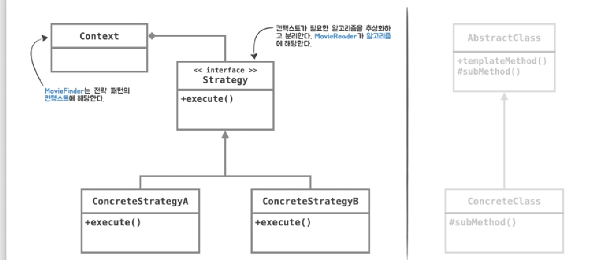

# 스프링러너의 스프링 아카데미: spring을 활용한 유여한 백엔드 개발 트레이닝

## 합성

- 합성은 다른 객체의 인스턴스를 자신의 인스턴스 변수로 포함해서 재사용하는 방법
  - 객체는 인터페이스를 사용해 참조하라  
    **인터페이스는 정의된 메시지를 통해서만 재사용이 가능하므로** 구현을 효과적으로 캡슐화 가능하다
  - 즉, 합성은 메시지를 통해 느슨하게 결합되며, 따라서 코드를 재사용하기 위해서는 상속보다는 합성을 선호하는 것이 더 좋은 방법이다

## 상속(템플릿 메소드 패턴)의 단점

- 캡슐화를 위반한다
  - 반면 합성에서 인터페이스를 활용하면 정의된 메시지를 통해서만 재사용이 가능하므로 캡슐화가 가능하다
  - <https://unluckyjung.github.io/oop/2021/03/17/Inheritance-and-Encapsulation/>
- 설계를 유연하지 못하게 만든다
  - 반면 합성에서는 갈아끼우기가 비교적 더 쉽다

## 팩토리

- 객체를 생성하고 관계를 구성하는 것 또한 하나의 관심사이기 때문에 분리할 필요가 있다
- 이러한 객체 생성방법을 결정하고 생성한 객체를 반환하는 역할을 수행하는 객체를 Factory 라고 부른다

## 제어의 역전

- 프로그램의 제어흐름의 구조가 뒤바뀌는 것
- 모든 객체가 능동적으로 자신이 사용할 객체를 결정하고, 언제 어떻게 그 객체를 만들지를 스스로 관장한다.
  즉 모든 종류의 흐름을 **사용하는 쪽**에서 제어하는 구조다
- 제어 역전원리가 적용된 코드는 자신이 **사용할 객체**를 스스로 결정하지 않는다.
- 자바 프로그램의 흐름은 메인 메소드와 같이 프로그램이 시작되는 지점에서 사용할 객체를 결정하고 결정한 객체를 생성하고, 생성된 객체에 있는 메소드를 호출한다. 다시 호출된 객체 메소드 안에서 또다시 사용할 객체를 결정,생성,호출을 반복
  - 즉, 각 객체는 프로그램 흐름을 결정하거나 사용할 객체를 구성하는 작업에 능동적으로 참여한다.

## SOLID 원칙

- SOLID는 깔끔한 설계를 위해 적용 가능한 다섯가지 소프트웨어 설계 원칙이다
- 함수와 데이터 구조를 클래스로 배치하는 방법, 그리고 이들 클래스를 서로 결합하는 방법으로 구성되어 있다
- 모듈과 컴포넌트 내부의 구조를 이해하기 쉽고, 변경에 유연하게 만드는데 목적을 두고 있다

## 개방폐쇄원칙

- 소프트웨어 개체(클래스나 모듈)은 확장에는 열려 있어야하고 변경에는 닫혀 있어야한다.

- `MovieFinder` 변경은 내부 다른 코드를 **변경**하지 않고 `MovieReader`를 갈아끼울 수 있다(**확장**)

## 의존성 역전원칙

- 상위 정책은 하위 정책에 의존하면 안된다. 하위 정책이 상위 정책에 정의된 추상 타입에 의존해야 한다.
- 이전에는 `MovieFinder`가 직접 `CsvMovieReader`를 의존하고 있었다. 이는 상위 정책인 `MovieFinder`가 하위 정책인 `CsvMovieReader`에 의존하고 있는 것
  - 이런 환경에서는 추상화된 `MovieReader`의 다형성이 동작하기 어렵다 -> `MovieFinder`가 직접 구체적인 하위객체를 생성하므로 다른 구현체를 사용할 수 없다
- 개선 후에는 런타임의 생성자를 통해 객체를 주입받아 사용하므로 다형성을 적극 활용 가능하고 재사용성이 높아진다

## 관심사의 분리

- 관심이 같은 것끼리는 한 곳으로(객체) 모으고, 다른 것은 따로 떨어뜨려 서로 영향을 주지 않도록 분리하는 것
  - 관심사가 같은 코드를 모아 **응집**시키고,
    관심사가 다른 코드는 분리하고 서로 낮은 **결합**을 갖도록 한다.

## 높은 응집도

- 응집도가 높다는 건 하나의 모듈, 클래스가 하나의 책임 또는 관심사에만 집중이 되어 있다는 뜻입니다
- 불필요하거나 직접 관련이 없는 외부의 관심과 책임이 얽혀있지않고 하나의 공통 관심사는 하나의 클래스에 모여 있다.

## 낮은 결합도

- 결합도가 낮다는 건 하나의 클래스가 변경이 일어날 때 관계를 맺고 있는 다른 클래스에 영향을 주지 않는다는 뜻
- 책임과 관심사가 다른 클래스 또는 모듈과는 낮은 결합도(**느슨한 연결형태**)를 유지하는게 좋다
  - 느슨한 연결은 관계를 유지하는 꼭 필요한 최소한의 방법만 간접적인 형태로 제공하고 나머지는 서로 독립적이고 알 필요없게 만들어주는 것
- 결합도가 낮아지면 변화에 대응하는 속도가 높아지고 구성이 깔끔해집니다. 또한 확장하기에도 편리하다

## 디자인 패턴

- 소프트웨어 설계시 자주 발생하는 문제에 대해 반복적으로 적용할 수 있는 해결방법

## 전략 패턴

- 전략 패턴은 자신의 기능 맥락에서 필요에 따라 변경이 필요한 알고리즘을 추상화를 통해 통째로 외부로 분리시키고 이를 구현한 구체적인 알고리즘 클래스를 필요에 따라 바꿔 사용할 수 있게 하는 디자인패턴
- `MovieFinder`는 전략 패턴의 콘텍스트에 해당한다
  - 콘텍스트는 자신의 기능을 수행하는데 필요한 기능 중에서 변경 가능한 알고리즘(메타데이터 읽기 알고리즘)을 `MovieReader`라는 인터페이스로 추상화하고 이를 구현한 클래스(전략)을 바꿔가면서 사용할 수 있게 하는 것

## 템플릿 메소드 패턴

- 어떤 작업을 처리하는 일부분을 서브 클래스로 캡슐화해서 전체 구조는 바꾸지 않으면서도 특정 행위를 수행하는 전략만 바꾸는 패턴
  

## 의존관계(dependency)

- 의존관계 정의: 어떤 클래스가 다른 클래스에 접근할 수 있는 경로를 가지거나 해당 클래스의 객체의 메소드를 호출하는 경우, 두 클래스 사이에 의존관계가 있다고 말한다.
  - 의존관계가 형성되면 `MovieReader`의 기능이 추가되거나 변경되었을 때 그 영향이 `MovieFinder`에게 전달된다
  - 의존관계는 객체와 객체가 협력하기 위해서는 반드시 필요하다
- **객체지향설계 핵심**은 협력을 위해 필요한 의존관계는 유지하면서도 변경을 방해하는 의존 관계는 제거하는데 있다
  - 객체지향설계란 의존관계를 관리하는 것이고 객체가 변경을 받아들일 수 있게 의존관계를 정리하는 기술

## 의존관계주입(Dependency Injection, DI)

- 코드 시점의 의존관계와 실행시점의 의존관계가 서로 다를 수 있다(다시말해 클래스 사이의 의존관계와 객체(인스턴스) 사이의 의존관계는 동일하지 않을 수 있다)
  - e.g. 코드상에서 `MovieFinder`클래스는 `MovieReader` 인터페이스에게 메시지를 전송하지만 실행시점에 실행되는 메소드는 협력하는 객체의 실제 클래스가 무엇인지에 따라 다르다(메세지를 수신하는 클래스에 따라 달라진다)
- **정의**:외부의 독립적인 존재가 객체를 생성한 후 이를 전달해서 의존관계를 해결하는 방법
- 방법: 생성자주입(생성하는 시점), 설정자주입(생성 후), 메서드 주입(메서드 실행시)

## 다형성

- 의존관계주입은 객체 지향 프로그램의 코드시점 의존관계와 실행시점 의존관계가 다를 수 있다는 사실에 기반으로 한다

## 스프링 IoC 컨테이너

- 스프링은 제어의 역전 원칙에 따라 객체의 생성, 의존관계주입과 가능 기능을 제공하는 IoC 컨테이너로 빈 팩토리를 제공한다
- 애플리케이션 콘텍스트는 빈 팩토리 특징을 그대로 가지고 있으면서 스프링 AOP 통합, 국제화지원, 이벤트기반애플리케이션, 웹애플리케이션을 위한 기능을 제공한다
- 빈팩토리(애플리케이션 콘텍스트)는 컨피규레이션 메타데이터라는 빈 구성 정보를 읽어 빈을 생성하고 관리한다

## 빈

- 스프링 빈은 스프링 컨테이너가 생성, 관계설정, 사용 등을 제어해주는 제어의 역전 원리가 적용된 객체
  - 객체 단위의 애플리케이션 컴포넌트를 말한다
- 다시말해, 컨테이너에 의해 생성 및 조립된 후 관리(초기화 소멸 등)되는 객체를 빈이라 부른다

## 정리:스프링 IoC 컨테이너와 빈

- 스프링은 IoC 컨테이너인 애플리케이션 콘텍스트나 빈 팩토리로 빈 구성 정보를 읽어 애플리케이션을 구성합니다
- 스프링 애플리케이션은 객체의 생성과 의존관계설정, 사용, 제거 등의 작업을 애플리케이션 코드 대신 독립적인 컨테이너가 담당한다.
  - 즉, 컨테이너가 코드 대신 객체에 대한 제어권을 가지고 있으므로 IoC라고 부른다.
- 컨테이너는 제어의 역전원리가 적용된 스프링 핵심 컴포넌트
- 빈 생성시 의존관계주입이 일어난다
- 빈 구성정보를 바탕으로 비즈니스 오브젝트를 이용해 애플리케이션을 구성하고 생애를 관리한다.

## 빈 구성정보(Configuration Metadata)

- 스프링 컨테이너가 빈 객체 생성 및 구성, 조립시 사용하는 설정정보
- 컨테이너 기능을 설정하거나 조정이 필요할 때도 사용
- 스프링은 빈 구성정보를 읽고 `Bean Definition`이라는 인터페이스로 추상화된 객체를 만들어 사용
  - IoC 컨테이너는 `Bean Definition`으로 만들어지는 객체를 사용해 애플리케이션을 구성합니다 -> 특정 파일포맷이나 형식에 제한되거나 종속되지 않는다
- 자바 코드로 작성하는 빈 구성정보는 관심사가 같은 컴포넌트들을 함께 묶어 모듈화가 가능하다 -> 여러 개의 구성정보를 작성하고 조합할 수 있다

## 빈 스코프

- 스프링 컨테이너는 빈을 생성할 때 단 하나의 빈을 만들지,
  아니면 빈이 요청될 때마다 새로운 빈 객체를 만들지 결정하는 메커니즘
- 싱글톤 스코프: 단 하나의 빈 객체만 만들 때  
  프로토타입 스코프: 빈이 요청될 때마다 새로운 빈을 생성하기

## 싱글톤 스코프

- 스프링 컨테이너 내에서 단 하나만 생성이 되고, 그 빈을 의존하는 모든 빈에 유일한 객체를 공유한다.

## @Import, @ImportResource

- `@Import` 애노테이션은 다른 클래스에서 빈 구성 정보를 불러오기 위해 사용한다
- XML 형식으로 작성된 빈 구성정보가 있다면 `@ImportResource`으로 XML 파일 위치를 지정해주면 된다

## @ComponentScan

- `@ComponentScan`으로 자동 클래스 탐지 기능을 활성화하면 지정된 패키지 경로에서 스테레오타입(e.g. `@Component`)으로 선언된 클래스를 찾아 빈으로 등록하고 관리한다
  - 패키지를 지정하지 않으면 ComponentScan 애노테이션이 선언된 클래스를 기준으로 탐색한다

## Stereotype Bean

- 각 스테레오 타입 애노테이션은 빈의 역할과 관련이 있다
- `@Service`는 다른 빈이 필요로 하는 서비스를 제공하는 복잡한 비즈니스 기능을 가진 빈을 정의하는데 사용
- `@Repository`는 데이터베이스와 같이 데이터 접근 기술이 사용되는 빈을 정의하는데 사용

## 자동 와이어링(Autowired)

- 스프링은 빈이 생성된 후 자동으로 의존관계를 주입해주는 기법
- 생성자가 **하나** 뿐이라면 `@Autowired` 생략가능
  - 두개 이상의 생성자일 경우에는 스프링이 어떤 생성자로 생성해야할지 모르기 때문에 문제가 발생한다
- 처음은 타입을 기반으로(선언되어 있는 타입) 해당하는 빈을 찾아 의존관계주입을 해결하고,  
  만약 같은 타입의 빈이 2개 이상 존재하면 (설정된 빈의)이름으로 의존관계를 구성해주는 전략을 가진다
- ComponentScan을 통해서 자동으로 빈이 등록이 될 때는 클래스의 이름을 기반으로 빈의 이름이 등록된다
- `@Bean`으로 자바 구성클래스에서 어노테이션으로 등록할 경우 메소드 이름을 기반으로 빈의 이름이 등록된다

## 테스트 컨텍스트 프레임워크

- 스프링은 테스트에 사용되는 스프링 컨테이너를 생성 및 관리하고 테스트에 적용할 수 있는 기능을 가진 테스트 프레임워크를 제공한다
- 테스트 컨텍스트 프레임워크는 JUnit 또는 TestNG와 같은 테스트 프레임워크와 잘 통합되어 동작한다

## `@ExtendWith`, `SpringExtension.class`

- `@ExtendWith`: JUnit 이 테스트 실행 전략을 확장할 때 사용하는 애노테이션
- `SpringExtension.class`: 스프링의 테스트 컨텍스트 프레임워크에서 제공하는 JUnit 지원클래스로,  
  JUnit이 테스트를 실행하는 과정에서 테스트가 필요로 하는 스프링 컨테이너를 구성하고 관리해줍니다
  - 스프링 컨테이너를 구성할 때 `@ContextConfiguration` 어노테이션이 지정이 되어있다면 해당 어노테이션이 저장한 빈 구성정보를 바탕으로 스프링 컨테이너를 만든다

## 엔터프라이즈 애플리케이션 계층

- 소프트웨어를 계층으로 나누고 분리시키는 건 서로 변경의 주기가 다르고,
  또 다른 맥락에서는 구체적인 세부 기술로부터 도메인 논리를 보호하기 위함도 있다
  - 도메인계층은 핵심업무논리외에는 없는 것이 가장 좋다
  - 변화의 이유와 시기가 다르면 분리할 필요가 있다

## 분리된 인터페이스 패턴

- 추상화를 별도의 독립적인 패키지가 아니라 클라이언트에 속한 패키지에 포함하는 구조를 분리된 인터페이스 패턴이라고 한다.
  - MovieFinder와 MovieReader 인터페이스를 하나의 패키지로 모음으로, 결과적으로, domain 패키지를 완벽하게 독립시킬 수 있다. 성격이 다른 MovieReader 가 필요하다면 다른 패키지를 추가하고 새로운 MovieReader 구현체를 만들면 상위 수준의 협력관계를 재사용할 수 있다
- 의존성 역전원칙에 따라 상위 수준의 협력흐름을 재사용하기 위해서는 추상화가 제공하는 인터페이스의 소유권 역시 역전 시켜야한다.

## 소프트웨어의 두가지 가치

- 행위적 가치: 사용자가 가진 문제를 해결해주는 것
  - 이를 위해 소프트웨어 사용자가 기능명세서나 요구사항문서를 구체화하고 충족하도록 개발
- 구조적 가치: 변경하기 쉬운 소프트웨어를 만드는 것
- 소프트웨어를 만든 이유는 기계의 행위를 빠르고 쉽게 변경하는 방법이 필요했기 때문이다
  - 그러기 위해서는 애플리케이션의 형태, 코드의 배치 방식, 코드의 상호연결방식에 의존

## 변경하기 쉬운 소프트웨어 만들기

- 소프트웨어를 부드럽게 유지하는 방법은 선택사항을 가능한 많이, 가능한 오랫동안 열어두는 것
  - 열어둬야할 선택사항이란? -> 상대적으로 중요치 않은 구현 세부사항
- 좋은 아키텍처는 선택사항을 열어둠으로써 향후 소프트웨어에 변경이 필요할 때 어떤 방향으로든 쉽게 변경할 수 있도록 해야한다

## 소프트웨어를 구성하는 두 가지 요소

- 정책: 모든 업무 규칙과 업무 절차를 구체화한 것
- 구현세부사항: 입출력장치, 데이터베이스 등 시스템을 사용 또는 구동하는데 필요한 것
  - 구현세부사항은 사람, 외부 시스템, 프로그래머가 정책과 소통할 때 필요한 요소지만, 정책이 가진 행위에는 영향을 미치지 않는다
- 세부사항을 몰두하지 않은 채 고수준의 정책을 만들 수 있다면 이러한 구현세부사항에 대한 결정을 오랫동안 미루거나 연기할 수 있다

## 외부에서 내부로 접근하는 의존방향

- 변경하기 쉬운 소프트웨어를 만들기위해 애플리케이션을 내부와 외부를 분리하고, 내부는 핵심 도메인 개념을 구현한 코드를 배치하고, 외부 영역은 입출력 장치나 데이터베이스 등의 구체적인 기술을 사용하는 구현세부사항과 상호작용 코드를 배치합니다. 이를 통해서 **애플리케이션의 핵심을 외부의 기술적인 부분들과 분리시키는 것**이 핵심입니다.
- 이렇게 분리된 영역은 테스트하기 쉽고 필요에 따라 어렵지 않게 변경할 수 있다
- 반드시 지켜야할 원칙은 외부에서 내부로 접근하는 의존방향
- e.g. `MovieFinder`는 (`MovieReader` 인터페이스에 정의된 영화목록불러오기를 통해 취득한 영화목록으로) 사용자 명령을 수행합니다. 이는 애플리케이션의 정책이자, 핵심 도메인 개념을 구현한 코드로 내부 영역에 배치합니다
- `MovieReader` 인터페이스를 실체화한 `CsvMovieReader`나 `JaxbMovieReader`는 모두 파일을 기반으로 영화 메타데이터 읽기 구현세부 사항으로 외부영역에 배치합니다
  - 필요에 따라 파일이 아닌 데이터베이스나 외부 시스템으로부터로도 영화 메타데이터를 읽을 수 있도록 변경할 수 있습니다

## 객체지향패러다임: 협력하는 객체

- 객체지향의 핵심은 애플리케이션 기능을 구현하기 위해서 협력에 참여하는 객체들 사이의 상호작용이다
  - 객체들은 협력에 참여하기 위해 역할을 부여받고 역할에 적합한 책임을 수행합니다

## 객체지향과 스프링

- IoC와 DI는 객체의설계와 생성, 관계, 사용에 관한 기술이다

- 스프링은 어떻게 객체가 설계되고, 만들어지고, 어떻게 관계를 맺고, 사용되는지에 관심을 두는 프레임워크이다
  - 스프링의 관심은 객체와 그 관계이다. 하지만 객체를 어떻게 설계하고, 분리하고, 개선하고, 어떤 의존관계를 가질지 결정하는 일은 스프링이 아니라 개발자의 역할이며 책임이다. 스프링은 단지 원칙을 잘 따르는 설계를 적용하고자 할 때 필연적으로 등장하는 번거로운 작업을 편하게 할 수 있도록 도와주는 도구일뿐이다. -> 스프링을 사용한다고 좋은 객체지향설계와 깨끗하고 유연한 코드가 저절로 만들어지지 않습니다.

## 프로파일 - 환경에 따른 빈 구성기능

- 환경에 따라 다른 빈을 등록할 수 있게 하는 메커니즘
  - e.g. 개발서버와 QA서버 또는 프로덕션 서버에서 사용하는 데이터소스 유형이 다를 때
  - 성능검증서버에서 배포시에만 모니터링 인프라를 활성화시킬 때
  - 고객별로 사용자화된 애플리케이션을 제공할 때
- 보다 정교한 조건으로 빈 구성이 필요하다면 Conditional 애노테이션과 Condition 인터페이스를 사용할 수 있다

## 로깅

- 스프링이 출력하는 로그를 볼려면 지원되는 로깅 프레임워크를 애플리케이션 의존성에 추가하고 로거 설정 정보를 작성하면 된다.

## 이식가능한 서비스 추상화(Portable Service Abstraction)

- 이식가능한 서비스 추상화는 환경과 세부 기술의 변화와 관계없이 **일관된 방식으로 기술에 접근**할 수 있게 해줍니다
- POJO로 개발된 코드는 특정 환경이나 구현방식에 종속되지 않아야한다
  - 엔터프라이즈 자바 플랫폼을 사용하는 우리는 다양한 자바 EE 기술을 사용할 수 밖에 없다.
  - 특정 환경과 기술에 종속적이지 않다는 것은 자바 EE 기술을 사용하지 않는다는 뜻이 아니라 **POJO가 세부기술에 직접 노출되지 않도록 만든다는 뜻이다**
- 스프링은 엔터프라이즈 애플리케이션에 사용되는 다양한 기술의 서비스 추상화 기능을 제공해 POJO를 보호할 수 있도록 지원하고 있다
  - 캐시, 메일, 메시징과 같이 스프링이 정의한 추상화 API를 직접 이용하는 방식도 제공되며, 또는 AOP나 템플릿 콜백 패턴과 결합하여 직접 API를 사용하지 않지만 스프링에 의해 제어되는 트랜잭션 서비스 추상화 또는 원격 호출 서비스 추상화 등이 있다

- MovieFinder 와 MovieReader 는 각자 담당하는 코드의 기능적인 관심에 따라 분리되고 서로 불필요한 영향을 주지 않으면서 독자적으로 확장 가능하도록 만든 것이다
- 같은 애플리케이션 로직을 담은 코드지만 역할에 따라 분리를 했습니다

- OXM서비스 추상화는 이와 조금 다르다. 애플리케이션의 비즈니스 로직과 그 하위에서 동작하는 저수준의 XML 기술이라는 아예 다른 계층의 특성을 갖는 코드를 분리한 것이다

- XmlMovieReader는 XML 문서를 다루는 방식에 대해서는 독립적이다. Unmarshaller 인터페이스와 의존관계주입을 통해 추상화된 API로 저수준의 Object-XML Mapping 기술을 사용하기 때문이다.
  - 어떤 구현기술을 사용하든 상관없이 XmlMovieReader의 코드는 변하지 않는다
  - 즉, XmlMovieReader와 Object-XML Mapping 기술의 결합도가 낮다는 뜻이다

## 메타데이터 읽기

- 메타데이터 위치를 결정하는 것과 메타데이터를 읽는 행위도 변화의 이유와 시기가 다르기 때문에 분리할 필요가 있다

## 메타데이터 검증하는 방법

1. 빈을 생성하고 등록할 때 setter 메서드와 검증로직을 함께 동작시킨다
2.

## 빈의 생명주기 콜백

- 스프링 컨테이너는 빈의 생성부터 초기화, 소멸에 이르는 생명 주기에 관여할 수 있는 확장 지점을 제공하고 있다
  - e.g. `InitializingBean` 인터페이스와 `DisposableBean` 인터페이스
  - `InitializingBean` 콜백 인터페이스는 빈의 의존관계 주입이 끝난 후 호출된다
  - `DisposableBean` 콜백 인터페이스는 객체가 소멸될 때 네트워크 연결해제 등의 리소스 정리가 필요하다면 활용할 수 있다
- 스프링은 콜백 인터페이스 외에도 JSR 250으로 정의되어 있는 자바 표준 애노테이션을 사용해서 빈 생명 주기에 관여할 수 있다

## JSR 250

- 자바플랫폼을 위한 공통 애노테이션에 관한 스펙으로 자주 사용되는 여러 애노테이션을 표준화한 것이다. 스프링에도 사용가능하다
  - 이를 통해 선언적 프로그래밍 스타일이 가능하도록 계획하였다
- 이러한 표준 애노테이션들은 엔터프라이즈 자바에 먼저 도입이 되어 EJB나 서블릿 등에 적용된 이후에 표준 자바 플랫폼에도 적용이 되어 있는 상태이다
- `@Resource`: 리소스에 대한 참조를 선언할 수 있는 애노테이션으로 스프링 autowired와 같이 의존관계 주입시 사용할 수 있다
- `@PostConstruct`: 의존관계주입이 이루어진 후에 초기화를 수행하는 메소드에 사용을 할 수 있다
- 특정 규약과 환경에 종속되지 않도록 객체를 작성하기 위해서는 초기화 또는 소멸 시 필요한 작업은 자바 표준 애노테이션을 이용해서 해결을 하는게 좋다
  - 하지만 보다 정교하게 제어하기 위해서는 스프링이 제공하는 콜백 인터페이스를 사용해야할 때도 있다

## 코드 변경없고 설정값 바꾸기

- 애플리케이션 외부 설정 파일이나 시스템 환경변수 등에서 설정정보를 작성해둔 뒤 애플리케이션이 실행될 때 설정정보를 읽어 메타데이터 위치를 설정하기
- 애플리케이션 환경에 따라서 스프링 컨테이너 구성을 달리하는 방법: JVM 아규먼트를 설정해서 해당 아규먼트에 따라서 프로파일이 구성되고 프로파일에 따라서 스프링 컨테이너가 동적으로 구성되기

## Environment 인터페이스

- 스프링은 외부 설정파일이나, VM 아규먼트(시스템환경변수) 그 외의 **다양한 방식으로부터 일관된 방식으로 환경정보를 읽을 수 있는** 런타임 환경 서비스 추상화 인터페이스

## `@Value`

- `@Value`는 외부 설정 정보를 주입하는데 사용한다
  - 이때 필요한 외부설정 정보는 스프링 런타임 환경 추상화를 통해 취득할 수 있다

## 환경추상화(Environment Abstraction)

- 프로파일과 프로퍼티 소스로 구성되며, 컨테이너에 통합된 서비스 추상화이다
- 이를 통해 실행환경에 따라 빈을 구성할 수 있고, 일관된 방식으로 외부 설정정보를 관리하고 접근할 수 있다
- 개발자는 environment 인터페이스나 애노테이션을 이용해 환경 추상화 APi를 이용할 수 있다

## 빈 정의 프로파일(profiles)로 환경에 따라 컨테이너 구성하기

- 빈 정의 프로파일은 실행 환경에 따른 빈 구성 메커니즘으로 profile 애노테이션을 사용해 프로파일 별로 빈을 등록할 수 있게 합니다
  - 실행환경이란 개발, 운영 또는 성능 측정 등으로 애플리케이션이 실행되는 환경을 뜻하고
  - 프로파일은 OS 환경변수나 JVM 시스템 프로퍼티, Environment API 등을 통해서 활성화할 수 있습니다

### 프로파일 활성화 방법들

## 애플리케이션 설정정보를 다루는 PropertySource 추상화

- 프로퍼티소스는 키=밸류 형식으로 작성된 설정정보로 다양한 소스를 일관된 방식으로 사용할 수 있게 해주는 서비스 추상화입니다
- 사용할 수 있는 소스로 운영체제의 환경변수나 JVM 시스템 프로퍼티, 서블릿 설정 매개변수, 프로퍼티 파일 등이 있습니다

- 설정정보를 취득할 때는 Environment 인터페이스가 제공하는 getProperty 메소드나 애노테이션을 이용할 수 있습니다

## 스프링 환경(Environment)에 프로퍼티 파일 등록하기

- `@PropertySource`를 이용하면 환경에 프로퍼티 파일을 쉽게 등록할 수 있다.
  - 애노테이션 설정된 경로값은 리소스 로더로 읽어 들인다. 때문에 클래스패스나 파일 또는 서블릿 경로 등 다양한 소스를 사용할 수 있다

## @Value를 사용한 빈 프로퍼티 값 설정하기

- Value 애노테이션을 사용하면 환경설정정보 또는 컨테이너에 등록된 빈을 사용해 빈 프로퍼티 값을 설정할 수 있습니다
- Value 애노테이션은 필드, 설정자 메소드, 메소드 파라미터나 생성자에 사용할 수 있습니다
- e.g. 프로퍼티 파일로 작성된 설정정보를 환경(environment)에 등록하였습니다. 이후 Value 애노테이션을 통해 필요한 값을 빈 프로퍼티로 설정할 수 있습니다
- Value 애노테이션으로 빈 프로퍼티 값을 설정할 때 두가지 방식을 지원합니다
  - 프로퍼티 치환자를 사용하는 방식입니다. 달러와 중괄호를 이용해 명시된 프로퍼티 키에 연결된 값으로 바꿔치기 한 후에 빈 프로퍼티 값으로 설정하는 방식입니다.
  - 스프링 컨테이너는 프로퍼티 치환에 대한 기본적인 전략을 가지고 있습니다. 전략을 변경할 필요가 있다면 PropertySourcesPlaceholderConfigurer를 직접 빈으로 등록을 하면 됩니다(반드시 정적 메소드로 선언해야하는 제약이 있습니다)
    
  - 두번째는 스프링 표현언어를 이용해서 빈 프로퍼티 값을 설정하는 것입니다.
  - 스프링 표현언어(SpEL)는 런타임 시 객체의 그래프를 조회하고 조작하는 스프링 전용 표현식 언어로 표현식을 통해 다른 빈 객체나 프로퍼티에 접근할 수 있고, 다양한 연산도 할 수 있습니다
  - 샵과 중괄호로 작성된 표현식의 평가결과를 빈 프로퍼티 값으로 설정합니다
    

## 저수준 자원에 접근할 수 있는 서비스 추상화 -> 리소스 인터페이스

- 자바의 URL 클래스로는 자바 웹 애플리케이션 개발시 사용되는 서블릿 컨텍스트 경로나 클라우드 스토리지 서비스에 있는 자원과 같은 것들은 표현할 수 없다. 그래서 스프링은 일관된 방식으로 저수준 자원에 접근할 수 있는 서비스 추상화를 제공한다

## 리소스 인터페이스

- 스프링은 리소스 인터페이스를 통해서 다양한 외부자원정보를 읽어 들일 수 있습니다
- 스프링은 파일이나 원격지에 있는 자원에 일관된 방식으로 접근하고 사용할 수 있는 추상화 인터페이스로 **리소스 인터페이스**를 제공합니다
- 스프링은 컨테이너가 사용할 설정 정보 파일을 다루는 것부터 외부 리소스 정보가 필요할 때는 항상 리소스 추상화 인터페이스를 사용하고 있습니다

## 리소스 로더

- getResource 메소드를 통해서 주어진 위치에 자원을 취득할 수 있도록 도와주는 컴포넌트입니다
- 모든 애플리케이션 컨텍스트는 이 리소스 로더 인터페이스로 구현하고 있습니다
  - 그래서 콘텍스트별로 적합한 리소스 객체를 손쉽게 얻을 수 있도록 제공해주고 있다
  - 이때 접두어를 이용하면 다른 방식의 리소스도 손쉽게 얻을 수 있다

## ResourceLoaderAware, XXXXAware

- 리소스 로더를 외부에서 의존관계주입을 받을 수 있도록 도와준다
- 스프링 컨테이너는 Aware로 정의되어 있는 다양한 인터페이스를 이해하고, 이 인터페이스에 따라서 필요한, 적절한 의존객체를 주입해줍니다
