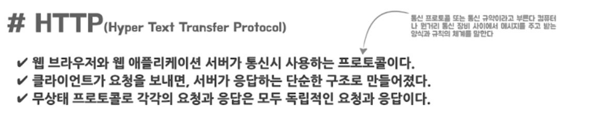
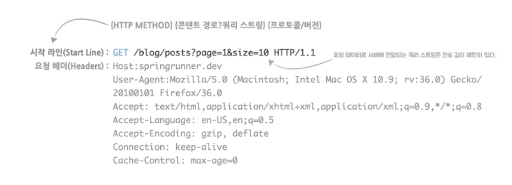
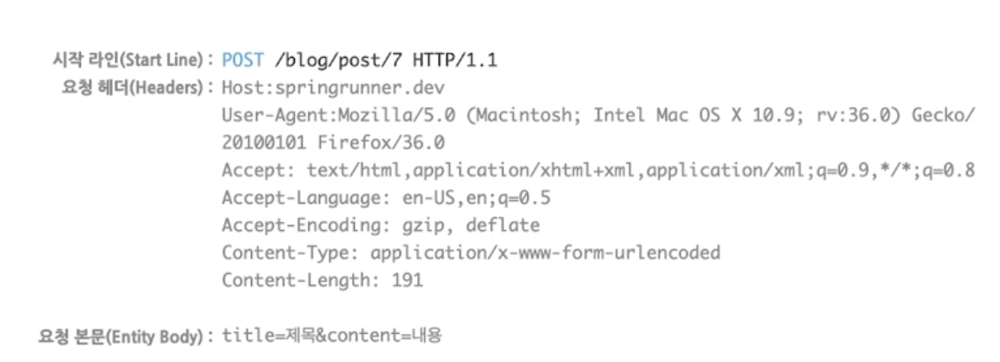
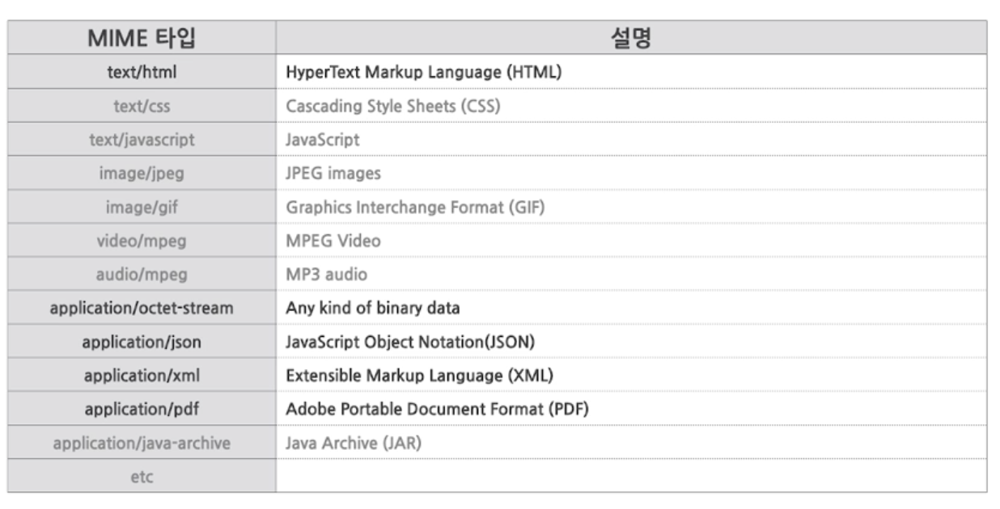
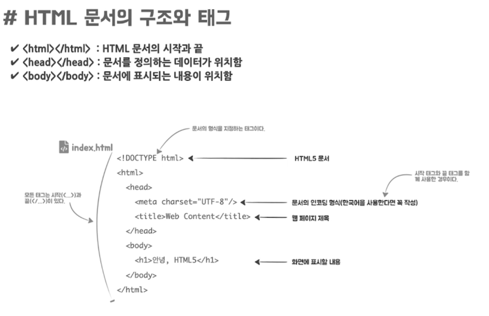
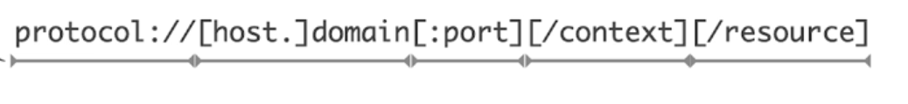

# 스프링러너의 스프링아카데미: 원리를 이해하는 spring mvc/spring boot 실전활용가이드

## 스프링, 한줄소개

- 스프링은 자바 엔터프라이즈 환경에 필요한 모든 것을 제공하고 자바 엔터프라이즈 애플리케이션을 손쉽게 만들 수 있다

## 스프링이 해결하고자 하는 문제

- 스프링은 엔터프라이즈 애플리케이션을 개발할 때 개발자가 복잡하고 실수하기 쉬운 저수준의 기술에 많은 신경을 쓰지 않으면서도 애플리케이션의 핵심기능 즉, 비즈니스 로직을 빠르고 효과적으로 구현할 수 있도록 돕습니다.
  - 엔터프라이즈 애플리케이션을 개발하는 것은 무척이나 어렵고 복잡하다

## 엔터프라이즈 애플리케이션 (enterprise application)

- 엔터프라이즈 애플리케이션은 서버에서 동작하며 기업과 조직의 업무를 처리해주는 시스템을 말한다.
- 엔터프라이즈 애플리케이션은 많은 사용자의 요청을 동시에 처리해야하기 때문에 서버의 자원을 효율적으로 공유하고 분배해서 사용할 수 있어야한다. 또한 기업의 중요한 핵심 정보를 처리하기 때문에 보안과 안정성, 확장성 면에서도 뛰어나야 한다.
  - 뛰어난 성능과 서비스의 안정성이 요구되고 그런 점을 고려한 개발 기술이 필요로 한다
  - 즉, 엔터프라이즈 애플리케이션을 개발하는데는 비즈니스 로직을 구현하는 것 외에도 기술적으로 고려해야할 사항이 많다
  - 또한 웹이나 모바일 앱을 통한 사용자 인터페이스 뿐만 아니라 타시스템과의 자동화된 연계와 웹 이외의 클라이언트와의 통신을 위한 리모트 기술, 다중 데이터베이스를 하나의 트랜잭션으로 묶어서 사용하는 분산 트랜잭션의 지원 등도 필요합니다

## 엔터프라이즈 애플리케이션의 4가지 특징

- 대규모의 복잡한 데이터를 관리하고 이러한 데이터를 이용해 비즈니스 프로세스를 지원하며 자동화한다
- 비즈니스의 근간으로 보안과 안정성, 확장성이 필요하며, 뛰어난 성능과 서비스의 안정성이 요구된다
- 다수의 사용자가 접근하며, 기업내 분산된 다른 엔터프라이즈 애플리케이션과 통합된다
- 데이터 입/출력을 위한 다양한 사용자 인터페이스가 제공된다

## 엔터프라이즈 자바 (Java Enterprise Edition, Java EE)

- 엔터프라이즈 애플리케이션에 필요한 확장성, 신뢰성, 보안성 등을 제공하는 자바 플랫폼이자 프레임워크이다
  - 엔터프라이즈 애플리케이션을 개발하는데는 비즈니스 로직을 구현하는 것 외에도 기술적으로 고려해야할 사항이 많다
- 대규모, 네트워크, 다계층 애플리케이션을 더 쉽게 안전하고 탄탄하게 구축할 수 있도록 설계되었다
- 웹을 통한 UI, 시스템 통합을 위한 리모팅, 선언적 트랜잭션 처리 등 전체 애플리케이션 스택을 제공한다
- 다양한 자바 명세 요청서(Java Specification Request, JSR) 을 바탕으로 작성된 표준 API 모음

## 자바 EE 서버

- 엔터프라이즈 자바로 만든 애플리케이션을 배포하려면 Java EE 서버가 필요하다
- 자바 EE 서버는 서블릿이나 EJB 등의 Java EE 명세를 구현한 서버를 뜻한다
  - 1. Java EE의 모든 표준 기술을 지원하고 다양한 모듈로 배포가 가능한 완전한 웹애플리케이션 서버(Web Application Server)
  - 2. 웹 모듈만 배포가 가능한 경량급 웹애플리케이션 서버(aka 서블릿 컨테이너)

## 스프링 프레임워크

- 자바 엔터프라이즈 개발을 편하게 해주는 오픈소스 경량급 애플리케이션 프레임워크
- 엔터프라이즈 애플리케이션 개발이 어려운 이유는 폭발적으로 늘어나는 비즈니스와 기술의 복잡성 때문이다
  - 스프링은 근본적인 부분에서 이런 복잡성을 다루기 위해 POJO를 중심으로 제어의 역전과 의존관계 주입, 관점지향프로그래밍, 이식 가능한 서비스 추상화와 같은 핵심 기술을 프레임워크와 컨테이너를 통해 제공한다
  - 이를 바탕으로 개발자가 다루기 어려운 저수준의 기술에 많은 신경을 쓰지 않으면서도 엔터프라이즈 애플리케이션을 쉽고 효과적으로 개발할 수 있는 해결책을 제시한다

## 스프링 프레임워크의 특징

- 자바 플랫폼으로 엔터프라이즈 애플리케이션을 개발하는데 필요한 하부 구조를 포괄적으로 제공한다
- 스프링이 하부 구조를 처리하므로 개발자는 애플리케이션 개발에 집중할 수 있다
- 핵심은 **엔터프라이즈 서비스 기능을 POJO에 제공**하는 것이다
  - e.g. 트랜잭션, 보안, 메일, 메시징, 캐시와 같은 기술

## 웹 애플리케이션이란

- 인터넷을 통해 웹 브라우저에서 이용할 수 있는 응용 소프트웨어이다

## 웹 애플리케이션의 동작

- 웹 애플리케이션의 동작은 클라이언트와 서버의 요청과 응답의 관계 속에서 이루어진다
  - 1. 웹 브라우저는 URL을 기반으로 보고 싶은 콘텐츠를 HTTP 요청한다
  - 2. 웹 애플리케이션 서버는 요청 처리 후 컨텐츠를 HTTP 응답한다
  - 3. 클라이언트(웹 브라우저)는 응답받은 컨텐츠를 결과 화면으로 출력한다
- 웹 애플리케이션의 동작 방식은 프로토콜(HTTP)을 따라 만들어졌다

## HTTP

- HTTP 요청은 HTTP 메소드(e.g. GET, POST), 콘텐츠주소(URL), 요청헤더, 요청본문(e.g. 쿼리 스트링, 폼 데이터)으로 구성되어 있다

## HTTP 메소드

- HTTP 메소드는 클라이언트는 요청시 메소드를 통해 주어진 자원에 수행하길 원하는 행동을 나타낸다
- 웹 브라우저는 GET과 POST라는 두가지 메소드를 기본으로 제공하고 있으며, 나머지 메소드는 자바스크립트와 같은 범용프로그램 언어를 이용해야만 사용할 수 있다

| HTTP메소드 | 설명                                                              |
| ---------- | ----------------------------------------------------------------- |
| options    | 요청 URL에 사용할 수 있는 메소드를 확인한다                       |
| get        | 요청 URL에 해당하는 콘텐츠(자원)을 가져온다                       |
| head       | get 요청에서 콘텐츠(자원)은 제외하고 헤더(메타 데이터)만 가져온다 |
| post       | 요청 URL의 콘텐츠(자원)의 새로운 데이터를 보낸다                  |
| put        | 요청 URL에 변경할 데이터를 보낸다                                 |
| delete     | 요청 URL의 콘텐츠(자원)을 삭제한다                                |
| trace      | 보낸 메세지를 다시 돌려보낸다(loop-back)                          |
| connect    | 프락시에 사용하기 위해 예약된 메소드이다                          |
| patch      | 요청 URI에 해당하는 콘텐츠 중 일부를 변경한다                     |

## HTTP GET 요청

- 시작라인(start line): HTTP 메소드, 콘텐츠 경로, 프로토콜의 버전이 명시되어 있다
  - 콘텐츠 경로에는 쿼리스트링을 추가로 표기할 수 있다. 이를 통해 서버에 데이터를 전달할 수 있다. 다만 전송 길에 제한이 있으며 웹 브라우저나 서버 등의 환경적인 특성을 타기 때문에 주의해서 사용해야한다
- 요청헤더(headers): HTTP 헤더는 클라이언트와 서버가 요청 또는 응답으로 부가적인 정보를 전송할 수 있도록 해준다
  - e.g. User-Agent 헤더는 요청을 보내는 클라이언트에 대한 정보를 담고 있다
    Connection 헤더는 클라이언트와 서버 간의 네트워크 커넥션 연결을 어떻게 처리할 것인지를 설정한다
    Accept로 시작하는 헤더는 서버에게 원하는 콘텐츠 형태를 Mime 타입으로 요구한다

## HTTP POST 요청

- 요청헤더: 전송하는 본문의 데이터의 형태와 길이 정보가 함께 작성되어 있다 (Content-Type, Content-Length)
- 요청본문(Entity Body): 요청본문을 통해 서버에 데이터를 전송할 수 있다. 쿼리스트링은 길이의 제한이 있었지만 요청 본문의 경우에는 제한이 없다. 전송할 데이터의 양이 많거나 보안상 감춰야 한다면은 POST를 사용하는 것이 더 적합하다

## HTTP 응답

- 상태코드, 헤더, 콘텐츠로 구성되어있다
- 상태라인(Status line): 프로토콜/버전, 상태코드, 상태코드값
- 응답헤더(headers): 서버가 응답에 대한 부가적인 정보를 작성
  e.g. Content-type: 응답 본문의 형식이 무엇인지 Mime 타입으로 클라이언트에게 알려준다

## HTTP 상태코드

- 요청에 대한 응답상태이다.
  웹 브라우저는 상태코드에 따라 동작방식을 결정한다

| 유형                | 상태코드 예시                                                                                                                                                                                                       |
| ------------------- | ------------------------------------------------------------------------------------------------------------------------------------------------------------------------------------------------------------------- |
| 1xx/조건부응답      | 100(계속): 요청자는 요청을 계속 해야한다.  101(프로토콜전환): 요청자가 서버에 프로토콜 전환을 요청했으며 서버는 이를 승인하는 중이다                                                                             |
| 2xx/성공            | 200(성공): 서버가 요청을 제대로 처리했다는 뜻이다. 201(작성됨): 성공적으로 요청되었으며 서버가 새 리소스를 작성했다.                                                                                             |
| 3xx/리다이렉션 완료 | 301(영구이동): 요청한 페이지를 새 위치로 영구적으로 이동했다. 302(임시이동): 현재 서버가 다른 위치의 페이지로 요청에 응답하고 있지만 요청자는 향후 요청 시 원래 위치를 계속 사용해야 한다                        |
| 4xx/클라이언트 오류 | 400(잘못된 요청): 서버가 요청의 구문을 인식하지 못했다 404(찾을 수 없음): 서버가 요청한 페이지를 찾을 수 없다. 예를 들면 서버에 존재하지 않는 페이지에 대한 요청이 있을 경우 서버는 이 코드를 제공한다           |
| 5xx/서버 오류       | 500(내부서버오류): 서버에 오류가 발생하여 요청을 수행할 수 없다 503(서비스를 사용할 수 없음): 서버가 오버로드 되었거나 유지관리를 위해 다운되었기 때문에 현재 서버를 이용할 수 없다. 이는 대개 일시적인 상태이다 |

## 쿠키

- 서버가 클라이언트에게 보내는 작은 기록정보이다. HTTP 프로토콜의 특성상 서버는 브라우저를 기억하지 못한다. 따라서 쿠키를 통해 재방문한 클라이언트를 식별한다

## MIME 타입

- 서버 또는 클라이언트에게 전성된 리소스의 유형을 알려주기 위한 메커니즘
  
- 브라우저는 리소스를 받았을 때 할 기본적인 동작을 결정하기 위해 MIME 타입을 활용한다
  - e.g. HTML이나 이미지 타입이라면 그대로 화면을 출력시키고 바이너리 데이터 형식이라면 리소스를 다운해서 로컬 디스크에 저장한다

## HTML

- 웹 문서를 만들기 위한 언어로 웹 브라우저 위에서 동작하는 마크업 언어이다
- 웹 문서를 구성하기 위해 만들어진 여러가지 태그로 작성할 수 있다
  

## URL(Uniform Resource Locators)

- 인터넷 상에서 자원이 어디있는지 알려주기 위한 주소 규약
- 웹 페이지 뿐만 아니라 네트워크 상의 모든 자원에 대한 주소를 표현할 수 있다

- 프로토콜은 클라이언트와 서버가 대화할 때 사용하는 통신 규약
- 도메인은 네트워크 상에 위치한 서버를 가리키는 이름으로 도메인 네임이나 IP 주소를 사용한다
- 포트는 네트워크 장치의 특정 프로그램에 접근을 하기 위한 논리적인 주소이다. 생략을 하면 프로토콜에 따라 지정된 포트를 사용한다
- context는 접근할 웹 애플리케이션의 이름을 나타내고 resource는 요청할 자원 이름을 의미한다
  - 웹 애플리케이션 서버는 여러 개의 컨텍스트(애플리케이션)을 가질 수 있다. 생략하면 기본 컨텍스트(ROOT./)가 동작한다

## 정적 콘텐츠와 동적 콘텐츠

- 정적 콘텐츠: 이미지, 스타일시트(CSS), 자바스크립트 같이 변하지 않는 콘텐츠
  브라우저가 요청하면 항상 정해져있는 데이터로 응답
- 동적 콘텐츠: 웹 애플리케이션 서버가 HTTP 의 요청을 해석한 후에 프로그램을 실행하고 그 결과값으로 만든 컨텐츠를 의미
  브라우저의 요청에 따라서 어떤 요청인지를 분석하고 그 요청의 내용에 따라서 응답의 데이터가 달라지는 것을 의미

## 자바 서블릿과 JSP

- 자바 서블릿과 JSP는 Java EE 에 속한 기술로 자바 웹 애플리케이션의 기반 기술이다
  - 웹 콘텐츠를 동적으로 생성하는 서버 측 자바 프로그램이다
  - 자바 서블릿이나 JSP를 실행하기 위해서는 Java EE 컨테이너 혹은 서블릿 컨테이너가 필요하다
- 동작흐름
  - 최초 클라이언트의 요청정보를 서블릿 컨테이너가 받는다
  - 서블릿 컨테이너는 HTTP 요청정보를 해석한 다음에 해당 정보를 바탕으로 적절한 서블릿을 찾아 실행한다
    응답 컨텐츠를 작성하여 서블릿 컨테이너에게 돌려준다
  - 서블릿 컨테이너는 해당 응답 컨텐츠 정보를 HTTP 응답에 담아서 클라이언트에게 전송한다

## 서블릿과 URL 연결방법

1. web.xml 이라는 배포서술자(Deployment Descriptor)를 작성
2. 애노테이션을 서블릿 클래스에 선언
