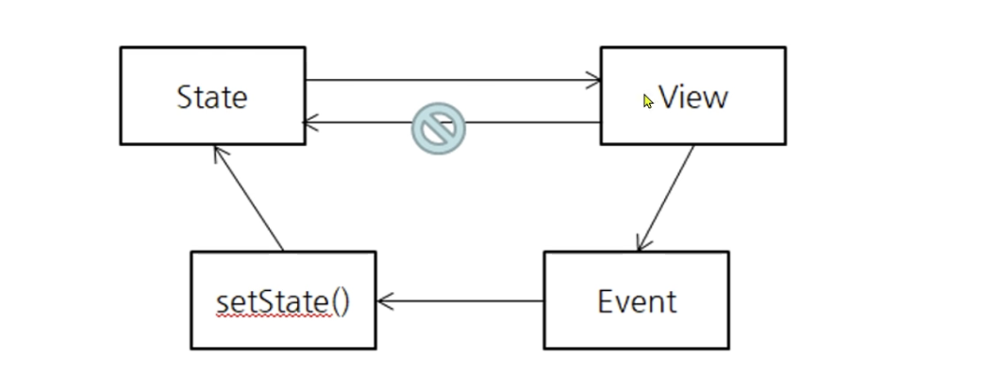
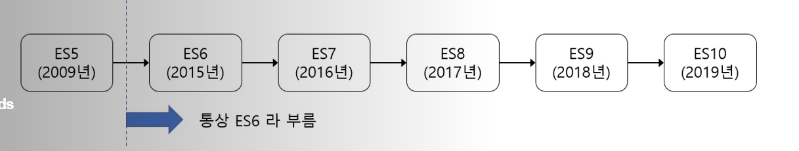
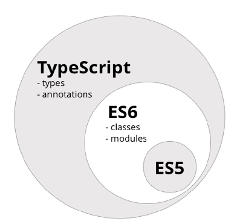

# 원쌤의 리액트 퀵스타트 with 타입스크립트

## React란?

- Facebook에서 만든 **UI를 작성하기 위한 자바스크립트 라이브러리**
  - A Javascript library for building user interfaces
- **Javascript 코드만을** 이용해 조합형 UI를 작성한다
  - JSX와 같은 형식을 사용하지만 결국 트랜스파일되어 자바스크립트 코드로 실행된다
- UI 즉, MVC 중 V(View)에 집중한다
- 데이터가 지속적으로 변하는 대규모 애플리케이션의 구축을 위해서 만들어졌다

## 전통적인 웹 애플리케이션

- 요청 단위가 페이지
  - 일부분만 갱신하고 싶어도 **페이지 전체**를 HTTP 서버로부터 다시 받아와야한다

## AJAX를 이용한 멀티페이지 애플리케이션(JQuery)

- 화면 전체가 전환될 때는 새로운 HTML 페이지로 이동
  - 화면 개수만큼 페이지가 존재
- 한 화면에서 데이터만 바뀌는 경우에는 backend API 호출

## 단일페이지 애플리케이션

- 하나의 페이지로(html)로 애플리케이션의 모든 화면을 제공한다
  - SPA(Single Page Application)

## SPA의 단점

- 상태관리가 힘들다
  - 상태란 애플리케이션에서 보여줘야하는 데이터, 브라우저에서 메모리상에서 관리한다
  - 한 상태 데이터를 여러 화면에서 이용하는 경우가 있기 때문에 각각의 화면의 상태 관리가 쉽지 않다
- DOM이 느리다
  - DOM이란 브라우저상에서 HTML Document를 계층적으로 나타내는 Document Object Model
  - SPA 는 DOM 을 아주 빈번히 갱신하는데, 브라우저의 DOM을 직접 다루는 것은 매우 느리다
- HTML 마크업 생성을 자바스크립트코드로 제어해야한다

## React의 특징

- 상태관리
  - 컴포넌트 단위로 상태를 관리할 수 있다
  - Recoil, Redux와 같은 중앙집중화된 상태관리 라이브러리, 애플리케이션 수준의 상태관리 라이브러리를 이용해서 전역으로 상태관리기능을 중앙집중화 시킬 수 있다
- 단방향 데이터 바인딩
  - 상태 데이터가 변경되면 즉시 UI(view)가 반영된다
  - 하지만 UI(view)에서의 변경(입력) 이 상태에 반영되지 않는다
    - UI(view)에서 변경발생시 이벤트를 발생시켜 이벤트핸들러를 통해 상태를 변경한다
      
- JSX(Javascript XML)
  - 템플릿이 아닌 XML과 유사한 자바스크립트 확장문법이다
- 컴포넌트 기반의 개발
  - react 컴포넌트는 독립적인 컴포넌트 -> 재사용성이 뛰어난다
- 마크업, 스타일, 자바스크립트 코드의 분리가 아닌 (자바스크립트 형태의) 결합
  - 관심사의 분리를 컴포넌트(화면의 영역) 단위로 분리시킨다
  - 템플릿을 이용하는 것은 표현적, 기능적 제약이 있을 수 있다
- 가상 DOM: virtual dom
  - DOM 조작은 느리므로 가상 DOM을 사용한다
  - 앱의 상태가 바뀔 때 전체 DOM을 업데이트 하지 않고 원하는 DOM 상태와 유사한 가상 트리를 브라우저 메모리에 (추상화된)중간계층을 만들어 형성한다
    - 브라우저상에 자바스크립트 객체 덩어리가 만들어진다
  - 결과적으로 전체 DOM을 업데이트하지 않고 차이나는 부분만 DOM 업데이트한다

## ES6

- ECMAScript6 -> ES6
  - ECMA-262 기술규격에 정의된 표준화된 스크립트 프로그래밍 언어
    

## 트랜스파일러

- Transpile = Translate + Compile
- 하위호환성을 위하여 ES6이나 Typescript 언어를 ES5와 같은 이전 버전의 자바스크립트 코드로 변환한다
- 대표적인 트랜스파일러(Transpiler): Babel, tsc

## Typescript란?

- ES6 에 정적타입이 추가된 것
  
  자바스크립트 언어의 확장버전이라 할 수 있다
- Typescript의 장점
  - 정적타입사용
    - 코드의 오류를 줄일 수 있다
    - 쉽고 편리한 디버깅

## npm 패키지

- 노드 애플리케이션에서 배포 단위를 패키지라고 한다
- npm(node package manage): 노드 패키지를 관리해주는 도구
  - 인터넷 상에 있는 노드 패키지들의 registry인 npm registry로부터 다운로드 가능
  - 노드 패키지를 만들고 npm registry에 publish 도 가능

## var

- hosting: 변수의 선언을 스코프의 최상단으로 옮기는 행위
- 2단계를 거쳐 실행된다
  - 호이스팅단계: (블록, 혹은 소스코드)내부에 var 키워드가 지정된 코드를 찾아 메모리에 미리 할당(변수만 미리 만든다)
  - 실행단계: 호이스팅 후 코드실행
- 함수단위 지원
  - 호이스팅은 함수단위의 scope만 제공하고 블록수준의 scope은 지원하지 않음
