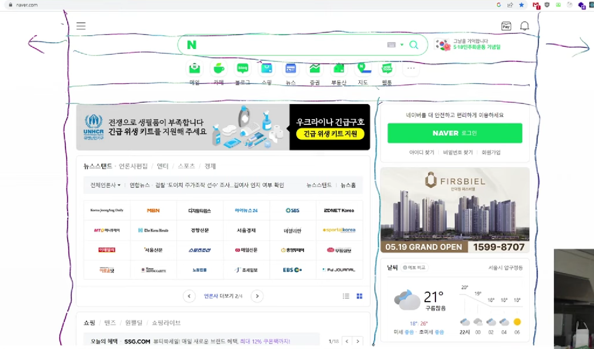

# 네이버 클론코딩(HTML, CSS, Flex, Grid)

## 수업순서

1. 검색창 만들기
2. 메뉴와 더보기

## 프로그래밍 방법

- 무턱대고 구현하지말고 생각(계획)을 해야한다

## 가로세로 법칙

- `div`란? division 구역
  - 구역을 처음에 잘 설계하는 것이 중요하다
- 가로세로법칙: 가로(수평선)로 먼저 자르고, 가로로 자른거 안에서 세로로 자른다.

- 공백은 위에나 아래에 포함시켜도 된다
  - 반응형일 경우도 고려해서 할 수 있다

## display

- 요소의 렌더링 박스 유형을 결정하는 속성

## padding vs margin

- 나의 요소에 포함되는 크기를 조절하고 싶으면 padding (border까지 자신의 사이즈)
- 외부의 크기를 조절하고 싶으면 margin
