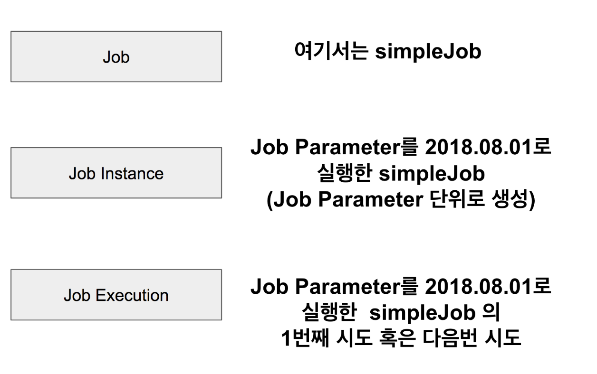

# 스프링 배치 가이드

- <https://jojoldu.tistory.com/324>

## 1. spring batch 가이드 - 배치 어플리케이션이란?

### 1. 배치 애플리케이션이란?

- 배치(Batch)란 '일괄처리'란 뜻을 갖고 있습니다
- 배치 어플리케이션: 단발성으로 대용량의 데이터를 처리하는 애플리케이션
  - 대용량 데이터: 배치 어플리케이션은 대량의 데이터를 가져오거나, 전달하거나, 계산하는 등의 처리를 할 수 있어야 합니다
  - 자동화: 배치 어플리케이션은 심각한 문제 해결을 제외하고는 사용자 개입 없이 실행되어야 합니다
  - 견고성: 배치 어플리케이션은 잘못된 데이터를 충돌/중단 없이 처리할 수 있어야 합니다
  - 신뢰성: 배치 어플리케이션은 무엇이 잘못되었는지를 추적할 수 있어야 합니다 (로깅, 알림)
  - 성능: 배치 어플리케이션은 **지정한 시간 안에 처리를 완료**하거나 동시에 실행되는 **다른 어플리케이션을 방해하지 않도록** 수행되어야 합니다

### 2-2 Simple Job 생성하기

- `@EnableBatchProcessing`
  - Spring Batch 기능을 사용하기 위해 필수로 선언해야 합니다
- `@Configuration`
  - Spring Batch 의 모든 Job은 `@Configuration`으로 등록해서 사용합니다
- `jobBuilderFactory.get("simpleJob")`
  - `simpleJob`이란 이름의 Batch Job 을 생성합니다
  - job의 이름을 별도로 지정하지 않고 이렇게 Builder를 통해 지정합니다
- `stepBuilderFactory.get("simpleStep1")`
  - `simpleStep1`이란 이름의 Batch Step을 생성합니다
  - `jobBuilderFactory.get("simpleJob")`와 마찬가지로 Builder를 통해 이름을 지정합니다
- `.tasklet((contribution, chunkContext))`
  - step 안에서 수행될 기능들을 명시합니다
  - Tasklet은 **Step 안에서 단일로 수행될 커스텀한 기능**들을 선언할 때 사용합니다
- Spring Batch 에서 **Job은 하나의 배치 작업 단위**를 얘기합니다
  - Job 안에는 여러 step이 존재하고, step 안에 Tasklet 혹은 Reader & Processor & Writer 묶음이 존재합니다
    
  - Tasklet 하나와 Reader & Processor & Wirter 한 묶음이 같은 레벨입니다

### 2-3 MySQL 환경에서 Spring Batch 실행해보기

- Spring Batch 에선 메타 데이터 테이블들이 필요합니다
  - 이전에 실행한 Job이 어떤 것들이 있는지
  - 최근 실패한 Batch Parameter가 어떤 것들이 있고, 성공한 Job은 어떤 것들이 있는지
  - 다시 실행한다면 어디서 부터 시작하면 될지
  - 어떤 Job에 어떤 Step들이 있었고, Step들 중 성공한 Step과 실패한 Step들은 어떤 것들이 있는지
  - MySQL 혹은 Oracle과 같은 DB를 사용할 때는 다음과 같은 테이블들 개발자가 직접 생성해야 합니다
    

### 3-1 BATCH_JOB_INSTANCE

- 'BATCH_JOB_INSTANCE' 테이블은 **Job Parameter에 따라 생성되는 테이블**입니다
  - 'Job Parameter': Spring Batch가 실행될 때 외부에서 받을 수 있는 파라미터
  - 같은 Batch Job이라도 Job Parameter가 다르면 'BATCH_JOB_INSTANCE'에는 기록되며, Job Parameter가 같다면 기록되지 않습니다
  - 다시말해, 동일한 Job이 Job Parameter가 달라지면 그때마다 'BATCH_JOB_INSTANCE'에 생성되며, **동일한 Job Parameter는 여러 개 존재할 수 없습니다**
- Spring Batch는 동일한 Job Parameter로 성공한 기록이 있을 때만 재수행이 안됩니다

### 3-2 BATCH_JOB_EXECUTION

- 'JOB_EXECUTION'와 'JOB_INSTANCE'는 부모-자식 관계입니다
- 'JOB_EXECUTION'은 자신의 부모 'JOB_INSTANCE'가 성공/실패했던 모든 내역을 갖고 있습니다

### JOB, JOB_INSTANCE, JOB_EXECUTION 정리

- 

### Step

- Step은 **실제 Batch 작업을 수행하는 역할**
  - Step에서는 **Batch로 실제 처리하고자 하는 기능과 설정을 모두 포함**하는 장소
- Job 내부의 **Step들 간에 순서 혹은 처리 흐름을 제어**할 필요가 있다

### 4-1 Next

- `next()`는 순차적으로 Step들 연결시킬 때 사용
- 앞의 step에서 오류가 나면 나머지 뒤에 있는 step 들은 실행되지 못합니다

### 4-2 조건별 흐름 제어

- `.on()`
  - 캐치할 **ExitStatus** 지정
  - `*`일 경우 모든 ExitStatus 가 지정된다
- `to()`
  - 다음으로 이동할 step 지정
- `from()`
  - 일종의 **이벤트 리스너** 역할
  - 상태값을 보고 일치하는 상태라면 `to()`에 포함된 `step`을 호출합니다
  - step1의 이벤트 캐치가 FAILED로 되있는 상태에서 **추가로 이벤트 캐치**하려면 `from`을 써야만 함
- `end()`
  - end는 FlowBuilder 를 반환하는 end와 FlowBuilder를 종료하는 end 2개가 있음
  - `on("*")` 뒤에 있는 end는 FlowBuilder를 반환하는 end
  - `build()` 앞에 있는 end는 FlowBuilder를 종료하는 end
  - `FlowBuilder`를 반환하는 end 사용시 계속해서 `from`을 이어갈 수 있음
- 분기처리를 위해 상태값 조정이 필요하시다면 ExitStatus를 조정해야합니다
  - `contribution.setExitStatus`

### Batch Status vs Exit Status

- BatchStatus는 **Job 또는 Step의 실행결과를 Spring에서 기록할 때 사용**하는 Enum
- ExitStatus는 **Step의 실행 후 상태**를 얘기합니다
- Spring Batch는 기본적으로 **ExitStatus의 exitCode는 Step의 BatchStatus와 같도록** 설정이 되어있습니다

### 4.3 Decide

- 'JobExecutionDecoder': Step들의 Flow 속에서 **분기만 담당하는 인터페이스**
- Step 으로 처리하는게 아니기 때문에 'ExitStatus'가 아닌 'FlowExecutionStatus'로 상태를 관리합니다

### 5.1 JobParameter와 Scope

- Job Parameter: Spring Batch의 경우 외부 혹은 내부에서 파라미터를 받아 여러 Batch 컴포넌트에서 사용할 수 있게 지원합니다
  - Job Parameter를 사용하기 위해선 항상 Spring Batch 전용 Scope 를 선언해야만 합니다
  - `@StepScope`, `@JobScope`
  - 사용법: `@Value("#{jobParameters[파라미터명]}")`
- `@JobScope`는 Step 선언문에서 사용 가능하고, `@StepScope`는 Tasklet 이나 ItemReader, ItemWriter, ItemProcessor 에서 사용할 수 있습니다

### 5.2 @StepScope & @JobScope 소개

- `@StepScope`와 `@JobScope`는 모두 Bean 의 생성 시점을 지정된 Scope가 실행되는 시점으로 지연 시킵니다
  - 이렇게 Bean 의 생성시점을 애플리케이션 실행시점이 아닌, Step 혹은 Job의 실행시점으로 지연시키면서 얻는 장점
    - 1. JobParameter의 Late Binding 이 가능합니다
    - 2. 동일한 컴포넌트를 병렬 혹은 동시에 사용할 때 유용합니다
         e.g. `@StepScope`가 있다면 각각의 Step에서 별도의 Tasklet을 생성하고 관리하기 때문에 서로의 상태를 침범할 일이 없습니다

### 5.3 Job Parameter 오해

- Job Parameters는 `@Value`를 통해 가능합니다
- Scope Bean을 생성할 때만 가능합니다: `@StepScope`, `@JobScope` Bean을 생성할 때만 Job Paramters가 생성되기 때문에 사용할 수 있습니다

---
