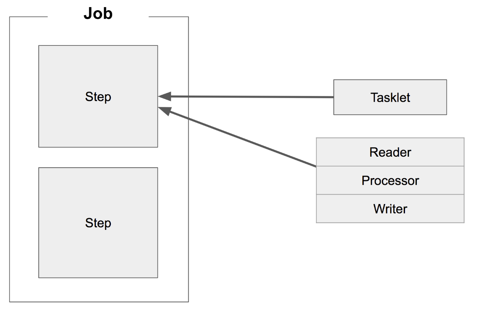
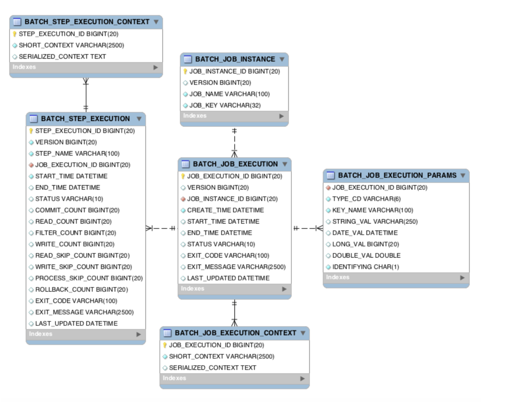

# 스프링 배치 가이드

- <https://jojoldu.tistory.com/324>

## 1. spring batch 가이드 - 배치 어플리케이션이란?

### 1. 배치 애플리케이션이란?

- 배치(Batch)란 '일괄처리'란 뜻을 갖고 있습니다
- 배치 어플리케이션: 단발성으로 대용량의 데이터를 처리하는 애플리케이션
  - 대용량 데이터: 배치 어플리케이션은 대량의 데이터를 가져오거나, 전달하거나, 계산하는 등의 처리를 할 수 있어야 합니다
  - 자동화: 배치 어플리케이션은 심각한 문제 해결을 제외하고는 사용자 개입 없이 실행되어야 합니다
  - 견고성: 배치 어플리케이션은 잘못된 데이터를 충돌/중단 없이 처리할 수 있어야 합니다
  - 신뢰성: 배치 어플리케이션은 무엇이 잘못되었는지를 추적할 수 있어야 합니다 (로깅, 알림)
  - 성능: 배치 어플리케이션은 **지정한 시간 안에 처리를 완료**하거나 동시에 실행되는 **다른 어플리케이션을 방해하지 않도록** 수행되어야 합니다

### 2-2 Simple Job 생성하기

- `@EnableBatchProcessing`
  - Spring Batch 기능을 사용하기 위해 필수로 선언해야 합니다
- `@Configuration`
  - Spring Batch 의 모든 Job은 `@Configuration`으로 등록해서 사용합니다
- `jobBuilderFactory.get("simpleJob")`
  - `simpleJob`이란 이름의 Batch Job 을 생성합니다
  - job의 이름을 별도로 지정하지 않고 이렇게 Builder를 통해 지정합니다
- `stepBuilderFactory.get("simpleStep1")`
  - `simpleStep1`이란 이름의 Batch Step을 생성합니다
  - `jobBuilderFactory.get("simpleJob")`와 마찬가지로 Builder를 통해 이름을 지정합니다
- `.tasklet((contribution, chunkContext))`
  - step 안에서 수행될 기능들을 명시합니다
  - Tasklet은 **Step 안에서 단일로 수행될 커스텀한 기능**들을 선언할 때 사용합니다
- Spring Batch 에서 **Job은 하나의 배치 작업 단위**를 얘기합니다
  - Job 안에는 여러 step이 존재하고, step 안에 Tasklet 혹은 Reader & Processor & Writer 묶음이 존재합니다
    
  - Tasklet 하나와 Reader & Processor & Wirter 한 묶음이 같은 레벨입니다

### 2-3 MySQL 환경에서 Spring Batch 실행해보기

- Spring Batch 에선 메타 데이터 테이블들이 필요합니다
  - 이전에 실행한 Job이 어떤 것들이 있는지
  - 최근 실패한 Batch Parameter가 어떤 것들이 있고, 성공한 Job은 어떤 것들이 있는지
  - 다시 실행한다면 어디서 부터 시작하면 될지
  - 어떤 Job에 어떤 Step들이 있었고, Step들 중 성공한 Step과 실패한 Step들은 어떤 것들이 있는지
  - MySQL 혹은 Oracle과 같은 DB를 사용할 때는 다음과 같은 테이블들 개발자가 직접 생성해야 합니다
    
