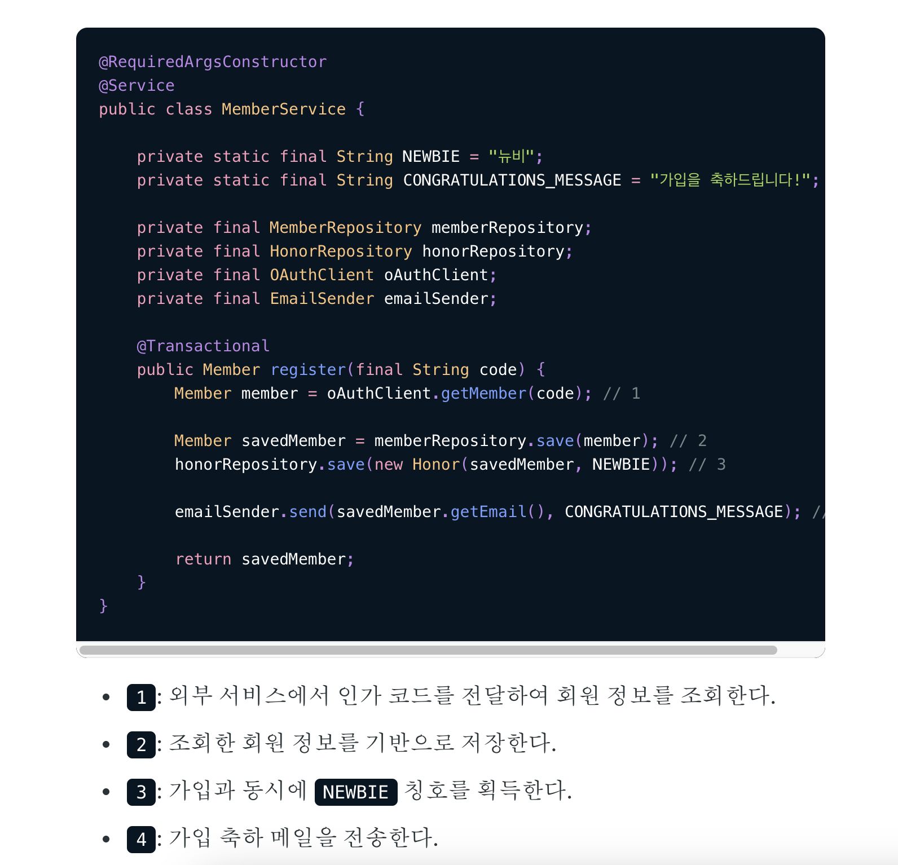
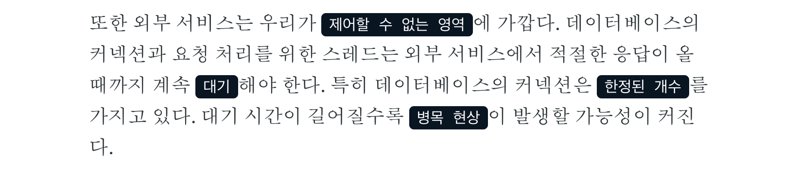

# real mysql 스터디 내용

## tmp

- 제목: 외부 리소스 요청과 트랜잭션 분리
- 원자성을 보장하자니 커넥션 지속시간이 너무 오래 걸리고,
  트랜잭션을 분리하면 원자성이 보장이 안된다
  어떻게 해야할까요?
- 울며겨자먹기로 원자성을 보장하기 위해 커넥션 지속시간이 길어지더라도 1번안을 그대로 하기만 하면 될까요?
  - 만약 외부리소스 요청이 두개라고 가정해보죠. 두번째 외부 리소스 요청이 실패하여 롤백해야한다면, 첫번째 외부 리소스 요청은 롤백 될까요?
  - 외부 리소스 요청인 알림메일발송은 롤백 되지 않습니다

## 레퍼런스

- tecoble: 트랜잭션 내에 외부 리소스 요청이 담기게 되면 어떤 문제가 발생할까?
  - real mysql 관점에서의 예제코드
  - <https://tecoble.techcourse.co.kr/post/2022-09-20-external-in-transaction/>
  -
- 2번: https://tecoble.techcourse.co.kr/post/2020-09-30-event-publish/
- 3번: https://cheese10yun.github.io/event-transaction/
- 4번: https://www.youtube.com/watch?v=uk5fRLUsBfk
- 5번: https://blog.gangnamunni.com/post/transactional-outbox/

## 전체구조

- real-my-sql의 대전제에 대한 의문: 정말 외부 리소스 요청은 트랜잭션 내에서 분리해야할까?
- tecoble: real-my-sql 전제를 충실히 따르고 있는 예제

## real-my-sql 내용

- 158 - 160p  
  "사용자가 게시판에 게시물을 작성한 후 저장 버튼을 클릭했을 때 서버에서 처리하는 내용을 순서대로 정리한 것"

  ```text
  1) 처리시작
    => 데이터베이스 커넥션 생성
    => 트랜잭션 시작
  2) 사용자의 로그인 여부 확인
  3) 사용자의 글쓰기 내용의 오류 여부 확인
  4) 첨부로 업로드된 파일 확인 및 저장
  5) 사용자의 입력 내용을 DBMS에 저장
  6) 첨부 파일 정보를 DBMS에 저장
  7) 저장된 내용 또는 기타 정보를 DBMS에 조회
  8) 게시물 등록에 대한 알림 메일 발송
  9) 알림 메일 발송 이력을 DBMS에 저장
    <= 트랜잭션 종료(COMMIT)
    <= 데이터베이스 커넥션 반납
  10) 처리 완료
  ```

  "위 처리 절차 중에서 DBMS의 **트랜잭션 처리에 좋지 않은 영향**을 미치는 부분"

  - "실제로 DBMS에 데이터를 저장하는 작업(트랜잭션)은 5번부터 시작된다는 것을 알 수 있다. 그래서 2번과 3번, 4번의 절차가 아무리 빨리 처리된다고 하더라도 DBMS의 트랜잭션에 포함시킬 필요는 없다."
  - "더 큰 위험은 8번 작업이라고 볼 수 있다. 메일 전송이나 FTP 파일 전송 작업 또는 네트워크를 통해 원격 서버와 통신하는 등과 같은 작업은 **어떻게 해서든 DBMS의 트랜잭션 내에서 제거하는 것이 좋다**"

  좋은 내용들

  - "9번 작업은 조금 성격이 다르기 때문에 이전 트랜잭션(5번과 6번 작업)에 함께 묶지 않아도 무방해 보인다(**물론 업무 요건에 따라 달라질 수는 있겠지만**). 이러한 작업은 별도의 트랜잭션으로 분리하는 것이 좋다.

  문제가 될 만한 부분 세 가지를 보완해서 위의 처리 절차를 다시 설계한 것

  ```text
  1) 처리시작
  2) 사용자의 로그인 여부 확인
  3) 사용자의 글쓰기 내용의 오류 여부 확인
  4) 첨부로 업로드된 파일 확인 및 저장
    => 데이터베이스 커넥션 생성
    => 트랜잭션 시작
  5) 사용자의 입력 내용을 DBMS에 저장
  6) 첨부 파일 정보를 DBMS에 저장
    <= 트랜잭션 종료(COMMIT)
  7) 저장된 내용 또는 기타 정보를 DBMS에 조회
  8) 게시물 등록에 대한 알림 메일 발송
    => 트랜잭션 시작
  9) 알림 메일 발송 이력을 DBMS에 저장
    <= 트랜잭션 종료(COMMIT)
    <= 데이터베이스 커넥션 반납
  10) 처리 완료
  ```

  논란의 여지의 말들

  - "실제로 DBMS에 데이터를 저장하는 작업(트랜잭션)은 5번부터 시작된다는 것을 알 수 있다. 그래서 2번과 3번, 4번의 절차가 아무리 빨리 처리된다고 하더라도 DBMS의 트랜잭션에 포함시킬 필요는 없다."
  - "프로그램의 코드에서 라인 수는 한둘 줄이라고 하더라도 네트워크 작업이 있는 경우에는 반드시 트랜잭션에서 배제해야한다"
    - "프로그램이 실행되는 동안 메일 서버와 통신할 수 없는 상황이 발생한다면 웹 서버뿐 아니라 DBMS 서버까지 위험해지는 상황이 발생할 것이다"

## 1번: tecoble: real-my-sql 전제를 충실히 따르고 있는 예제

### 1. DBMS에 저장하지 않는 작업을 트랜잭션에서 배제 2. 네트워크 작업이 있는 경우 배제

- 로직
  
- "데이터베이스 트랜잭션이 실질적으로 사용되는 부분"
  
  - "영속시키기 위해 데이터베이스 커넥션을 활용한다"
- "제어할 수 없는 영역"인 "외부서비스"
  
  - "제어할 수 없는 영역인 외부 리소스에 대한 요청을 트랜잭션에서 분리하지 않으면 응답이 올 때까지 요청 스레드가 대기하게 된다. 이때 요청에 데이터베이스 로직이 포함되면 커넥션도 함께 대기하게 된다. 한정된 개수를 가진 커넥션을 빠르게 반납하지 않으면 병목현상이 일어날 수 있다"

## 2번: 1번과 다른 비즈니스 로직 분리하기

- 로직
  
- 문제의식은 1번과 동일하다. 하지만 결론은 다르다. 문제의식은 데이터베이스 저장로직과 메일발송 로직이 하나의 트랜잭션에 묶여있을 경우 "요청의 의도와 다른 로직 때문에 **속도가 느려지거나**, **실패하여 회원가입이 되지 않는다면** 이것은 분명 문제로 인식되어야 한다"
  - 즉 1번에서는 데이터베이스 저장 로직과 메일발송 로직이 하나로 묶여진 경우 속도의 문제만 지적했다면 2번에서는 같은 트랜잭션으로 묶을 경우 전체 rollback을 잡고 있다
- 이벤트를 사용한 메일 발송 로직 분리
  - "이 문제는 '회원가입이 성공한다'라는 이벤트를 만들고, 이벤트 리스너에서 MailSender의 메서드를 호출한다면, 회원가입이 일어나는 트랜잭션과 분리해서 메일 발송 로직을 수행할 수 있다"
  - "이벤트는 기본적으로 spring에서 제공하는 ApplicationEvent를 사용하여 생성할 수 있고, 생성된 이벤트를 받아들이고 로직을 수행하는 리스너 객체는 어노테이션 기반으로 정의하여 사용할 수 있다"
    
- 결론
  - 1번과 달리 2번에서는 이벤트를 사용해서 데이터베이스 저장로직과 메일발송 로직 사이에 연결이 있다. 여기서는 데이터베이스 저장로직이 완료되면(rollback이 아니라 commit)이 되면 메일을 보낸다는 연결관계를 가진다
  - 이러한 로직 사이의 연결관계를 가지면서 1번과 2번 모두 문제의식으로 가지고 있던 데이터베이스 저장 로직의 속도에 메일전송이 악영향을 미치지도 않는다

## 그런데 1번과 2번에는 모두 공통된 사항이 있었어요. 바로 외부리소스 요청이 데이터베이스 요청과 분리가능하다는 전제조건이다. 분리가 불가능한 조건이라면 어떻게 될까?

### 3번

- 로직
  
  - "이메일 전송 실패, 쿠폰 발급이 실패하는 경우 회원가입을 다시 해야한다는 가정"이 있어요
- 문제점
  
  - "2. 외부 시스템 회원 가입 이메일 전송의 경우는 외부 인프라스트럭처이기 때문에 Rollback과는 무관하게 이메일을 전송하게 됩니다." 즉, "회원가입이 실패했지만, 이메일을 전송하게 되는 문제가 발생하게 된 것입니다."
- 해결방안
  - ApplicationEventPublisher로 해결하기
  - "이벤트 핸들러는 이벤트 생성 주체가 발생한 이벤트에 반응하고, 이벤트 핸들러는 생성 주체가 발행한 이벤트를 전달받아 이벤트에 담긴 정보(데이터)를 기반으로 해당 기능을 수행하게 됩니다"
    
  - "@TransactionalEventListener으로 리스너를 등록한 경우 해당 트랜잭션이 Commit된 이후에 리스너가 동작하게 됩니다". "회원가입 쿠폰에서 예외가 발생하게 된다면 트랜잭션 commit이 진행되지 않기 때문에 해당 리스너가 동작하지 않게 되어 트랜잭션 문제를 해결할 수 있습니다"
- 근데 정말 트랜잭션 문제가 해결되었을까??
  
  - "이메일 전송 실패, 쿠폰 발급이 실패하는 경우 회원가입을 다시 해야한다는 가정"이 있어요

## 2PC

https://kadensungbincho.tistory.com/125

## 4번: 어떻게 외부리소스 요청을 보장할 수 있을까?

- @TrsanactionalEventListener + @Retryable
  
  - 근데 maxAttemps(성공할때까지 최대 시도횟수) 모두 실패한다면 어떻게 해야할까??
- 최소한번 보장

## 5번
