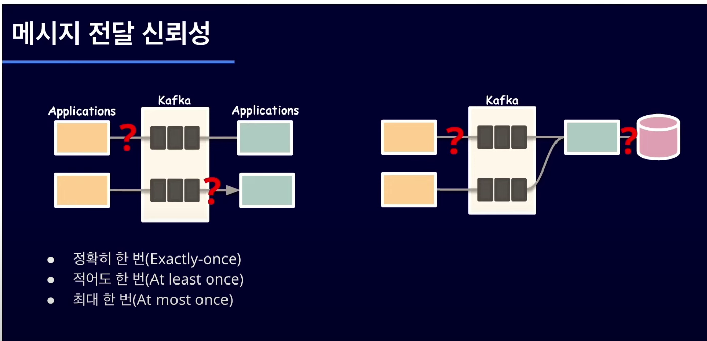
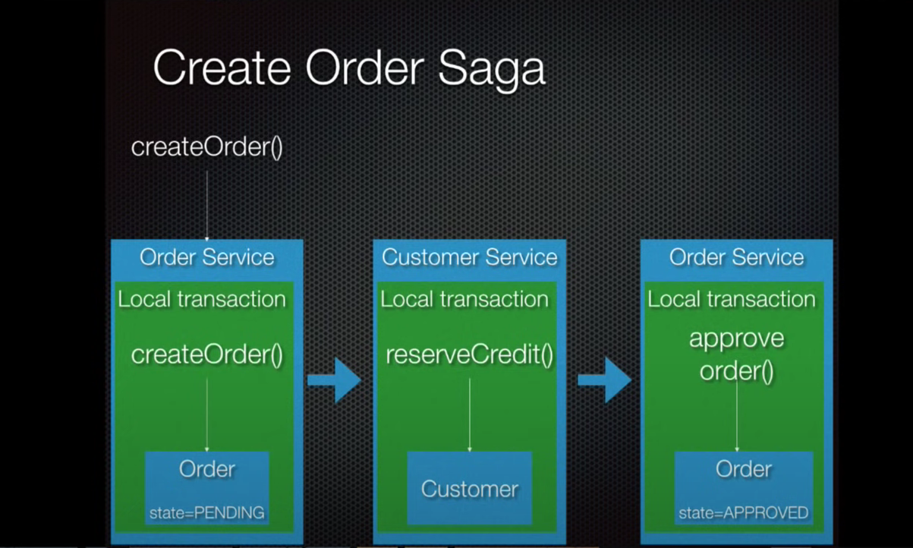

# 외부 리소스 요청과 트랜잭션 분리

## 레퍼런스

- 1번: <https://tecoble.techcourse.co.kr/post/2022-09-20-external-in-transaction/>
- 2번: https://tecoble.techcourse.co.kr/post/2020-09-30-event-publish/
- 3번: https://cheese10yun.github.io/event-transaction/
- 4번: https://www.youtube.com/watch?v=uk5fRLUsBfk
- 5번: https://blog.gangnamunni.com/post/transactional-outbox/

## Real MySQL

### 트랜잭션과 잠금

#### 5.1.2 주의사항

- 158 - 160p
- "사용자가 **게시판에 게시물을 작성**한 후 저장 버튼을 클릭했을 때 서버에서 처리하는 내용을 순서대로 정리한 것"

  ```text
  1) 처리시작
    => 데이터베이스 커넥션 생성
    => 트랜잭션 시작
  2) 사용자의 로그인 여부 확인
  3) 사용자의 글쓰기 내용의 오류 여부 확인
  4) 첨부로 업로드된 파일 확인 및 저장
  5) 사용자의 입력 내용을 DBMS에 저장
  6) 첨부 파일 정보를 DBMS에 저장
  7) 저장된 내용 또는 기타 정보를 DBMS에 조회
  8) 게시물 등록에 대한 알림 메일 발송
  9) 알림 메일 발송 이력을 DBMS에 저장
    <= 트랜잭션 종료(COMMIT)
    <= 데이터베이스 커넥션 반납
  10) 처리 완료
  ```

- "문제가 될 만한 부분 세 가지를 보완해서" 제시한 설계

  ```text
  1) 처리시작
  2) 사용자의 로그인 여부 확인
  3) 사용자의 글쓰기 내용의 오류 여부 확인
  4) 첨부로 업로드된 파일 확인 및 저장
    => 데이터베이스 커넥션 생성
    => 트랜잭션 시작
  5) 사용자의 입력 내용을 DBMS에 저장
  6) 첨부 파일 정보를 DBMS에 저장
    <= 트랜잭션 종료(COMMIT)
  7) 저장된 내용 또는 기타 정보를 DBMS에 조회
  8) 게시물 등록에 대한 알림 메일 발송
    => 트랜잭션 시작
  9) 알림 메일 발송 이력을 DBMS에 저장
    <= 트랜잭션 종료(COMMIT)
    <= 데이터베이스 커넥션 반납
  10) 처리 완료
  ```

- "프로그램의 코드에서 라인 수는 한둘 줄이라고 하더라도 **네트워크 작업이 있는 경우에는 반드시 트랜잭션에서 배제해야한다**"
  - "프로그램이 실행되는 동안 메일 서버와 통신할 수 없는 상황이 발생한다면 웹 서버뿐 아니라 DBMS 서버까지 위험해지는 상황이 발생할 것이다"

### 네트워크 작업은 반드시 트랜잭션에서 배제해야할까?

- 외부 리소스 요청과 트랜잭션에 관련된 다양한 예제를 살펴보자

## 1번 예제: real-my-sql 전제를 충실히 따르고 있는 예제

### 트랜잭션 분리 전 로직


### 1. 트랜잭션 분리: "데이터베이스와 관련된 처리"


### 2. 트랜잭션 분리: "제어할 수 없는 영역"인 "외부서비스"


- 한정된 개수를 가진 커넥션을 빠르게 반납하지 않으면 병목현상이 일어날 수 있다

### 트랜잭션 분리 후 로직



- `memberService.save(Member member)` 에만 트랜잭션을 적용하고 있다
- 문제점: `memberService.save(Member member)`가 실패했는데도 `emailSender.send()`가 호출하게 된다  
  혹은 `memberService.save(Member member)`와 `emailSender.send()`을 하나의 논리 작업 단위로 묶을려면 어떻게 해야할까?

## 2번 예제: 이벤트 발행을 통한 트랜잭션 분리

### 트랜잭션 분리 전 로직


- 2번 예제에서는 1번 예제와 문제의식을 공유하면서도 다른 점이 있다
  - 공유하는 문제의식은 속도의 문제이다. "요청의 의도와 다른 로직 때문에 **속도가 느려지는 것**"의 우려
  - 다른점은 1번 예제와 달리 데이터베이스 저장 로직이 실패하였을 경우 메일전송을 진행할 수도 있다는 것

### 이벤트를 사용한 메일 발송 로직 분리

- 2번 예제에서는 1) 데이터베이스 저장로직과 2) 메일전송의 관계형성을 위하여 이벤트를 활용한다
  - "이벤트는 기본적으로 spring에서 제공하는 ApplicationEvent를 사용하여 생성할 수 있고, 생성된 이벤트를 받아들이고 로직을 수행하는 리스너 객체는 어노테이션 기반으로 정의하여 사용할 수 있다"
- `@TransactionalEventListener`
  
  - 여기서 `@TransactionalEventListener`을 활용하여 데이터베이스 저장이 완료된 이후(Transaction이 끝난 이후) 메일을 보내게끔 설정해준다(`AFTER_COMMIT`)

### 트랜잭션 분리 후 로직

#### 이벤트 발행로직


#### 발행된 이벤트를 처리하는 handler



- 결론
  - 2번 예제에서는 1번 예제와 같이 메일전송이라는 외부 요청 대기시간을 기존 트랜잭션에서 제거하면서도 데이터베이스 저장로직과 메일전송로직 사이에 이벤트 발행과 처리를 통해 연결관계를 맺었다
  - 하지만 만약 기획상 정책으로 외부리소스 요청과 데이터베이스 저장로직이 원자성을 가져야한다면 어떻게 해야할까?

## 3번 예제: 외부 리소스 요청과 트랜잭션 처리에 대한 고려사항

### 시나리오


- "상품을 주문 시 장바구니에 있는 제품인 경우 해당 유저의 장바구니를 제거합니다. 만약 장바구니를 제거하다 예외가 발생하더라도 주문은 완료되어야 한다는 것이 전제입니다."

### 비동기와 이벤트 발행을 통한 해결


- 외부리소스 요청이 아니더라도 응답 속도를 높히기 위하여 비동기와 이벤트 발행을 통해 해결하였다

### 결론


- 장점: 장바구니 제거에 실패하더라도 주문요청은 정상적으로 완료할 수 있으며, 장바구니 제거에 block 되지 않고 주문요청완료 응답을 빠르게 할 수 있다
- 내재하고 있는 문제점: 주문은 완료했지만 장바구니 제거에 예외가 발생한다면 해당 장바구니는 제거 되지 않은 상태이다
  - 2번 예제와 똑같이 주문완료와 장바구니제거가 하나의 논리적 작업 단위로 묶이지 않는다

## 4번 예제: 마이크로서비스 saga 패턴


- Order의 속성(state) 값을 변경함으로써 외부 리소스 요청의 성공을 확인 받고 트랜잭션을 이어나가는 방식
  - 장점: 빠르게 local transaction 을 이어나감으로써 대기시간을 줄일 수 있다


- 외부 리소스 요청(reserveCredit())이 실패한 경우 실패에 대한 메시지를 전달하고 주문을 폐기처리한다

## 부록: 메시지큐 - 분산시스템의 기반기술


- 메시지 전달 신뢰성의 핵심키워드
  - 정확히 한 번
  - 적어도 한 번 (한 번 이상 메시지 전달이 이루어질 수 있다는 뜻)
  - 최대 한 번 (0번일 수도 있다는 뜻)


- 브로커를 중간에 두고 `Acknowledgement`와 `Offset commit`을 이용하여 메시지 전달에 대해 신뢰성을 확보한다
