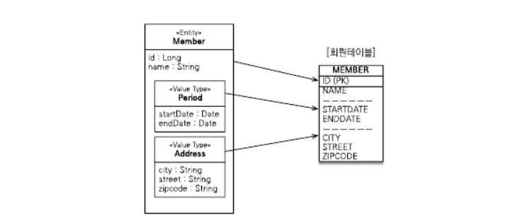

# 백지코딩

## 0831

### 스프링컨테이너의 영속성 컨텍스트 전략

- 트랜잭션 범위의 영속성 컨텍스트 전략
  - 트랜잭션 범위와 영속성 컨텍스트 생존 범위가 같다
- 스레드마다 각각 다른 트랜잭션을 할당한다 (엔티티매니저는 공유가능)

### 준영속 상태와 지연로딩

- 서비스계층에 `@Transactional` 사용시 프레젠테이션 계층에서는 영속성컨텍스트도 함께 종료된다
  - 변경감지와 지연로딩이 동작하지 않는다

### 해결방법

- 미리 로딩해두기
  - 1. 글로벌페치전략수정, 2. JPQL 페치조인, 3. 강제초기화
- `OSIV`를 사용해서 엔티티를 항상 영속상태로 유지하기

### N+1 문제

- JPQL을 사용하여 SQL을 생성할 때 글로벌 페치전략을 참고하지 않고 오직 JPQL 자체만 사용한다

### 스프링 OSIV(open session in view)

- 비즈니스계층 종료시 트랜잭셔만 종료하고 클라이언트 요청이 끝나기전까지 영속성 컨텍스트를 살려두어 트랜잭션 없이 읽기를 이용한다

### 컬렉션

- Collection, List: 엔티티 추가시에 지연로딩된 컬렉션 초기화하지 않음
- Set: 엔티티 추가시에 지연로딩된 컬렉션 초기화한다

### `@OrderBy`

- 데이터베이스의 `ORDER BY`절을 사용해 컬렉션 정렬

### `@Converter`

- 엔티티의 데이터를 변환해서 데이터베이스에 저장한다

### 리스너

- 리스너를 통해 엔티티 생명주기에 따른 이벤트 처리 가능

---

## 0829

### 임베디드 타입

- 임베디드 타입을 통해 새로운 값 타입(value type)을 정의해서 사용 가능

### 값 타입과 불변객체

- 값타입이 공유되면 사이드이펙트가 발생할 수 있다
  - 불변객체 처리

### JPQL

- 테이블이 아닌 객체를 대상으로 검색하는 객체지향 쿼리
- JPA가 JPQL를 분석하여 SQL를 만들고 데이터베이스를 조회한다

### 메타모델

- 어노테이션 프로세서를 이용하면 어노테이션을 분석해서 클래스를 생성할 수 있다
- JPA에서는 메타모델 API로 전용 클래스를 생성하고 이를 통해 문자열이 아닌 컴파일 검사가 가능한 쿼리작성 가능

### JPQL 내부조인

- JPQL 조인은 연관필드를 대상으로 한다

### 페치조인

- 성능 최적화를 위해 연관된 엔티티나 컬렉션을 한 번에 같이 조회하는 기능

---

## 0825

### 상속관계매핑

- 객체의 상속관계를 데이터베이스에서는 어떻게 매핑할 것인가?

#### 부모클래스를 테이블과 매핑하지 않을 때

- `@MappedSuperclass`

#### 부모클래스, 자식클래스 모두 테이블과 매핑할 때

- 조인전략
- 단일테이블전략
- 구현클래스마다 테이블전략

### 식별관계 vs 비식별관계

- 테이블 사이의 관계에서 외래키가 기본키에 포함되는지 여부에 따라 나누어진다
- 비식별관계는 다시 외래키에 `NULL`을 허용하는지에 따라서 **필수적 비식별관계**와 **선택적 비식별관계**로 나누어진다
- 비식별관계를 주로 사용하고 꼭 필요한 곳에만 식별관계 사용

### 복합키: 비식별관계매핑

- 복합키를 지원하는 방법으로는 `@IdClass`와 `@EmbeddedId` 가 있다

---

## 0822

### 전파옵션

- 트랜잭션이 수행중인데 또 다시 트랜잭션이 추가로 실행된다면?
  - 전파옵션에 따라 다르다

#### `REQUIRED`

- 기본설정
- (트랜잭션 동기화 매니저를 참고하여) 기본 트랜잭션이 없으면 생성하고, 있으면 참여한다

#### `REQUIRES_NEW`

- 항상 새로운 트랜잭션을 사용한다

## 0818

### 스프링 트랜잭션 추상화

- JPA, Mybatis 같은 데이터접근기술들은 각각 트랜잭션 처리 코드가 다르다
- 스프링 트랜잭션 추상화(`PlatformTransactionManager`)는 상이한 데이터접근기술의 트랜잭션 처리를 동일한 방식(인터페이스)으로 다룰 수 있게 해준다

### `@Transactionl`의 규칙

1. 우선순위 규칙 (더 자세한 것, 더 구체적인 것 우선)
2. 클래스에 적용되면 하위 메서드는 자동으로 적용된다

### 컨테이너에 트랜잭션 등록과정

- `@Transactional`이 클래스나 메서드에 하나라도 있으면 트랜잭션 AOP 는 해당 클래스 객체 대신 프록시 객체를 스프링 빈에 등록한다.
- 스프링 컨테이너는 해당 객체에 대한 의존관계 요청이 있으면 프록시를객체를 주입한다

### 프록시 내부 호출

- 프록시 객체의 메소드 내에서 메소드 호출을 할 경우 프록시 객체가 아닌 위임받은 대상 객체의 메소드가 호출된다.
